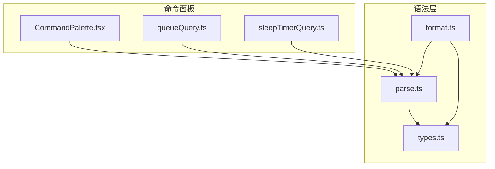
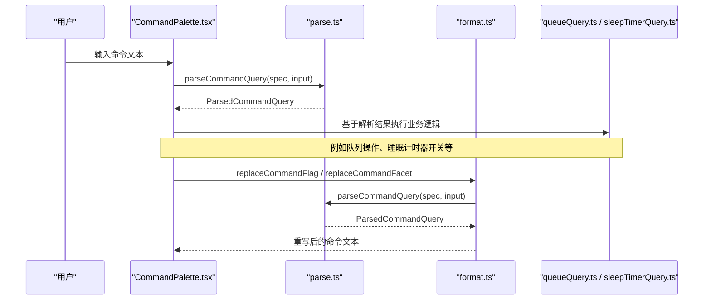
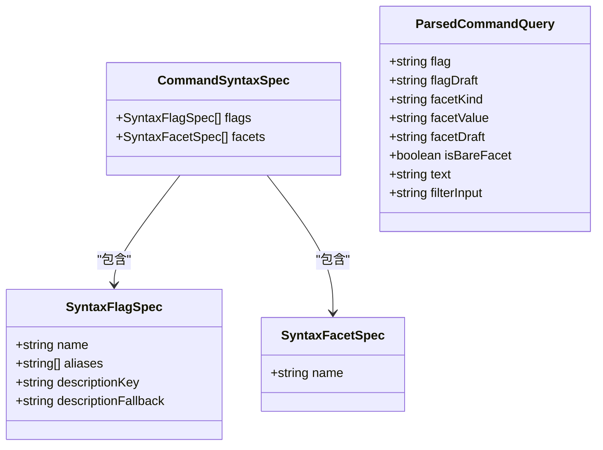
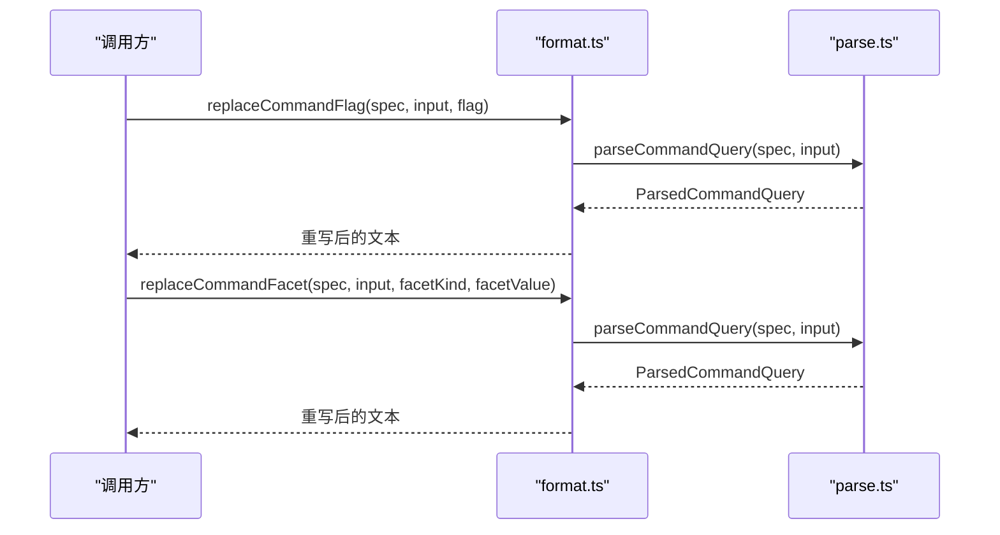
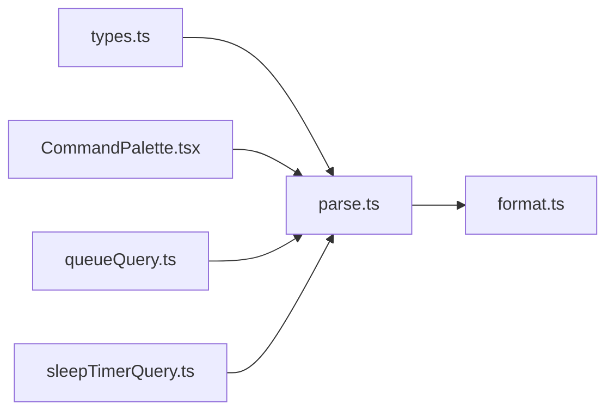

# 核心解析器

<cite>
**本文引用的文件**   
- [parse.ts](file://src/components/command-palette/syntax/parse.ts)
- [types.ts](file://src/components/command-palette/syntax/types.ts)
- [format.ts](file://src/components/command-palette/syntax/format.ts)
- [queueQuery.ts](file://src/components/command-palette/queueQuery.ts)
- [sleepTimerQuery.ts](file://src/components/command-palette/sleepTimerQuery.ts)
- [CommandPalette.tsx](file://src/components/command-palette/CommandPalette.tsx)
- [commandSyntax.test.ts](file://test/unit/command-palette/commandSyntax.test.ts)
</cite>

## 目录
1. [引言](#引言)
2. [项目结构](#项目结构)
3. [核心组件](#核心组件)
4. [架构总览](#架构总览)
5. [详细组件分析](#详细组件分析)
6. [依赖关系分析](#依赖关系分析)
7. [性能与内存考虑](#性能与内存考虑)
8. [故障排查指南](#故障排查指南)
9. [结论](#结论)
10. [附录：语法与使用示例](#附录语法与使用示例)

## 引言
本文件聚焦命令语法解析器的核心实现，围绕 `parseCommandQuery` 函数展开，系统说明标志符提取、词法分析、语法树（结构化结果）构建、语言特性支持、状态管理、别名系统、性能优化策略以及输出数据结构。该解析层是命令面板中多个命令共享的通用语法层，面向 `--flag @facet:value text` 这一小型领域特定语言。

## 项目结构
命令语法解析相关代码集中在命令面板的语法子模块中，采用“类型定义 + 解析器 + 格式化器”的分层组织方式：
- 类型定义：描述语法规范与解析结果的结构。
- 解析器：将原始输入字符串解析为结构化查询对象。
- 格式化器：将结构化查询对象重新序列化为文本，并支持替换标志符和面片。
- 消费者：队列、睡眠计时器等命令通过声明各自的语法规范来复用解析能力。



**图表来源**
- [CommandPalette.tsx:1-20](file://src/components/command-palette/CommandPalette.tsx#L1-L20)
- [queueQuery.ts:1-30](file://src/components/command-palette/queueQuery.ts#L1-L30)
- [sleepTimerQuery.ts:1-38](file://src/components/command-palette/sleepTimerQuery.ts#L1-L38)
- [types.ts:1-40](file://src/components/command-palette/syntax/types.ts#L1-L40)
- [parse.ts:1-97](file://src/components/command-palette/syntax/parse.ts#L1-L97)
- [format.ts:1-55](file://src/components/command-palette/syntax/format.ts#L1-L55)

**章节来源**
- [parse.ts:1-97](file://src/components/command-palette/syntax/parse.ts#L1-L97)
- [types.ts:1-40](file://src/components/command-palette/syntax/types.ts#L1-L40)
- [format.ts:1-55](file://src/components/command-palette/syntax/format.ts#L1-L55)
- [queueQuery.ts:1-30](file://src/components/command-palette/queueQuery.ts#L1-L30)
- [sleepTimerQuery.ts:1-38](file://src/components/command-palette/sleepTimerQuery.ts#L1-L38)

## 核心组件
- 语法类型定义：提供标志符、面片和解析结果的类型契约。
- 解析器：实现标志符提取、面片匹配、引号与转义处理、空白规范化、错误恢复与未解析草稿保留。
- 格式化器：将解析结果序列化回文本，并提供替换标志符和面片的便捷方法。
- 消费者：队列命令、睡眠计时器命令等通过声明自己的语法规范接入解析层。

**章节来源**
- [types.ts:5-39](file://src/components/command-palette/syntax/types.ts#L5-L39)
- [parse.ts:10-96](file://src/components/command-palette/syntax/parse.ts#L10-L96)
- [format.ts:12-54](file://src/components/command-palette/syntax/format.ts#L12-L54)
- [queueQuery.ts:12-30](file://src/components/command-palette/queueQuery.ts#L12-L30)
- [sleepTimerQuery.ts:10-38](file://src/components/command-palette/sleepTimerQuery.ts#L10-L38)

## 架构总览
命令面板在用户输入时调用解析器，得到结构化查询；随后根据具体命令的业务逻辑进行执行或继续补全建议。



**图表来源**
- [CommandPalette.tsx:1-20](file://src/components/command-palette/CommandPalette.tsx#L1-L20)
- [parse.ts:57-96](file://src/components/command-palette/syntax/parse.ts#L57-L96)
- [format.ts:28-54](file://src/components/command-palette/syntax/format.ts#L28-L54)
- [queueQuery.ts:33-33](file://src/components/command-palette/queueQuery.ts#L33-L33)
- [sleepTimerQuery.ts:46-46](file://src/components/command-palette/sleepTimerQuery.ts#L46-L46)

## 详细组件分析

### 语法类型定义
- 标志符规范：包含名称、可选别名、描述键与后备描述。
- 面片规范：仅包含名称。
- 解析结果：包含已解析的标志符、未解析草稿、面片种类与值、面片草稿、是否裸面片、自由文本、过滤输入等字段。



**图表来源**
- [types.ts:5-39](file://src/components/command-palette/syntax/types.ts#L5-L39)

**章节来源**
- [types.ts:5-39](file://src/components/command-palette/syntax/types.ts#L5-L39)

### 解析器实现原理
解析器以“规格驱动”的方式工作，主要步骤如下：
1. 构建标志符别名映射：将所有标志符名称及其别名统一小写后映射到正式名称。
2. 提取标志符：支持前缀标志符（如 `--pin` 在开头）和后缀标志符（如 `notes --pin`），若未匹配到已知标志符则返回草稿。
3. 空白规范化：对剩余输入进行首尾去空与连续空白压缩。
4. 面片匹配：
   - 显式面片：匹配 `@facetName:"value"` 或 `@facetName:value`，其中 value 支持 JSON 风格引号和转义。
   - 简写面片：当没有显式匹配时，尝试匹配 `@draft`，用于补全阶段。
5. 构建自由文本：从原输入中剥离标志符与面片片段，保留其余部分作为自由文本。
6. 转义解包：对自由文本中的 `\@`、`\-` 等转义序列进行还原。

```mermaid
flowchart TD
Start(["开始"]) --> BuildAliases["构建标志符别名映射"]
BuildAliases --> StripFlag["提取前缀/后缀标志符<br/>返回 flag / flagDraft / filterInput"]
StripFlag --> NormalizeSpaces["空白规范化"]
NormalizeSpaces --> MatchExplicit["匹配显式面片 @name:\"value\" 或 @name:value"]
MatchExplicit --> |命中| SetExplicit["设置 facetKind / facetValue / facetDraft<br/>计算 text"]
MatchExplicit --> |未命中| MatchShorthand["匹配简写面片 @draft"]
MatchShorthand --> |命中| SetShorthand["设置 facetDraft / isBareFacet<br/>计算 text"]
MatchShorthand --> |未命中| KeepText["保持 text = filterInput"]
SetExplicit --> EscapeUnwrap["转义解包 \\@ / \\-"]
SetShorthand --> EscapeUnwrap
KeepText --> EscapeUnwrap
EscapeUnwrap --> End(["返回 ParsedCommandQuery"])
```

**图表来源**
- [parse.ts:10-96](file://src/components/command-palette/syntax/parse.ts#L10-L96)

**章节来源**
- [parse.ts:10-96](file://src/components/command-palette/syntax/parse.ts#L10-L96)

### 语言特性支持
- 标志符语法：
  - 支持 `--flag` 形式，可位于输入开头或结尾。
  - 支持别名映射，如 `--ar` 映射到 `archive`。
  - 未识别标志符会作为草稿保留，便于补全。
- 面片表达式：
  - 支持 `@facet:value`，其中 value 可为普通字符串或带双引号的 JSON 字符串。
  - 支持引号内转义序列，优先尝试 JSON.parse，失败时按自定义规则解包 `\"` 和 `\\`。
  - 支持裸面片 `@`，表示空草稿，用于触发补全。
- 转义序列：
  - 自由文本中支持 `\@`、`\-` 等转义，解析后还原为字面量字符。
- 空白处理：
  - 对输入进行首尾去空与连续空白压缩，保证结果稳定。

**章节来源**
- [parse.ts:19-29](file://src/components/command-palette/syntax/parse.ts#L19-L29)
- [parse.ts:33-55](file://src/components/command-palette/syntax/parse.ts#L33-L55)
- [parse.ts:61-84](file://src/components/command-palette/syntax/parse.ts#L61-L84)
- [parse.ts:93-94](file://src/components/command-palette/syntax/parse.ts#L93-L94)

### 解析状态管理与错误恢复
- 输入规范化：
  - 通过 `normalizeSpaces` 统一空白，避免多余空格影响后续匹配。
- 标志符位置容错：
  - 同时接受前缀与后缀标志符，允许用户在已有文本前后追加标志符而不打乱顺序。
- 未解析草稿保留：
  - 当标志符或面片尚未完全输入时，保留 `flagDraft` 或 `facetDraft`，供补全系统使用。
- 错误恢复：
  - 引号解析失败时回退到自定义解包逻辑，避免抛错中断解析。
  - 未知面片名不会报错，而是作为草稿保留，确保用户体验流畅。

**章节来源**
- [parse.ts:6-8](file://src/components/command-palette/syntax/parse.ts#L6-L8)
- [parse.ts:33-55](file://src/components/command-palette/syntax/parse.ts#L33-L55)
- [parse.ts:19-29](file://src/components/command-palette/syntax/parse.ts#L19-L29)
- [parse.ts:61-84](file://src/components/command-palette/syntax/parse.ts#L61-L84)

### 别名系统与面片名称匹配
- 标志符别名：
  - 通过 `buildFlagAliases` 将标志符名称与别名统一小写后映射到正式名称。
  - 支持多别名，如 `archive` 的别名 `ar`。
- 面片名称匹配：
  - 显式匹配时要求面片名来自规格声明，否则视为草稿。
  - 简写匹配用于补全阶段，不要求面片名存在。

**章节来源**
- [parse.ts:10-17](file://src/components/command-palette/syntax/parse.ts#L10-L17)
- [parse.ts:61-65](file://src/components/command-palette/syntax/parse.ts#L61-L65)

### 格式化与替换辅助
- 序列化：
  - `formatCommandQuery` 将解析结果重新组合为文本，自动对含空格或引号的面片值进行 JSON 化。
- 替换标志符：
  - `replaceCommandFlag` 解析输入后替换标志符，同时保留未解析的面片草稿作为自由文本。
- 替换面片：
  - `replaceCommandFacet` 解析输入后替换面片种类与值，保留其他部分不变。



**图表来源**
- [format.ts:28-54](file://src/components/command-palette/syntax/format.ts#L28-L54)
- [parse.ts:57-96](file://src/components/command-palette/syntax/parse.ts#L57-L96)

**章节来源**
- [format.ts:12-54](file://src/components/command-palette/syntax/format.ts#L12-L54)

### 消费者集成示例
- 队列命令：
  - 声明标志符 `remove`、`next`、`end` 及面片 `artist`、`album`。
  - 使用 `parseCommandQuery` 解析用户输入，再结合业务逻辑执行队列操作。
- 睡眠计时器命令：
  - 声明标志符 `on`、`off` 及其别名。
  - 使用 `parseCommandQuery` 解析开关指令，并进行参数校验。

**章节来源**
- [queueQuery.ts:12-30](file://src/components/command-palette/queueQuery.ts#L12-L30)
- [sleepTimerQuery.ts:10-38](file://src/components/command-palette/sleepTimerQuery.ts#L10-L38)

## 依赖关系分析
- 解析器依赖类型定义，确保输入规范与输出结构一致。
- 格式化器依赖解析器，以实现往返序列化与替换功能。
- 命令面板与消费者依赖解析器，以获取结构化查询结果。



**图表来源**
- [types.ts:1-40](file://src/components/command-palette/syntax/types.ts#L1-L40)
- [parse.ts:1-97](file://src/components/command-palette/syntax/parse.ts#L1-L97)
- [format.ts:1-55](file://src/components/command-palette/syntax/format.ts#L1-L55)
- [CommandPalette.tsx:1-20](file://src/components/command-palette/CommandPalette.tsx#L1-L20)
- [queueQuery.ts:1-30](file://src/components/command-palette/queueQuery.ts#L1-L30)
- [sleepTimerQuery.ts:1-38](file://src/components/command-palette/sleepTimerQuery.ts#L1-L38)

**章节来源**
- [parse.ts:1-97](file://src/components/command-palette/syntax/parse.ts#L1-L97)
- [format.ts:1-55](file://src/components/command-palette/syntax/format.ts#L1-L55)
- [types.ts:1-40](file://src/components/command-palette/syntax/types.ts#L1-L40)

## 性能与内存考虑
- 正则表达式复用：
  - 显式面片匹配通过动态构建正则表达式，仅在必要时编译一次，减少重复开销。
- 字符串操作优化：
  - 使用 `slice` 与模板字符串拼接，避免不必要的中间对象创建。
- 别名映射缓存：
  - 每次解析都会重建别名映射，适用于小规模规格；若规格较大，可考虑外部缓存。
- 错误路径快速回退：
  - 引号解析失败时直接回退到自定义解包，避免异常栈开销。
- 内存管理：
  - 解析结果对象轻量，仅包含必要字段；自由文本经过规范化，避免冗余空白占用内存。

[本节为一般性指导，不直接分析具体文件]

## 故障排查指南
- 标志符未生效：
  - 检查是否使用了正确的别名，或是否在输入末尾追加了标志符。
  - 确认规格中是否声明了对应标志符。
- 面片值解析异常：
  - 检查引号是否正确闭合，或使用 JSON 风格转义。
  - 若值中包含空格或引号，建议使用双引号包裹。
- 转义未生效：
  - 确认自由文本中使用的是 `\@` 或 `\-`，而非其他字符。
- 草稿未显示：
  - 检查是否为未识别的标志符或未完整输入的面片，草稿字段应为非空。

**章节来源**
- [parse.ts:33-55](file://src/components/command-palette/syntax/parse.ts#L33-L55)
- [parse.ts:61-84](file://src/components/command-palette/syntax/parse.ts#L61-L84)
- [parse.ts:93-94](file://src/components/command-palette/syntax/parse.ts#L93-L94)

## 结论
命令语法解析器以规格驱动的方式实现了稳定的标志符与面片解析，支持引号与转义、空白规范化与错误恢复，并通过别名系统提升易用性。其输出结构清晰，便于上层命令消费与扩展。格式化器提供了往返序列化与替换能力，使命令面板的用户体验更加流畅。整体设计简洁、可扩展，适合在多命令场景中复用。

[本节为总结性内容，不直接分析具体文件]

## 附录：语法与使用示例
- 基本语法：
  - 标志符：`--flag`，可前置或后置。
  - 面片：`@facet:value`，value 支持引号与转义。
  - 自由文本：标志符与面片之外的其余部分。
- 示例：
  - 解析带别名的标志符与引号面片：
    - 输入：`--ar @author:"Ada Lovelace" analytical engine`
    - 解析结果包含已解析标志符、面片种类与值、自由文本。
  - 后置标志符与未解析草稿：
    - 输入：`notes --pi`
    - 解析结果包含自由文本与标志符草稿。
  - 裸面片与转义：
    - 输入：`@`
    - 解析结果包含空草稿与裸面片标记。
    - 输入：`\@home \-draft`
    - 解析结果中文本已解包为字面量。

**章节来源**
- [commandSyntax.test.ts:17-35](file://test/unit/command-palette/commandSyntax.test.ts#L17-L35)
- [commandSyntax.test.ts:44-54](file://test/unit/command-palette/commandSyntax.test.ts#L44-L54)