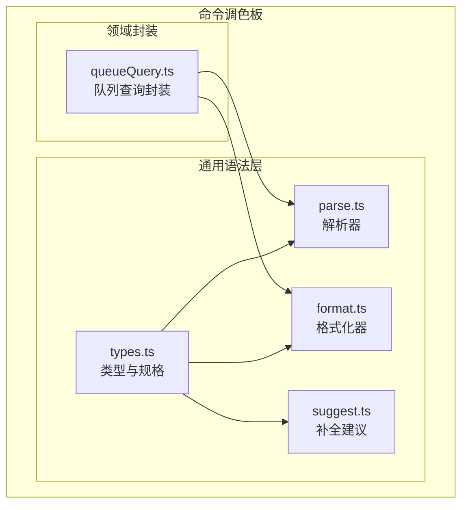
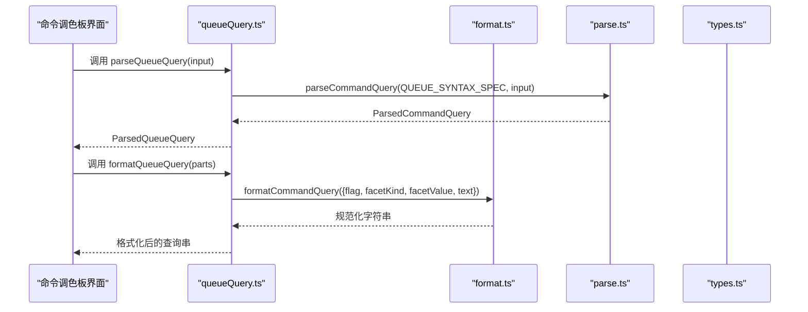
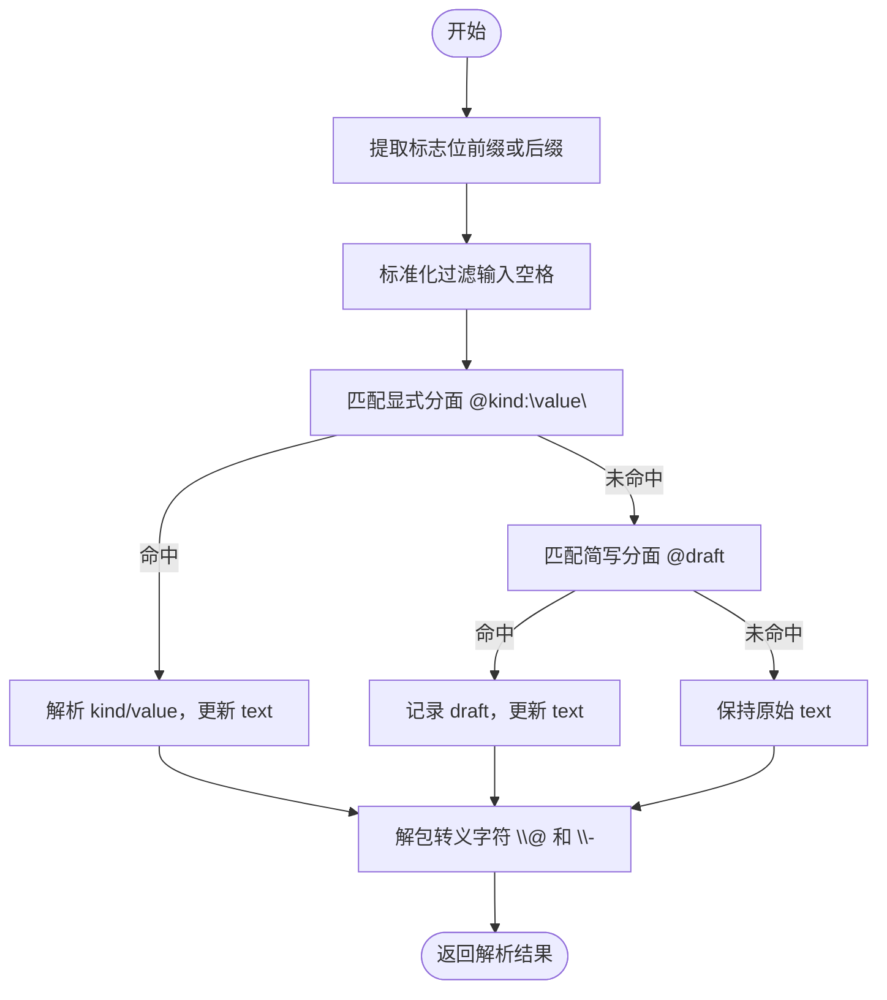
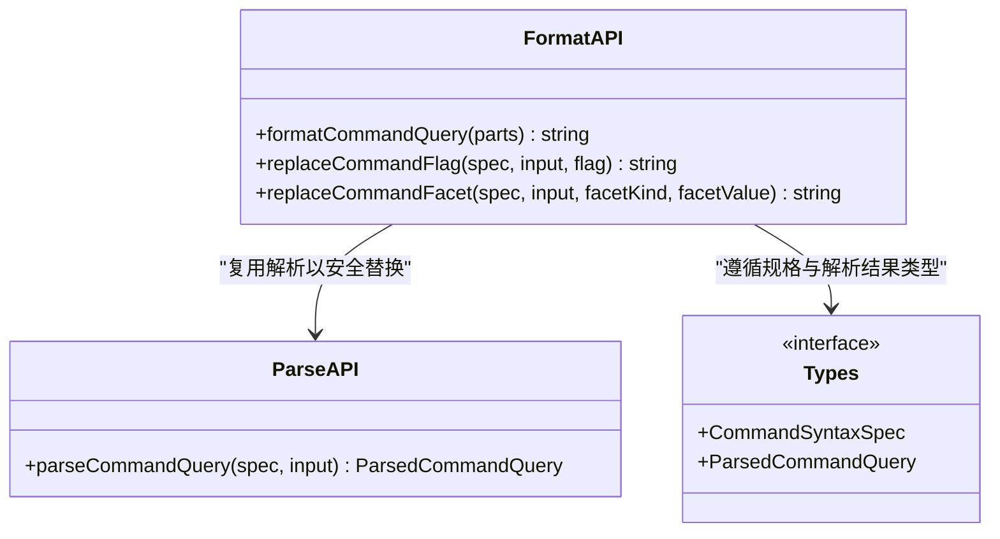
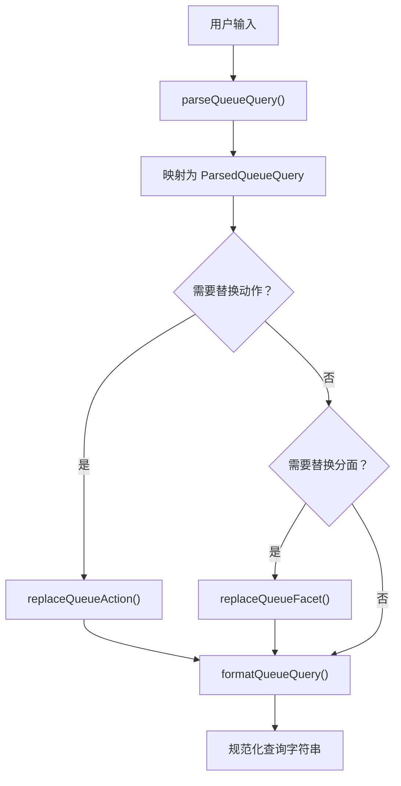
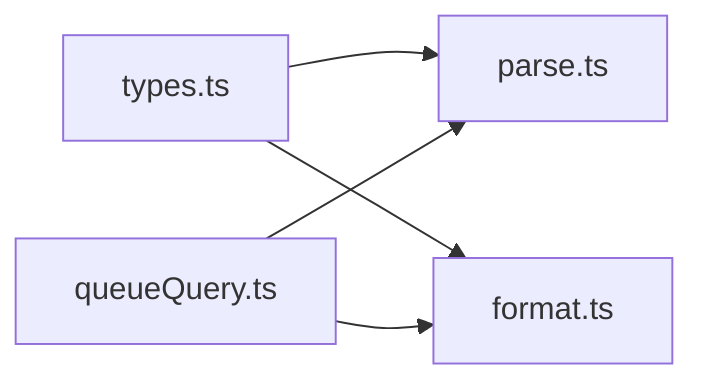
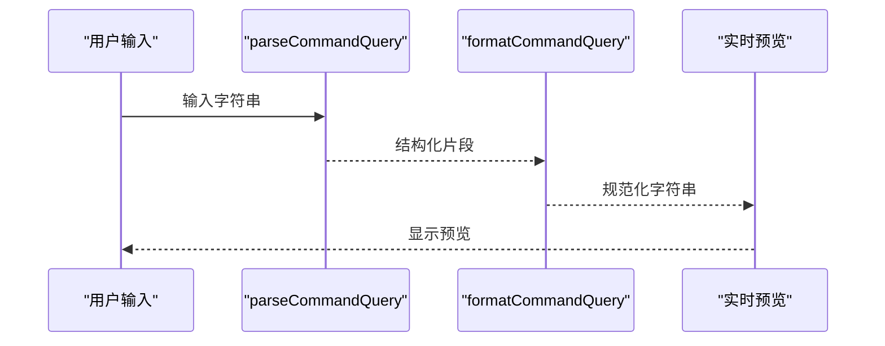

# 语法格式化器

<cite>
**本文引用的文件**   
- [format.ts](file://src/components/command-palette/syntax/format.ts)
- [parse.ts](file://src/components/command-palette/syntax/parse.ts)
- [types.ts](file://src/components/command-palette/syntax/types.ts)
- [queueQuery.ts](file://src/components/command-palette/queueQuery.ts)
- [commandSyntax.test.ts](file://test/unit/command-palette/commandSyntax.test.ts)
- [queueQuery.test.ts](file://test/unit/command-palette/queueQuery.test.ts)
</cite>

## 目录
1. [引言](#引言)
2. [项目结构](#项目结构)
3. [核心组件](#核心组件)
4. [架构总览](#架构总览)
5. [详细组件分析](#详细组件分析)
6. [依赖关系分析](#依赖关系分析)
7. [性能与可扩展性](#性能与可扩展性)
8. [可读性与风格规则](#可读性与风格规则)
9. [批量格式化与实时预览](#批量格式化与实时预览)
10. [故障排查](#故障排查)
11. [结论](#结论)

## 引言
本文件面向命令语法格式化器，聚焦于命令调色板中的“--flag @facet:value free text”语法的解析、格式化与补全。该格式化器负责：
- 将用户输入解析为结构化片段（标志位、分面、自由文本）。
- 将结构化片段重新格式化为规范化的字符串。
- 提供替换工具，用于在交互过程中稳定地改写输入，避免追加式编辑导致的重复或错位。
- 通过规格驱动的方式扩展新的命令领域，例如队列操作、网格过滤、歌词分段等。

## 项目结构
命令语法层位于命令调色板的子模块中，采用“解析 + 格式化 + 类型 + 领域封装”的分层组织：
- 通用语法层：解析、格式化、类型定义、建议生成。
- 领域封装：为具体命令（如队列）暴露更贴近业务语义的 API。

**图表来源**
- [types.ts:1-40](file://src/components/command-palette/syntax/types.ts#L1-L40)
- [parse.ts:1-97](file://src/components/command-palette/syntax/parse.ts#L1-L97)
- [format.ts:1-55](file://src/components/command-palette/syntax/format.ts#L1-L55)
- [queueQuery.ts:1-67](file://src/components/command-palette/queueQuery.ts#L1-L67)

**章节来源**
- [types.ts:1-40](file://src/components/command-palette/syntax/types.ts#L1-L40)
- [parse.ts:1-97](file://src/components/command-palette/syntax/parse.ts#L1-L97)
- [format.ts:1-55](file://src/components/command-palette/syntax/format.ts#L1-L55)
- [queueQuery.ts:1-67](file://src/components/command-palette/queueQuery.ts#L1-L67)

## 核心组件
- 类型与规格
  - CommandSyntaxSpec：声明当前命令可用的标志位和分面。
  - SyntaxFlagSpec：标志位名称、别名、描述键与回退文案。
  - SyntaxFacetSpec：分面名称。
  - ParsedCommandQuery：解析结果，包含已解析的标志位、草稿标志位、分面种类与值、草稿分面、是否裸分面、自由文本、过滤输入。
- 解析器
  - parseCommandQuery：从输入中提取标志位、分面和自由文本，支持引号转义、未匹配分面作为草稿、前缀或后缀标志位。
- 格式化器
  - formatCommandQuery：将结构化片段规范化输出，统一空格、处理分面值引号。
  - replaceCommandFlag / replaceCommandFacet：在不破坏用户已有输入的前提下替换标志位或分面。
- 领域封装
  - queueQuery.ts：为队列命令定义动作（remove/next/end）、分面（artist/album），并复用通用语法层。

**章节来源**
- [types.ts:5-39](file://src/components/command-palette/syntax/types.ts#L5-L39)
- [parse.ts:10-96](file://src/components/command-palette/syntax/parse.ts#L10-L96)
- [format.ts:8-54](file://src/components/command-palette/syntax/format.ts#L8-L54)
- [queueQuery.ts:9-67](file://src/components/command-palette/queueQuery.ts#L9-L67)

## 架构总览
命令语法层的职责边界清晰：解析器专注“从字符串到结构”，格式化器专注“从结构到字符串”，类型与规格提供契约，领域封装提供业务语义。

**图表来源**
- [queueQuery.ts:32-56](file://src/components/command-palette/queueQuery.ts#L32-L56)
- [format.ts:12-26](file://src/components/command-palette/syntax/format.ts#L12-L26)
- [parse.ts:57-96](file://src/components/command-palette/syntax/parse.ts#L57-L96)
- [types.ts:20-39](file://src/components/command-palette/syntax/types.ts#L20-L39)

## 详细组件分析

### 解析器：parse.ts
- 标志位提取
  - 支持前缀标志位（如 `--flag` 开头）和后缀标志位（如 `text --flag` 结尾）。
  - 根据规格构建别名映射，将用户输入的别名归一化为正式标志位名；若未匹配则保留草稿。
- 分面提取
  - 优先匹配显式分面（如 `@kind:"value"`），其次匹配简写分面（如 `@draft`）。
  - 支持引号包裹的值，内部可转义；若未匹配显式分面，则将 `@` 后内容视为草稿。
  - 裸 `@` 被视为空草稿分面，标记 `isBareFacet=true`。
- 自由文本处理
  - 剥离标志位与分面后剩余部分作为自由文本。
  - 对转义的 `@` 和 `-` 进行反斜杠解包，使它们成为普通搜索字符。
- 空格标准化
  - 使用统一的 `normalizeSpaces` 去除首尾空白并将连续空白压缩为单空格。

**图表来源**
- [parse.ts:31-96](file://src/components/command-palette/syntax/parse.ts#L31-L96)

**章节来源**
- [parse.ts:6-96](file://src/components/command-palette/syntax/parse.ts#L6-L96)

### 格式化器：format.ts
- 规范化输出
  - 将标志位、分面、自由文本拼接为规范字符串。
  - 自动在自由文本两端去空白并将内部连续空白压缩为单空格。
- 分面值引号策略
  - 当分面值包含空格或双引号时，使用 JSON.stringify 包装，保证可逆解析。
- 替换工具
  - replaceCommandFlag：在保留现有分面与自由文本的前提下替换标志位；若存在未解析的分面草稿，将其作为自由文本保留。
  - replaceCommandFacet：在保留标志位与自由文本的前提下替换分面；清空分面时移除整个分面片段。

**图表来源**
- [format.ts:12-54](file://src/components/command-palette/syntax/format.ts#L12-L54)
- [parse.ts:57-96](file://src/components/command-palette/syntax/parse.ts#L57-L96)
- [types.ts:20-39](file://src/components/command-palette/syntax/types.ts#L20-L39)

**章节来源**
- [format.ts:8-54](file://src/components/command-palette/syntax/format.ts#L8-L54)

### 领域封装：queueQuery.ts
- 队列语法规格
  - 标志位：remove（别名 rm/delete）、next、end。
  - 分面：artist、album。
- 类型映射
  - 将通用的 ParsedCommandQuery 映射为 ParsedQueueQuery，将 flag 重命名为 action，facets 限定为 QueueFacetKind。
- 便捷 API
  - parseQueueQuery：解析队列查询。
  - formatQueueQuery：格式化队列查询。
  - replaceQueueAction：替换动作（标志位）。
  - replaceQueueFacet：替换分面。

**图表来源**
- [queueQuery.ts:12-67](file://src/components/command-palette/queueQuery.ts#L12-L67)

**章节来源**
- [queueQuery.ts:9-67](file://src/components/command-palette/queueQuery.ts#L9-L67)

### 类型与规格：types.ts
- SyntaxFlagSpec
  - name：标志位正式名称。
  - aliases：别名列表。
  - descriptionKey/descriptionFallback：用于提示与帮助文本。
- SyntaxFacetSpec
  - name：分面名称。
- CommandSyntaxSpec
  - flags/facets：声明当前命令可用的标志位与分面集合。
- ParsedCommandQuery
  - flag/flagDraft：已解析标志位与草稿标志位。
  - facetKind/facetValue：已解析分面种类与值。
  - facetDraft/isBareFacet：草稿分面与是否裸分面。
  - text/filterInput：自由文本与过滤输入。

**章节来源**
- [types.ts:5-39](file://src/components/command-palette/syntax/types.ts#L5-L39)

## 依赖关系分析
- 低耦合高内聚
  - 通用语法层不感知队列业务，仅依赖 types 提供的契约。
  - 领域封装通过 QUEUE_SYNTAX_SPEC 注入业务语义，复用通用解析与格式化逻辑。
- 外部依赖
  - 无运行时第三方依赖；纯函数式实现，便于测试与移植。
- 潜在循环依赖
  - 当前结构无循环导入；类型定义独立，解析与格式化相互独立但共享类型。

**图表来源**
- [types.ts:1-40](file://src/components/command-palette/syntax/types.ts#L1-L40)
- [parse.ts:1-97](file://src/components/command-palette/syntax/parse.ts#L1-L97)
- [format.ts:1-55](file://src/components/command-palette/syntax/format.ts#L1-L55)
- [queueQuery.ts:1-67](file://src/components/command-palette/queueQuery.ts#L1-L67)

**章节来源**
- [types.ts:1-40](file://src/components/command-palette/syntax/types.ts#L1-L40)
- [parse.ts:1-97](file://src/components/command-palette/syntax/parse.ts#L1-L97)
- [format.ts:1-55](file://src/components/command-palette/syntax/format.ts#L1-L55)
- [queueQuery.ts:1-67](file://src/components/command-palette/queueQuery.ts#L1-L67)

## 性能与可扩展性
- 时间复杂度
  - 解析主要基于正则匹配与字符串切片，整体接近 O(n)，n 为输入长度。
  - 格式化主要为字符串拼接与 JSON.stringify，接近 O(n)。
- 空间复杂度
  - 中间对象较小，主要为解析结果与临时数组，空间开销低。
- 可扩展性
  - 新增命令只需定义 CommandSyntaxSpec，即可复用解析与格式化能力。
  - 建议补全（suggest.ts）与领域封装（如 queueQuery.ts）可并行扩展。

[本节为一般性指导，无需引用具体文件]

## 可读性与风格规则
- 自动缩进
  - 命令语法层不涉及多行缩进；所有输入均按单行处理。
- 空格标准化
  - 统一去除首尾空白并将内部连续空白压缩为单空格，确保输出一致。
- 换行处理
  - 不支持多行；如需多行输入，应在上层编辑器中进行预处理。
- 操作符间距
  - 标志位与后续内容之间、分面与自由文本之间均以单空格分隔。
- 括号与引号配对
  - 分面值若含空格或双引号，使用 JSON.stringify 包装，保证可逆解析。
- 语句分隔
  - 通过标志位与分面作为结构化分隔符，自由文本作为自然语言补充。

**章节来源**
- [format.ts:8-26](file://src/components/command-palette/syntax/format.ts#L8-L26)
- [parse.ts:6-96](file://src/components/command-palette/syntax/parse.ts#L6-L96)

## 批量格式化与实时预览
- 批量格式化
  - 可对多条命令逐一调用 formatCommandQuery 或 formatQueueQuery，得到一致的规范化输出。
  - 结合 replaceCommandFlag/replaceCommandFacet，可在批量操作中统一修正标志位与分面。
- 实时预览
  - 在用户输入时，先 parse 再 format，形成“所见即所得”的预览效果。
  - 对于未完成的分面草稿，保留为自由文本，避免打断用户输入流。

**图表来源**
- [parse.ts:57-96](file://src/components/command-palette/syntax/parse.ts#L57-L96)
- [format.ts:12-26](file://src/components/command-palette/syntax/format.ts#L12-L26)

**章节来源**
- [parse.ts:57-96](file://src/components/command-palette/syntax/parse.ts#L57-L96)
- [format.ts:12-26](file://src/components/command-palette/syntax/format.ts#L12-L26)

## 故障排查
- 常见问题
  - 标志位未识别：检查是否在规格中声明，或使用别名；未匹配时会保留草稿。
  - 分面值包含空格或引号：确保使用引号包裹，格式化器会自动处理。
  - 转义字符未生效：确认使用 `\@` 或 `\-` 表示字面量。
  - 后缀标志位位置异常：确保后缀标志位位于末尾且前后有空格。
- 单元测试参考
  - commandSyntax.test.ts：覆盖通用语法的解析、格式化、替换与补全行为。
  - queueQuery.test.ts：覆盖队列动作、分面与转义行为。

**章节来源**
- [commandSyntax.test.ts:16-76](file://test/unit/command-palette/commandSyntax.test.ts#L16-L76)
- [queueQuery.test.ts:7-55](file://test/unit/command-palette/queueQuery.test.ts#L7-L55)

## 结论
命令语法格式化器通过规格驱动的解析与格式化机制，提供了稳定、可组合的命令输入处理能力。其设计强调：
- 清晰的职责分离：解析、格式化、类型、领域封装各司其职。
- 强大的可拓展性：新增命令仅需声明规格。
- 良好的用户体验：实时预览、草稿保留、转义支持与空格标准化。

在实际使用中，建议：
- 明确声明 CommandSyntaxSpec，避免隐式行为。
- 使用 replace* 工具进行交互式改写，避免直接字符串拼接。
- 在需要复杂样式（如多行缩进）时，在上层编辑器层进行处理，保持语法层简洁。

[本节为总结性内容，无需引用具体文件]