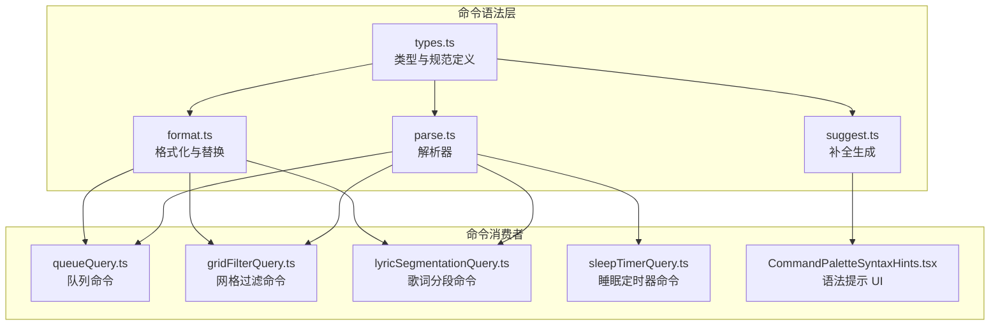
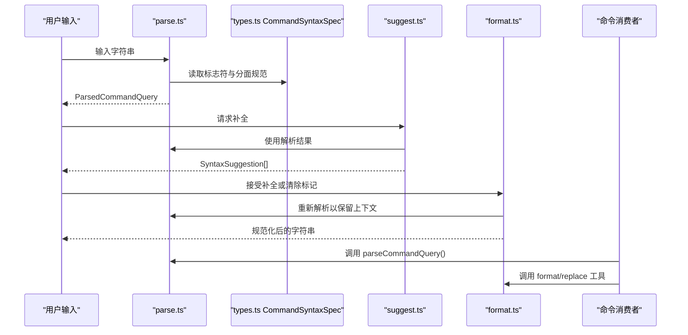
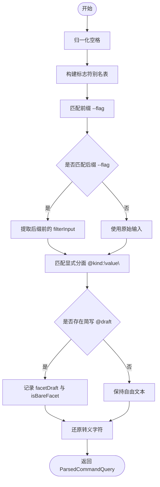
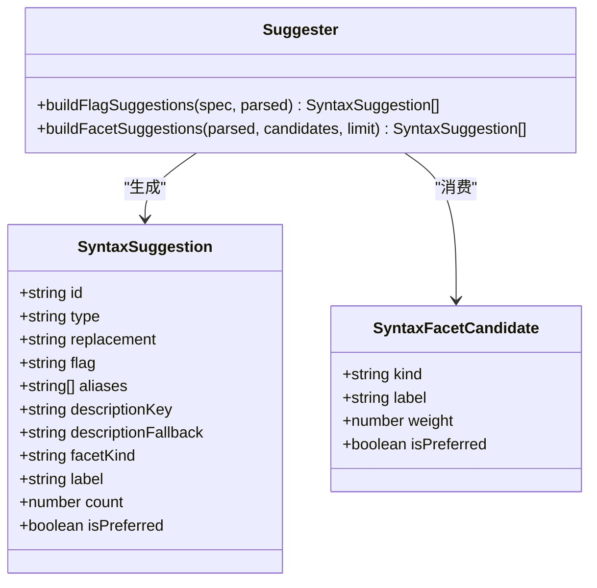
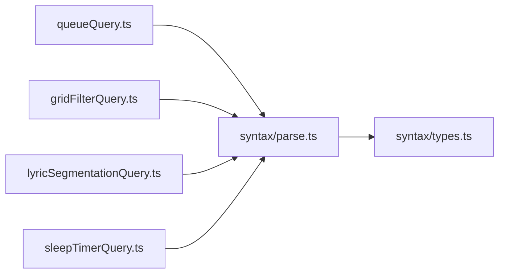
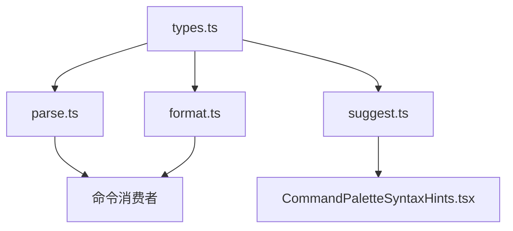
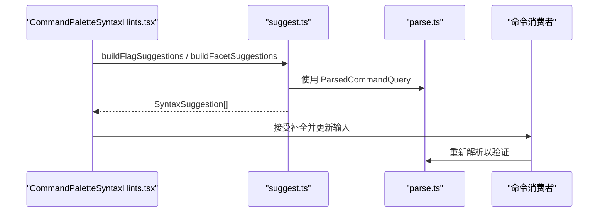

# 语法解析器

<cite>
**本文引用的文件**   
- [types.ts](file://src/components/command-palette/syntax/types.ts)
- [parse.ts](file://src/components/command-palette/syntax/parse.ts)
- [suggest.ts](file://src/components/command-palette/syntax/suggest.ts)
- [format.ts](file://src/components/command-palette/syntax/format.ts)
- [queueQuery.ts](file://src/components/command-palette/queueQuery.ts)
- [gridFilterQuery.ts](file://src/components/command-palette/gridFilterQuery.ts)
- [lyricSegmentationQuery.ts](file://src/components/command-palette/lyricSegmentationQuery.ts)
- [sleepTimerQuery.ts](file://src/components/command-palette/sleepTimerQuery.ts)
- [CommandPaletteSyntaxHints.tsx](file://src/components/command-palette/CommandPaletteSyntaxHints.tsx)
- [commandSyntax.test.ts](file://test/unit/command-palette/commandSyntax.test.ts)
</cite>

## 目录
1. [引言](#引言)
2. [项目结构](#项目结构)
3. [核心组件](#核心组件)
4. [架构总览](#架构总览)
5. [详细组件分析](#详细组件分析)
6. [依赖关系分析](#依赖关系分析)
7. [性能与复杂度](#性能与复杂度)
8. [错误处理与恢复](#错误处理与恢复)
9. [语法高亮与可读性优化](#语法高亮与可读性优化)
10. [智能提示系统](#智能提示系统)
11. [扩展点与语言服务器协议支持](#扩展点与语言服务器协议支持)
12. [调试与测试指南](#调试与测试指南)
13. [结论](#结论)

## 引言
本文面向 Folia Major 命令调色板中的“共享命令语法规则层”，目标是系统化说明其命令语法设计、词法分析、语法树构建、验证机制、格式化、智能提示以及扩展方式。该语法层为队列、网格过滤、歌词分段、睡眠定时器等多个命令提供统一的 `--flag @facet:value free text` 方言，使不同命令可以复用相同的解析、补全和格式化能力。

## 项目结构
命令语法相关代码集中在命令调色板的 `syntax` 子模块中，并由多个具体命令消费：

**图表来源**
- [types.ts:1-40](file://src/components/command-palette/syntax/types.ts#L1-L40)
- [parse.ts:1-97](file://src/components/command-palette/syntax/parse.ts#L1-L97)
- [suggest.ts:1-113](file://src/components/command-palette/syntax/suggest.ts#L1-L113)
- [format.ts:1-55](file://src/components/command-palette/syntax/format.ts#L1-L55)
- [queueQuery.ts:1-67](file://src/components/command-palette/queueQuery.ts#L1-L67)
- [gridFilterQuery.ts:1-84](file://src/components/command-palette/gridFilterQuery.ts#L1-L84)
- [lyricSegmentationQuery.ts:1-52](file://src/components/command-palette/lyricSegmentationQuery.ts#L1-L52)
- [sleepTimerQuery.ts:1-38](file://src/components/command-palette/sleepTimerQuery.ts#L1-L38)
- [CommandPaletteSyntaxHints.tsx:1-34](file://src/components/command-palette/CommandPaletteSyntaxHints.tsx#L1-L34)

**章节来源**
- [types.ts:1-40](file://src/components/command-palette/syntax/types.ts#L1-L40)
- [parse.ts:1-97](file://src/components/command-palette/syntax/parse.ts#L1-L97)
- [suggest.ts:1-113](file://src/components/command-palette/syntax/suggest.ts#L1-L113)
- [format.ts:1-55](file://src/components/command-palette/syntax/format.ts#L1-L55)
- [queueQuery.ts:1-67](file://src/components/command-palette/queueQuery.ts#L1-L67)
- [gridFilterQuery.ts:1-84](file://src/components/command-palette/gridFilterQuery.ts#L1-L84)
- [lyricSegmentationQuery.ts:1-52](file://src/components/command-palette/lyricSegmentationQuery.ts#L1-L52)
- [sleepTimerQuery.ts:1-38](file://src/components/command-palette/sleepTimerQuery.ts#L1-L38)
- [CommandPaletteSyntaxHints.tsx:1-34](file://src/components/command-palette/CommandPaletteSyntaxHints.tsx#L1-L34)

## 核心组件
- 类型与规范定义：描述标志符、分面（facet）和解析结果的结构。
- 解析器：将用户输入拆分为标志符、分面和自由文本，并处理转义与引号。
- 补全生成：基于规范和候选值生成标志符与分面的智能提示。
- 格式化与替换：将解析结果重新格式化为字符串，并提供替换标志符或分面的工具函数。
- 命令消费者：队列、网格过滤、歌词分段、睡眠定时器等命令各自声明自己的标志符与分面，并复用通用解析逻辑。

**章节来源**
- [types.ts:5-39](file://src/components/command-palette/syntax/types.ts#L5-L39)
- [parse.ts:10-96](file://src/components/command-palette/syntax/parse.ts#L10-L96)
- [suggest.ts:9-112](file://src/components/command-palette/syntax/suggest.ts#L9-L112)
- [format.ts:12-54](file://src/components/command-palette/syntax/format.ts#L12-L54)

## 架构总览
命令语法层采用“规范驱动”的设计：每个命令通过 `CommandSyntaxSpec` 声明可用的标志符与分面，解析器据此工作，不关心业务语义；补全器根据解析状态与外部候选值生成建议；格式化器负责将结构化结果写回字符串，保证接受补全后不会重复拼接。

**图表来源**
- [parse.ts:57-96](file://src/components/command-palette/syntax/parse.ts#L57-L96)
- [suggest.ts:43-112](file://src/components/command-palette/syntax/suggest.ts#L43-L112)
- [format.ts:12-54](file://src/components/command-palette/syntax/format.ts#L12-L54)
- [queueQuery.ts:32-66](file://src/components/command-palette/queueQuery.ts#L32-L66)

## 详细组件分析

### 类型与规范定义
- `SyntaxFlagSpec`：标志符的名称、别名与描述键/后备文案。
- `SyntaxFacetSpec`：分面名称，用于限定 `@kind:value` 的合法种类。
- `CommandSyntaxSpec`：命令可使用的标志符列表与分面列表。
- `ParsedCommandQuery`：解析结果，包括已解析的标志符、未解析的标志符草稿、分面种类与值、分面草稿、是否裸分面、自由文本与过滤输入。

这些类型确保解析器、补全器和格式化器对同一数据结构达成一致，避免命令消费者各自实现不同的内部表示。

**章节来源**
- [types.ts:5-39](file://src/components/command-palette/syntax/types.ts#L5-L39)

### 解析器：词法分析与令牌化
解析器将输入划分为三类内容：
- 标志符：以 `--` 开头，支持别名，允许出现在输入前缀或后缀位置。
- 分面：以 `@` 开头，支持显式 `@kind:"value"` 或简写 `@draft`。
- 自由文本：去除标志符与分面后的剩余部分，并进行空格归一化与转义还原。

关键行为：
- 标志符别名映射：从规范构建大小写不敏感的别名表，将用户输入的原始标志符解析为规范名称。
- 引号值解析：优先尝试 JSON 解析，失败时退回手动转义处理，支持 `\"` 与 `\\`。
- 转义处理：`\@` 与 `\ -` 等被识别为字面量，避免误判为分面或特殊字符。
- 裸分面：仅输入 `@` 被视为空分面草稿，便于触发补全。
- 未知分面名：若分面名不在规范中，整体作为分面草稿而非显式分面。

**图表来源**
- [parse.ts:10-96](file://src/components/command-palette/syntax/parse.ts#L10-L96)

**章节来源**
- [parse.ts:6-96](file://src/components/command-palette/syntax/parse.ts#L6-L96)

### 补全生成：智能提示系统
补全器提供两类建议：
- 标志符补全：当存在未解析的标志符草稿时，按规范过滤并生成替换字符串。
- 分面补全：当存在分面草稿时，结合外部候选值进行排序与筛选，支持“首选项优先”、“前缀匹配优先”和“权重排序”。

重要特性：
- 未解析的分面草稿在应用标志符时仍作为自由文本保留，避免破坏用户已输入的内容。
- 精确匹配的分面不再产生补全，减少冗余提示。
- 补全结果包含 `replacement`，可直接替换当前输入，避免重复拼接。

**图表来源**
- [suggest.ts:9-32](file://src/components/command-palette/syntax/suggest.ts#L9-L32)
- [suggest.ts:43-112](file://src/components/command-palette/syntax/suggest.ts#L43-L112)

**章节来源**
- [suggest.ts:34-112](file://src/components/command-palette/syntax/suggest.ts#L34-L112)

### 格式化与替换
格式化器负责：
- 将结构化查询对象序列化为字符串，自动处理空格与引号。
- 提供替换标志符与分面的工具函数，确保接受补全后输入保持一致且无重复。

关键点：
- 含空格或引号的值会被 JSON 序列化，保证可逆。
- 替换标志符时会保留未解析的分面草稿，避免丢失用户输入。
- 替换分面时会移除旧分面并插入新分面，同时保留自由文本。

**章节来源**
- [format.ts:8-54](file://src/components/command-palette/syntax/format.ts#L8-L54)

### 命令消费者：队列、网格过滤、歌词分段、睡眠定时器
各命令通过 `CommandSyntaxSpec` 声明自身语法，并复用通用解析与格式化能力：

- 队列命令：支持 `remove`、`next`、`end` 标志符，以及 `artist`、`album` 分面。
- 网格过滤命令：支持 `play`、`add` 标志符，无分面；提供上下文感知的动作解析与可用性判断。
- 歌词分段命令：支持 `ai`、`copy-seg`、`copy-prompt` 标志符，无分面；提供粘贴检测辅助。
- 睡眠定时器命令：支持 `on`、`off` 标志符，无分面；提供额外业务校验与错误码。

**图表来源**
- [queueQuery.ts:12-19](file://src/components/command-palette/queueQuery.ts#L12-L19)
- [gridFilterQuery.ts:14-32](file://src/components/command-palette/gridFilterQuery.ts#L14-L32)
- [lyricSegmentationQuery.ts:11-18](file://src/components/command-palette/lyricSegmentationQuery.ts#L11-L18)
- [sleepTimerQuery.ts:10-16](file://src/components/command-palette/sleepTimerQuery.ts#L10-L16)

**章节来源**
- [queueQuery.ts:12-66](file://src/components/command-palette/queueQuery.ts#L12-L66)
- [gridFilterQuery.ts:14-84](file://src/components/command-palette/gridFilterQuery.ts#L14-L84)
- [lyricSegmentationQuery.ts:11-52](file://src/components/command-palette/lyricSegmentationQuery.ts#L11-L52)
- [sleepTimerQuery.ts:10-38](file://src/components/command-palette/sleepTimerQuery.ts#L10-L38)

## 依赖关系分析
- 低耦合：解析器不依赖任何命令的业务逻辑，只依赖规范类型。
- 高内聚：补全器与格式化器围绕同一解析结果协作，避免状态不一致。
- 可扩展：新增命令只需声明 `CommandSyntaxSpec`，无需修改解析器。
- 外部依赖：UI 层通过 `CommandPaletteSyntaxHints.tsx` 消费补全结果，展示语法提示条。

**图表来源**
- [types.ts:1-40](file://src/components/command-palette/syntax/types.ts#L1-L40)
- [parse.ts:1-97](file://src/components/command-palette/syntax/parse.ts#L1-L97)
- [suggest.ts:1-113](file://src/components/command-palette/syntax/suggest.ts#L1-L113)
- [format.ts:1-55](file://src/components/command-palette/syntax/format.ts#L1-L55)
- [CommandPaletteSyntaxHints.tsx:1-34](file://src/components/command-palette/CommandPaletteSyntaxHints.tsx#L1-L34)

**章节来源**
- [types.ts:1-40](file://src/components/command-palette/syntax/types.ts#L1-L40)
- [parse.ts:1-97](file://src/components/command-palette/syntax/parse.ts#L1-L97)
- [suggest.ts:1-113](file://src/components/command-palette/syntax/suggest.ts#L1-L113)
- [format.ts:1-55](file://src/components/command-palette/syntax/format.ts#L1-L55)
- [CommandPaletteSyntaxHints.tsx:1-34](file://src/components/command-palette/CommandPaletteSyntaxHints.tsx#L1-L34)

## 性能与复杂度
- 标志符别名构建：O(F)，F 为标志符数量。
- 正则匹配：每次解析执行若干次正则匹配，时间复杂度近似 O(N)，N 为输入长度。
- 补全排序：分面候选排序 O(K log K)，K 为候选数量，默认限制为 6。
- 格式化：线性扫描与字符串拼接，O(M)，M 为输出长度。

优化建议：
- 对于高频补全场景，可缓存候选集并按 `kind` 分组，减少过滤开销。
- 对长输入可进行增量解析，避免每次完整重算。
- 正则表达式可预编译并复用，减少重复创建成本。

[本节为一般性指导，不涉及具体文件分析]

## 错误处理与恢复
- 未解析标志符：保留 `flagDraft`，供补全器继续提示。
- 未知分面名：整体作为 `facetDraft`，不视为有效分面。
- 引号解析失败：退回手动转义处理，避免崩溃。
- 命令级校验：例如睡眠定时器命令会返回错误码，指示参数缺失、冲突或范围越界。

这些策略确保用户在输入过程中始终获得渐进式反馈，而不是立即报错。

**章节来源**
- [parse.ts:19-29](file://src/components/command-palette/syntax/parse.ts#L19-L29)
- [parse.ts:61-84](file://src/components/command-palette/syntax/parse.ts#L61-L84)
- [sleepTimerQuery.ts:18-38](file://src/components/command-palette/sleepTimerQuery.ts#L18-L38)

## 语法高亮与可读性优化
- 语法高亮：当前仓库未提供专门的语法高亮引擎；可通过补全结果与解析结果推断 token 边界，由 UI 层渲染不同样式。
- 可读性优化：
  - 空格归一化：避免多余空白影响显示与比较。
  - 引号自动添加：格式化时对含空格或引号的值进行 JSON 序列化，提升可读性与可逆性。
  - 转义还原：`\@` 与 `\ -` 等字面量在最终文本中被还原，提高自然阅读体验。

**章节来源**
- [format.ts:8-26](file://src/components/command-palette/syntax/format.ts#L8-L26)
- [parse.ts:93-94](file://src/components/command-palette/syntax/parse.ts#L93-L94)

## 智能提示系统
- 标志符补全：基于规范过滤，支持别名前缀匹配。
- 分面补全：基于候选值排序，支持首选项、前缀匹配与权重。
- 上下文感知：网格过滤命令根据当前作用域决定是否可用；队列命令根据业务数据提供候选。
- 实时语法检查：通过解析结果暴露 `flagDraft`、`facetDraft`、`isBareFacet`，UI 可即时提示未完成状态。

**图表来源**
- [CommandPaletteSyntaxHints.tsx:1-34](file://src/components/command-palette/CommandPaletteSyntaxHints.tsx#L1-L34)
- [suggest.ts:43-112](file://src/components/command-palette/syntax/suggest.ts#L43-L112)
- [parse.ts:57-96](file://src/components/command-palette/syntax/parse.ts#L57-L96)

**章节来源**
- [CommandPaletteSyntaxHints.tsx:1-34](file://src/components/command-palette/CommandPaletteSyntaxHints.tsx#L1-L34)
- [suggest.ts:34-112](file://src/components/command-palette/syntax/suggest.ts#L34-L112)

## 扩展点与语言服务器协议支持
- 扩展点：
  - 新增命令：声明 `CommandSyntaxSpec`，并在命令处理器中调用 `parseCommandQuery` 与格式化函数。
  - 新增分面候选：在命令侧维护候选集，传入 `buildFacetSuggestions`。
  - 自定义补全规则：可在命令侧包装 `SyntaxSuggestion`，增加业务标签或优先级。
- 语言服务器协议（LSP）支持：
  - 当前仓库未直接实现 LSP；但解析结果与补全结构可作为 LSP 的 `CompletionItem`、`Diagnostic` 与 `Hover` 数据源。
  - 可将 `ParsedCommandQuery` 映射为 LSP 诊断，将 `SyntaxSuggestion` 映射为补全项。

[本节为概念性说明，不涉及具体文件分析]

## 调试与测试指南
- 单元测试覆盖：
  - 解析：前缀/后缀标志符、引号分面、转义、裸分面、未知分面名。
  - 格式化：往返一致性、标志符替换、分面替换。
  - 补全：标志符过滤、分面排序、精确匹配抑制。
- 调试技巧：
  - 打印 `ParsedCommandQuery` 以确认标志符与分面是否正确分离。
  - 检查 `flagDraft` 与 `facetDraft` 以确定补全触发条件。
  - 使用格式化函数验证输入是否可逆。

**章节来源**
- [commandSyntax.test.ts:16-76](file://test/unit/command-palette/commandSyntax.test.ts#L16-L76)

## 结论
Folia Major 的命令语法解析器通过规范驱动的解析、补全与格式化，实现了跨命令的语法一致性。其设计强调可扩展性与用户体验：用户输入过程中的未完成状态得到友好反馈，补全结果可直接替换输入，格式化保证可读性与可逆性。未来可在 LSP 集成、增量解析与高亮渲染方面进一步扩展，以提升开发者与用户的效率与体验。