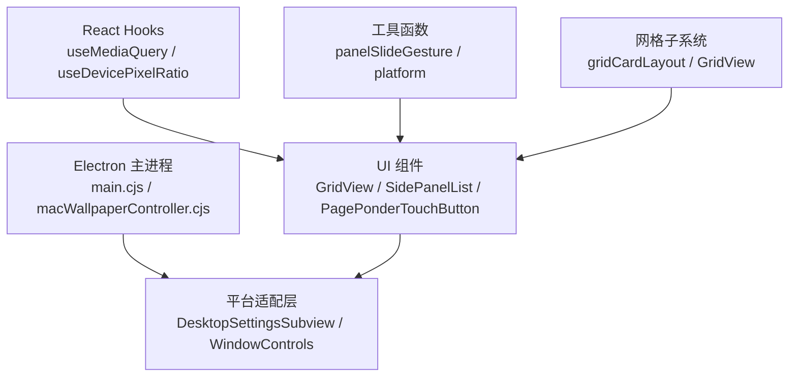
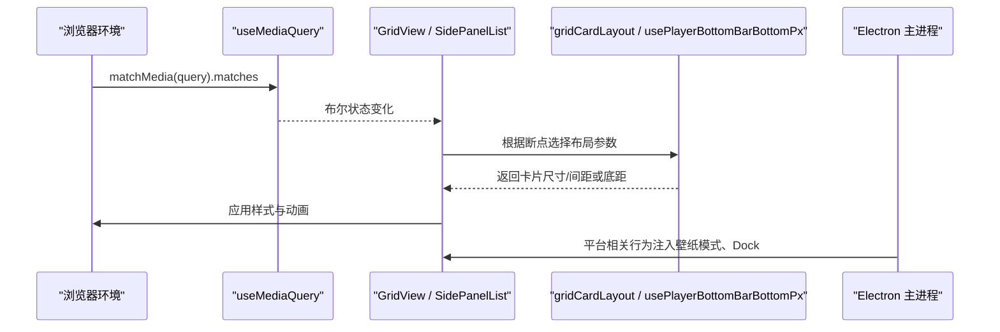
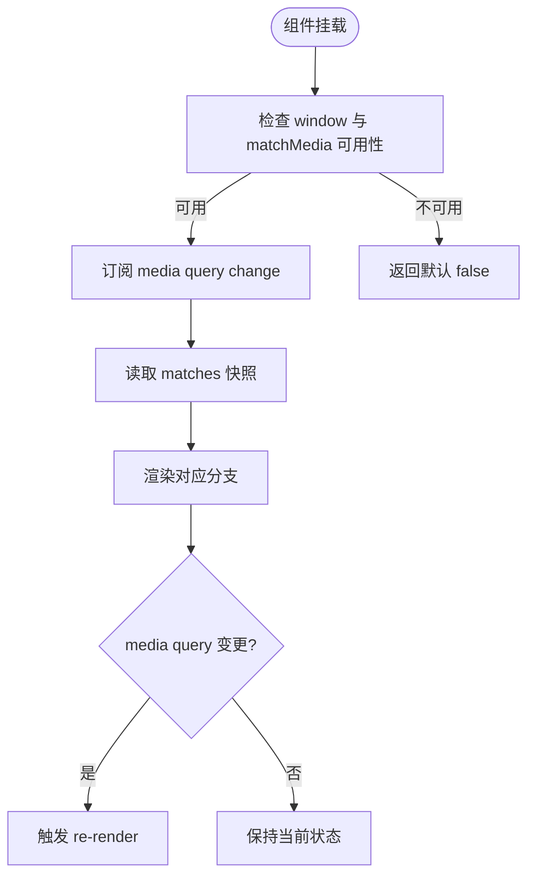
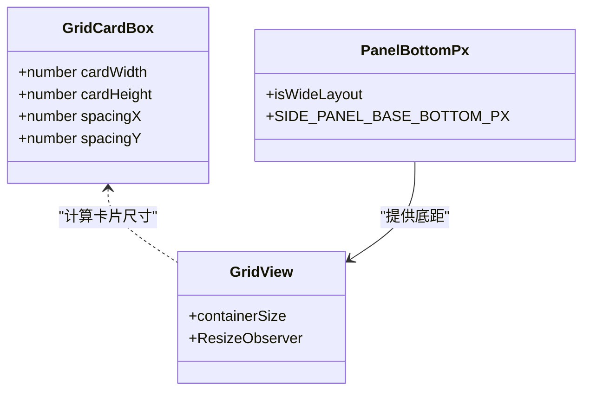
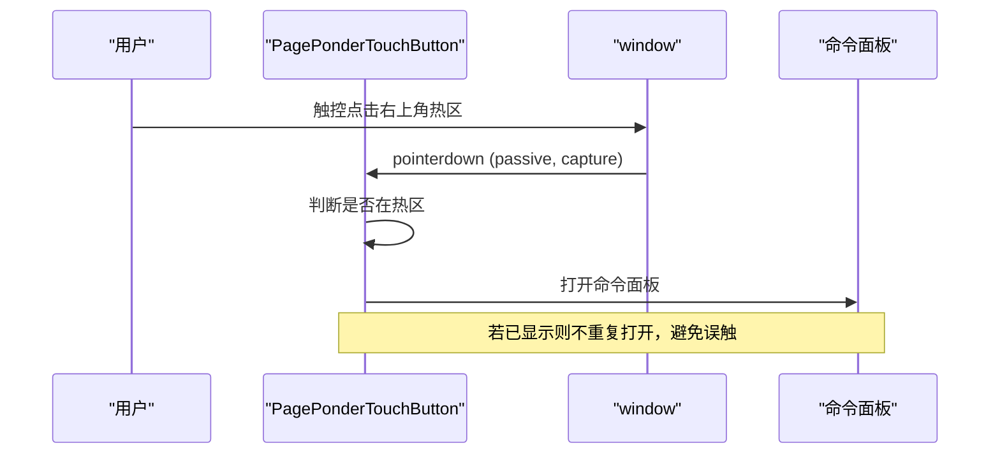
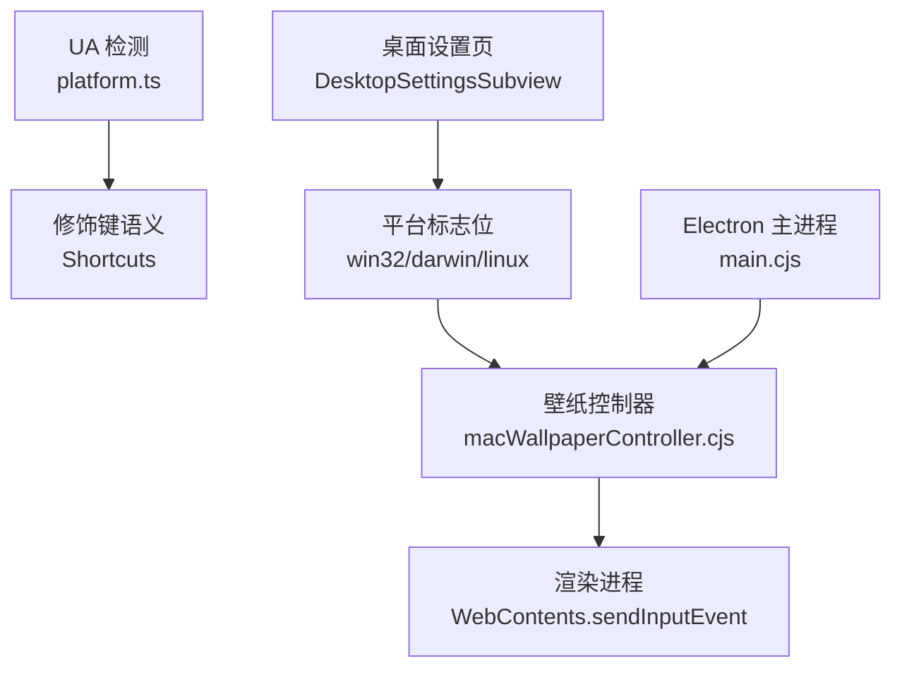
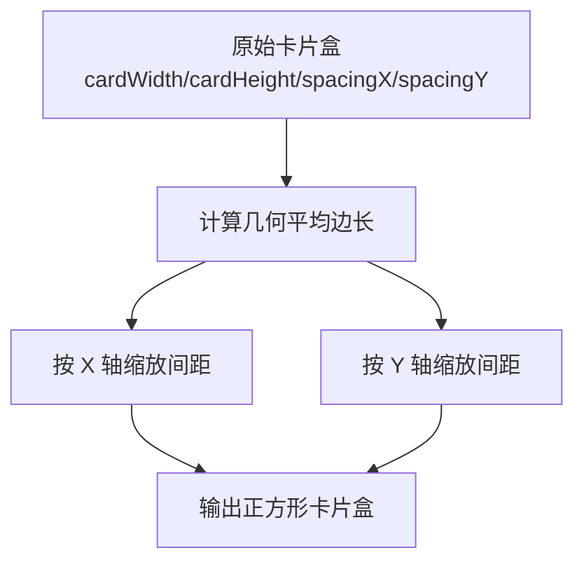
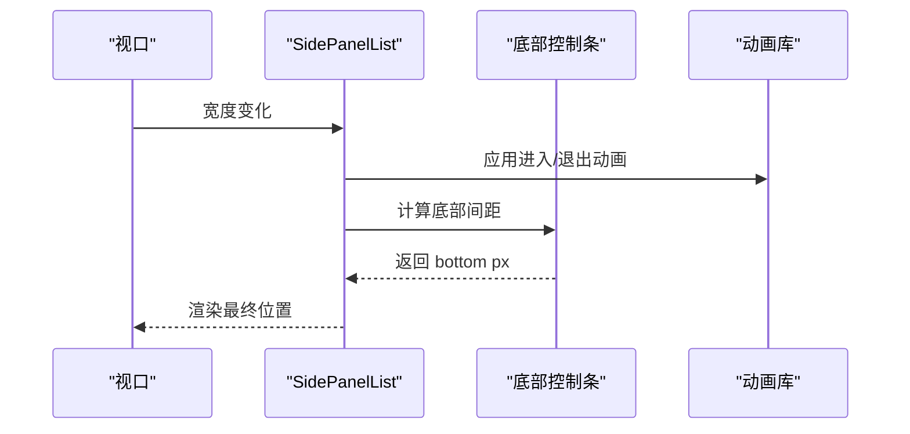
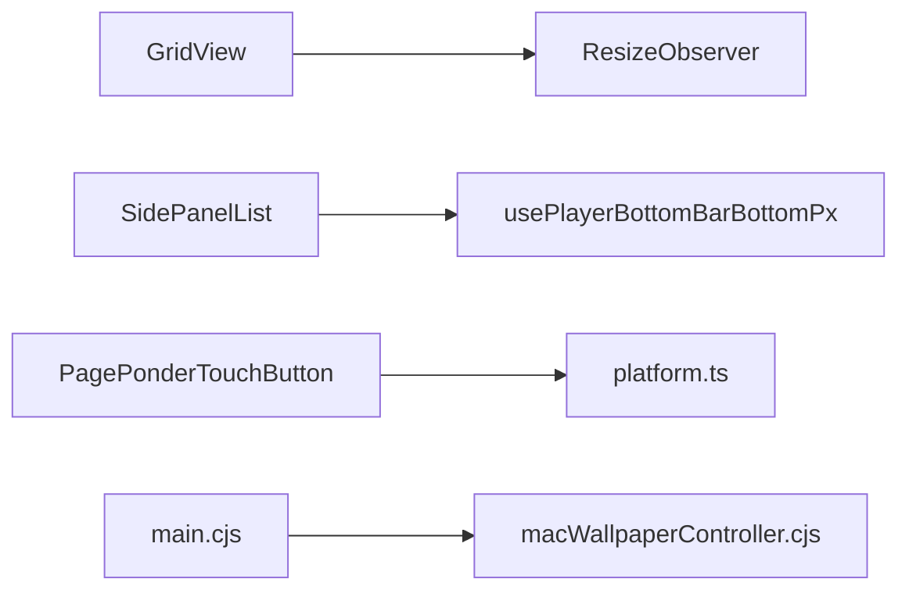

# 响应式设计系统

<cite>
**本文引用的文件**   
- [useMediaQuery.ts](file://src/hooks/useMediaQuery.ts)
- [gridCardLayout.ts](file://src/components/folia-grid/gridCardLayout.ts)
- [gridCardLayout.test.ts](file://test/unit/gridView/gridCardLayout.test.ts)
- [GridView.tsx](file://src/components/GridView.tsx)
- [panelSlideGesture.ts](file://src/utils/panelSlideGesture.ts)
- [usePlayerBottomBarBottomPx.ts](file://src/hooks/usePlayerBottomBarBottomPx.ts)
- [SidePanelList.tsx](file://src/components/shared/SidePanelList.tsx)
- [PagePonderTouchButton.tsx](file://src/components/ponder/PagePonderTouchButton.tsx)
- [platform.ts](file://src/utils/platform.ts)
- [DesktopSettingsSubview.tsx](file://src/components/modal/settings/DesktopSettingsSubview.tsx)
- [macWallpaperController.cjs](file://electron/macWallpaperController.cjs)
- [main.cjs](file://electron/main.cjs)
- [lattice.spec.ts](file://test/component/lattice.spec.ts)
</cite>

## 目录
1. [引言](#引言)
2. [项目结构](#项目结构)
3. [核心组件](#核心组件)
4. [架构总览](#架构总览)
5. [详细组件分析](#详细组件分析)
6. [依赖关系分析](#依赖关系分析)
7. [性能与兼容性](#性能与兼容性)
8. [故障排查指南](#故障排查指南)
9. [结论](#结论)

## 引言
本文件面向 Folia Major 的响应式设计系统，聚焦以下目标：
- 媒体查询机制与 useMediaQuery hook 的实现原理、使用方式。
- 多分辨率适配策略：断点定义、布局切换、元素缩放。
- 触摸交互支持：手势识别、触摸事件处理与移动端优化。
- 平台特定适配：Windows、macOS、Linux 差异与 Electron 集成。
- 网格系统：FoliaGrid 自适应布局与卡片排列算法。
- 面板系统：侧边栏折叠、工具栏自适应与内容重排。
- 性能优化技巧与跨浏览器兼容性处理。

## 项目结构
响应式能力在仓库中分散于 React hooks、组件、工具函数与 Electron 主进程模块：
- 媒体查询与像素密度：`src/hooks/useMediaQuery.ts`
- 网格卡片布局算法：`src/components/folia-grid/gridCardLayout.ts`
- 网格视图容器尺寸监听：`src/components/GridView.tsx`
- 面板滑动手势常量：`src/utils/panelSlideGesture.ts`
- 面板底部间距计算：`src/hooks/usePlayerBottomBarBottomPx.ts`
- 侧边面板列表渲染：`src/components/shared/SidePanelList.tsx`
- 触屏入口按钮：`src/components/ponder/PagePonderTouchButton.tsx`
- 平台检测与修饰键语义：`src/utils/platform.ts`
- 桌面设置页平台分支：`src/components/modal/settings/DesktopSettingsSubview.tsx`
- macOS 壁纸模式控制器：`electron/macWallpaperController.cjs`
- Electron 主进程入口：`electron/main.cjs`

**图表来源**
- [useMediaQuery.ts:1-62](file://src/hooks/useMediaQuery.ts#L1-L62)
- [gridCardLayout.ts:1-32](file://src/components/folia-grid/gridCardLayout.ts#L1-L32)
- [GridView.tsx:290-326](file://src/components/GridView.tsx#L290-L326)
- [panelSlideGesture.ts:1-18](file://src/utils/panelSlideGesture.ts#L1-L18)
- [platform.ts:1-24](file://src/utils/platform.ts#L1-L24)
- [macWallpaperController.cjs:1-21](file://electron/macWallpaperController.cjs#L1-L21)
- [main.cjs:1-19](file://electron/main.cjs#L1-L19)

**章节来源**
- [useMediaQuery.ts:1-62](file://src/hooks/useMediaQuery.ts#L1-L62)
- [gridCardLayout.ts:1-32](file://src/components/folia-grid/gridCardLayout.ts#L1-L32)
- [GridView.tsx:290-326](file://src/components/GridView.tsx#L290-L326)
- [panelSlideGesture.ts:1-18](file://src/utils/panelSlideGesture.ts#L1-L18)
- [platform.ts:1-24](file://src/utils/platform.ts#L1-L24)
- [macWallpaperController.cjs:1-21](file://electron/macWallpaperController.cjs#L1-L21)
- [main.cjs:1-19](file://electron/main.cjs#L1-L19)

## 核心组件
- 媒体查询 Hook：提供基于 `matchMedia` 的响应式状态订阅，避免首帧闪烁，并附带设备像素密度 Hook。
- 网格卡片布局：提供等面积正方形化算法，保持网格密度与间距比例不变。
- 网格视图容器：通过 ResizeObserver 动态获取容器宽高，驱动卡片尺寸与布局。
- 面板滑动手势：集中定义滑动手势几何常量，保证 UI 与教程脚本一致。
- 面板底部间距：统一窄宽布局下的底距断点值，避免多处散落导致漂移。
- 平台检测：以 UA 判定 Mac，并提供修饰键语义与标签，确保快捷键提示一致。
- 桌面设置页：在 Electron 环境下按平台显示不同选项（如壁纸模式、Dock 自动隐藏）。
- macOS 壁纸控制器：原生层窗口层级、事件监听与 Dock 管理，fail-safe 设计。

**章节来源**
- [useMediaQuery.ts:1-62](file://src/hooks/useMediaQuery.ts#L1-L62)
- [gridCardLayout.ts:1-32](file://src/components/folia-grid/gridCardLayout.ts#L1-L32)
- [GridView.tsx:290-326](file://src/components/GridView.tsx#L290-L326)
- [panelSlideGesture.ts:1-18](file://src/utils/panelSlideGesture.ts#L1-L18)
- [usePlayerBottomBarBottomPx.ts:29-46](file://src/hooks/usePlayerBottomBarBottomPx.ts#L29-L46)
- [platform.ts:1-24](file://src/utils/platform.ts#L1-L24)
- [DesktopSettingsSubview.tsx:95-141](file://src/components/modal/settings/DesktopSettingsSubview.tsx#L95-L141)
- [macWallpaperController.cjs:1-21](file://electron/macWallpaperController.cjs#L1-L21)

## 架构总览
响应式系统由三层构成：
- 数据与状态层：媒体查询、设备像素密度、容器尺寸、平台信息。
- 布局与算法层：网格卡片布局算法、面板底部间距计算、手势几何常量。
- 表现与交互层：GridView、SidePanelList、PagePonderTouchButton、桌面设置页、Electron 主进程。

**图表来源**
- [useMediaQuery.ts:13-32](file://src/hooks/useMediaQuery.ts#L13-L32)
- [gridCardLayout.ts:23-31](file://src/components/folia-grid/gridCardLayout.ts#L23-L31)
- [usePlayerBottomBarBottomPx.ts:38-42](file://src/hooks/usePlayerBottomBarBottomPx.ts#L38-L42)
- [macWallpaperController.cjs:1-21](file://electron/macWallpaperController.cjs#L1-L21)

## 详细组件分析

### 媒体查询机制与 useMediaQuery
- 实现要点：
  - 使用 `useSyncExternalStore` 直接读取 `matchMedia` 快照，避免首次渲染错误分支导致的视觉闪烁。
  - 订阅 `change` 事件，在视口变化时触发更新。
  - 对服务端或无 window 环境做安全回退，返回默认值。
- 设备像素密度：
  - 通过 `(resolution: ${ratio}dppx)` 媒体查询监听 DPI 变化，拖动到不同显示器时能重新选择合适资源。
- 使用建议：
  - 将断点查询封装为字符串常量，便于维护。
  - 在布局分支处直接使用返回值，避免手动监听 resize。

**图表来源**
- [useMediaQuery.ts:13-32](file://src/hooks/useMediaQuery.ts#L13-L32)
- [useMediaQuery.ts:48-59](file://src/hooks/useMediaQuery.ts#L48-L59)

**章节来源**
- [useMediaQuery.ts:1-62](file://src/hooks/useMediaQuery.ts#L1-L62)

### 多分辨率适配策略
- 断点定义：
  - 网格卡片测试用例定义了四档断点，从小到大递增卡片宽高与间距，用于验证等面积正方形化算法。
- 布局切换：
  - GridView 通过 ResizeObserver 监听容器尺寸变化，动态更新容器宽高，从而驱动卡片尺寸与布局。
- 元素缩放：
  - gridCardLayout 的等面积正方形化算法通过几何平均数计算新边长，并按轴缩放间距，保持网格密度不变。
  - 面板底部间距通过断点选择不同 base bottom px，避免在不同宽度下出现遮挡。

**图表来源**
- [gridCardLayout.ts:5-10](file://src/components/folia-grid/gridCardLayout.ts#L5-L10)
- [gridCardLayout.ts:23-31](file://src/components/folia-grid/gridCardLayout.ts#L23-L31)
- [GridView.tsx:290-326](file://src/components/GridView.tsx#L290-L326)
- [usePlayerBottomBarBottomPx.ts:29-42](file://src/hooks/usePlayerBottomBarBottomPx.ts#L29-L42)

**章节来源**
- [gridCardLayout.test.ts:10-15](file://test/unit/gridView/gridCardLayout.test.ts#L10-L15)
- [gridCardLayout.ts:12-31](file://src/components/folia-grid/gridCardLayout.ts#L12-L31)
- [GridView.tsx:290-326](file://src/components/GridView.tsx#L290-L326)
- [usePlayerBottomBarBottomPx.ts:29-42](file://src/hooks/usePlayerBottomBarBottomPx.ts#L29-L42)

### 触摸交互支持与移动端优化
- 手势识别：
  - 侧边面板滑动手势常量集中在 `panelSlideGesture.ts`，包括夹紧上限、触发阈值、滑轨常态与展开宽度。
  - 测试覆盖触摸滑动惯性（coast）与次要指针不替换手势的行为。
- 触摸事件处理：
  - PagePonderTouchButton 在触屏上提供右上角热区入口，使用 passive 监听与坐标判断避免遮挡。
  - 通过 `pointerdown` 捕获触控输入，结合悬停与点击抑制逻辑提升体验。
- 移动端优化：
  - 使用 `useSupportsFinePointer` 区分精细指针与非精细指针，仅在粗指针设备上展示触控入口。
  - 面板与悬浮控件采用动效降级策略，减少低端设备负担。

**图表来源**
- [PagePonderTouchButton.tsx:82-109](file://src/components/ponder/PagePonderTouchButton.tsx#L82-L109)
- [panelSlideGesture.ts:8-18](file://src/utils/panelSlideGesture.ts#L8-L18)
- [lattice.spec.ts:155-174](file://test/component/lattice.spec.ts#L155-L174)

**章节来源**
- [panelSlideGesture.ts:1-18](file://src/utils/panelSlideGesture.ts#L1-L18)
- [PagePonderTouchButton.tsx:1-113](file://src/components/ponder/PagePonderTouchButton.tsx#L1-L113)
- [lattice.spec.ts:155-174](file://test/component/lattice.spec.ts#L155-L174)

### 平台特定适配与 Electron 集成
- 平台检测：
  - 通过 UA 判定 Mac，提供修饰键语义与标签，确保快捷键提示一致。
- 桌面设置页：
  - 在 Electron 环境下按平台显示不同选项（如壁纸模式、Dock 自动隐藏），并调用相应控制逻辑。
- macOS 壁纸控制器：
  - 使用 FFI 操作 NSWindow 层级与 collection behavior，监听全局鼠标事件并转发至渲染进程。
  - 所有 FFI 入口 fail-safe，失败时返回 no-op，避免崩溃。
- Electron 主进程：
  - 引入各平台壁纸控制器与模块，统一管理生命周期与 IPC。

**图表来源**
- [platform.ts:1-24](file://src/utils/platform.ts#L1-L24)
- [DesktopSettingsSubview.tsx:122-124](file://src/components/modal/settings/DesktopSettingsSubview.tsx#L122-L124)
- [macWallpaperController.cjs:1-21](file://electron/macWallpaperController.cjs#L1-L21)
- [main.cjs:1-19](file://electron/main.cjs#L1-L19)

**章节来源**
- [platform.ts:1-24](file://src/utils/platform.ts#L1-L24)
- [DesktopSettingsSubview.tsx:95-141](file://src/components/modal/settings/DesktopSettingsSubview.tsx#L95-L141)
- [macWallpaperController.cjs:1-21](file://electron/macWallpaperController.cjs#L1-L21)
- [main.cjs:1-19](file://electron/main.cjs#L1-L19)

### 网格系统的实现：FoliaGrid 自适应布局与卡片排列算法
- 自适应布局：
  - GridView 通过 ResizeObserver 监听容器尺寸变化，动态更新容器宽高，驱动卡片尺寸与布局。
- 卡片排列算法：
  - gridCardLayout 提供等面积正方形化算法，保持网格密度与间距比例不变，适用于“方形卡片”选项。
  - 测试用例验证了各断点下卡片与单元格面积的稳定性，以及行重叠与列间隙符号的正确性。

**图表来源**
- [gridCardLayout.ts:23-31](file://src/components/folia-grid/gridCardLayout.ts#L23-L31)
- [gridCardLayout.test.ts:20-56](file://test/unit/gridView/gridCardLayout.test.ts#L20-L56)

**章节来源**
- [gridCardLayout.ts:1-32](file://src/components/folia-grid/gridCardLayout.ts#L1-L32)
- [gridCardLayout.test.ts:1-57](file://test/unit/gridView/gridCardLayout.test.ts#L1-L57)
- [GridView.tsx:290-326](file://src/components/GridView.tsx#L290-L326)

### 面板系统的响应式行为：侧边栏折叠、工具栏自适应与内容重排
- 侧边栏折叠：
  - SidePanelList 使用 AnimatePresence 与 motion.div 实现进入/退出动画，并根据底部栏位置调整 bottom 值。
- 工具栏自适应：
  - usePlayerBottomBarBottomPx 根据 isWideLayout 选择不同 base bottom px，避免在不同宽度下出现遮挡。
- 内容重排：
  - 面板与悬浮控件采用动效降级策略，减少低端设备负担；在触屏设备上提供替代入口（如 PagePonderTouchButton）。

**图表来源**
- [SidePanelList.tsx:97-123](file://src/components/shared/SidePanelList.tsx#L97-L123)
- [usePlayerBottomBarBottomPx.ts:29-42](file://src/hooks/usePlayerBottomBarBottomPx.ts#L29-L42)

**章节来源**
- [SidePanelList.tsx:24-123](file://src/components/shared/SidePanelList.tsx#L24-L123)
- [usePlayerBottomBarBottomPx.ts:29-42](file://src/hooks/usePlayerBottomBarBottomPx.ts#L29-L42)

## 依赖关系分析
- 组件耦合：
  - GridView 依赖 ResizeObserver 与容器尺寸状态，驱动卡片布局。
  - SidePanelList 依赖底部间距 Hook 与动画库，实现面板进出场。
  - PagePonderTouchButton 依赖平台检测与触控事件，提供移动端入口。
- 外部依赖：
  - Electron 主进程引入平台特定控制器，提供壁纸模式与 Dock 管理。
  - 媒体查询 Hook 依赖浏览器 API，服务端环境需回退。

**图表来源**
- [GridView.tsx:290-326](file://src/components/GridView.tsx#L290-L326)
- [SidePanelList.tsx:97-123](file://src/components/shared/SidePanelList.tsx#L97-L123)
- [PagePonderTouchButton.tsx:82-109](file://src/components/ponder/PagePonderTouchButton.tsx#L82-L109)
- [platform.ts:1-24](file://src/utils/platform.ts#L1-L24)
- [main.cjs:1-19](file://electron/main.cjs#L1-L19)
- [macWallpaperController.cjs:1-21](file://electron/macWallpaperController.cjs#L1-L21)

**章节来源**
- [GridView.tsx:290-326](file://src/components/GridView.tsx#L290-L326)
- [SidePanelList.tsx:97-123](file://src/components/shared/SidePanelList.tsx#L97-L123)
- [PagePonderTouchButton.tsx:82-109](file://src/components/ponder/PagePonderTouchButton.tsx#L82-L109)
- [platform.ts:1-24](file://src/utils/platform.ts#L1-L24)
- [main.cjs:1-19](file://electron/main.cjs#L1-L19)
- [macWallpaperController.cjs:1-21](file://electron/macWallpaperController.cjs#L1-L21)

## 性能与兼容性
- 性能优化：
  - 使用 `useSyncExternalStore` 避免首次渲染闪烁，减少不必要的 re-render。
  - 通过 ResizeObserver 精确监听容器尺寸变化，避免全局 resize 带来的抖动。
  - 面板动画采用降级策略，在低性能设备上减少复杂动效。
- 跨浏览器兼容：
  - 媒体查询 Hook 对无 window 或无 matchMedia 的环境做回退，确保服务端渲染稳定。
  - 设备像素密度监听通过 resolution 媒体查询，适应多显示器拖拽场景。
  - Electron 主进程对 FFI 调用 fail-safe，避免原生依赖缺失导致崩溃。

[本节为通用指导，不直接分析具体文件]

## 故障排查指南
- 媒体查询未触发：
  - 检查是否在服务端环境，确认已做回退处理。
  - 验证媒体查询字符串是否正确，避免语法错误。
- 网格布局异常：
  - 检查容器尺寸是否被正确监听，确认 ResizeObserver 是否生效。
  - 验证卡片正方形化算法是否被正确应用，检查间距缩放逻辑。
- 面板遮挡问题：
  - 检查底部间距 Hook 是否根据断点返回正确值。
  - 确认面板动画是否被正确触发，避免 z-index 冲突。
- 平台功能异常：
  - 检查 Electron 主进程是否正确引入平台控制器。
  - 验证 macOS 壁纸控制器权限与 FFI 加载状态。

**章节来源**
- [useMediaQuery.ts:13-32](file://src/hooks/useMediaQuery.ts#L13-L32)
- [gridCardLayout.ts:23-31](file://src/components/folia-grid/gridCardLayout.ts#L23-L31)
- [usePlayerBottomBarBottomPx.ts:38-42](file://src/hooks/usePlayerBottomBarBottomPx.ts#L38-L42)
- [macWallpaperController.cjs:1-21](file://electron/macWallpaperController.cjs#L1-L21)

## 结论
Folia Major 的响应式设计系统通过统一的媒体查询 Hook、精确的容器尺寸监听、稳定的网格布局算法与细致的面板交互设计，实现了多分辨率、多平台与多交互模式的适配。系统在性能与兼容性方面采取了多项优化措施，确保在不同环境与设备上均能提供流畅体验。未来可进一步扩展断点配置、增强手势识别与优化低端设备性能。

[本节为总结性内容，不直接分析具体文件]