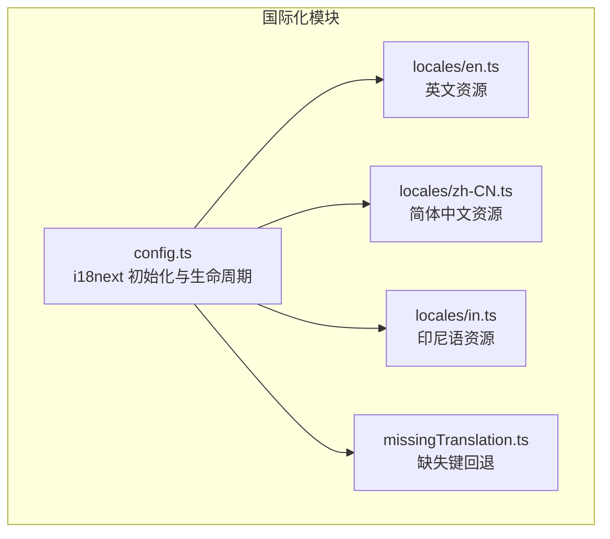
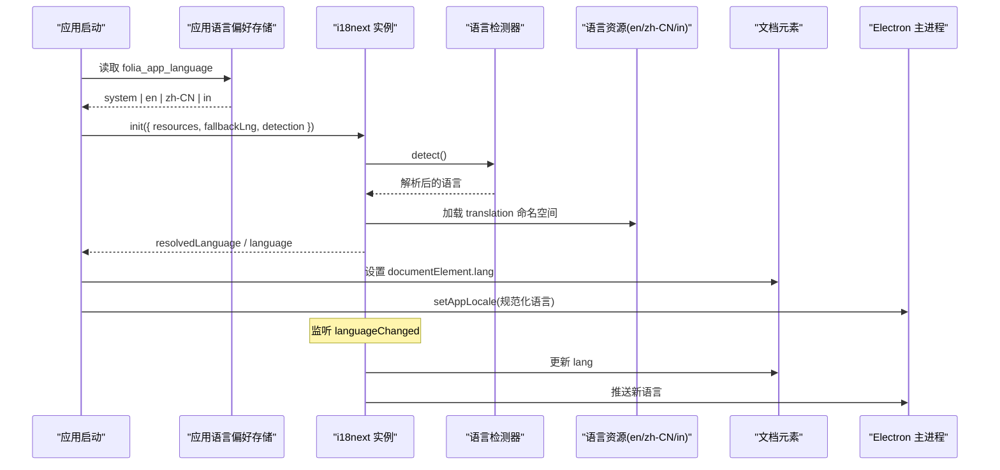
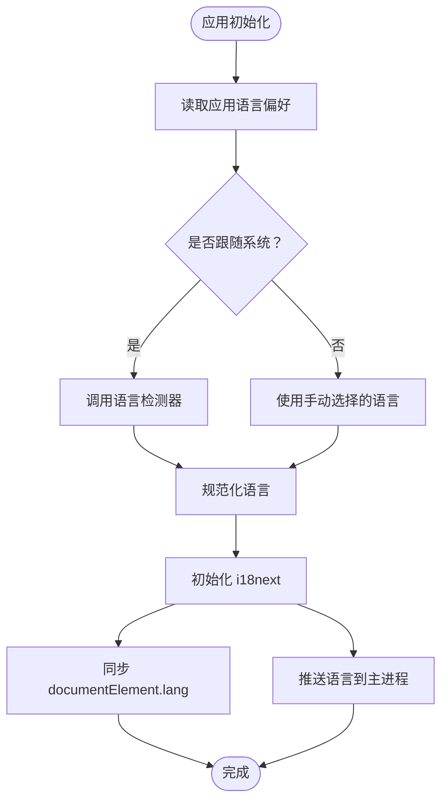
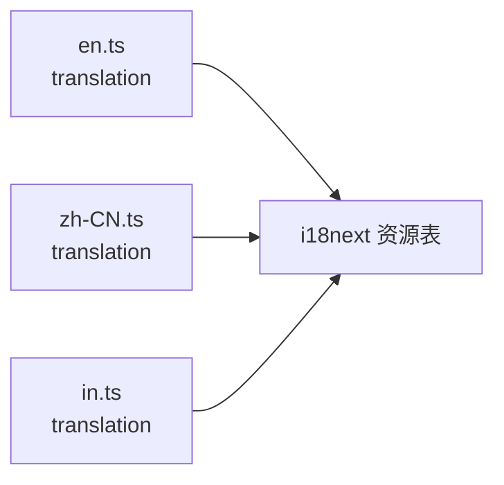
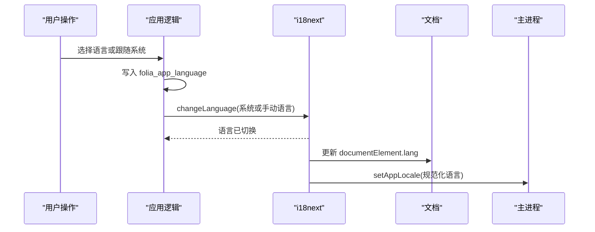
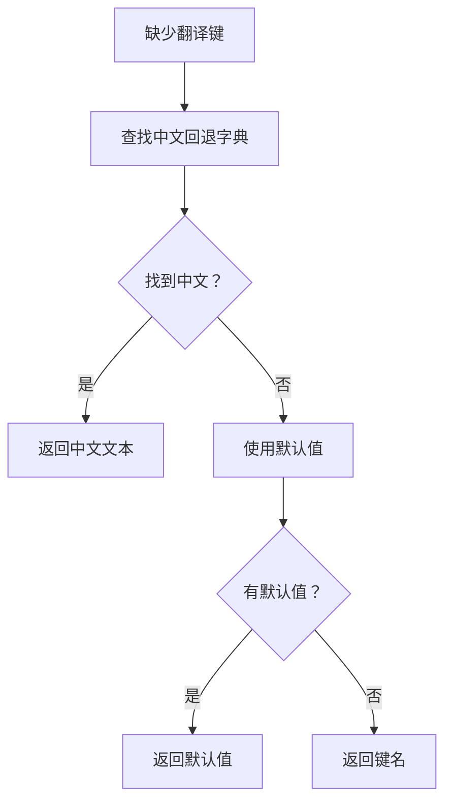
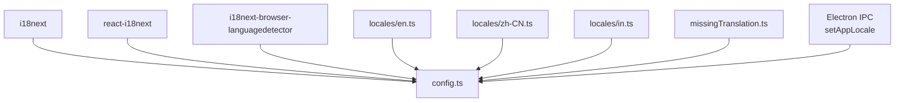

# 国际化支持

<cite>
**本文引用的文件**   
- [src/i18n/config.ts](file://src/i18n/config.ts)
- [src/i18n/missingTranslation.ts](file://src/i18n/missingTranslation.ts)
- [src/i18n/locales/en.ts](file://src/i18n/locales/en.ts)
- [src/i18n/locales/zh-CN.ts](file://src/i18n/locales/zh-CN.ts)
- [src/i18n/locales/in.ts](file://src/i18n/locales/in.ts)
</cite>

## 目录
1. [简介](#简介)
2. [项目结构](#项目结构)
3. [核心组件](#核心组件)
4. [架构总览](#架构总览)
5. [详细组件分析](#详细组件分析)
6. [依赖关系分析](#依赖关系分析)
7. [性能与可维护性](#性能与可维护性)
8. [故障排查指南](#故障排查指南)
9. [结论](#结论)
10. [附录：工作流与新增语言步骤](#附录工作流与新增语言步骤)

## 简介
本文件为 Folia Major 的国际化系统提供全面技术文档，覆盖 i18next 配置、语言检测、资源加载、命名空间管理、多语言文件结构、动态语言切换、文本插值、缺失翻译回退、以及本地化日期时间处理现状。同时给出翻译协作流程、新语言添加步骤和翻译质量保证建议。

## 项目结构
国际化相关代码集中在 `src/i18n` 目录：
- `config.ts`：i18next 初始化、语言检测、运行时语言切换、文档语言同步、Electron 主进程语言同步。
- `missingTranslation.ts`：缺失键的回退策略。
- `locales/`：各语言资源字典，当前包含英文、简体中文、印尼语。

**图表来源**
- [src/i18n/config.ts:1-158](file://src/i18n/config.ts#L1-L158)
- [src/i18n/missingTranslation.ts:1-9](file://src/i18n/missingTranslation.ts#L1-L9)
- [src/i18n/locales/en.ts:1-800](file://src/i18n/locales/en.ts#L1-L800)
- [src/i18n/locales/zh-CN.ts:1-800](file://src/i18n/locales/zh-CN.ts#L1-L800)
- [src/i18n/locales/in.ts:1-800](file://src/i18n/locales/in.ts#L1-L800)

**章节来源**
- [src/i18n/config.ts:1-158](file://src/i18n/config.ts#L1-L158)
- [src/i18n/locales/en.ts:1-800](file://src/i18n/locales/en.ts#L1-L800)
- [src/i18n/locales/zh-CN.ts:1-800](file://src/i18n/locales/zh-CN.ts#L1-L800)
- [src/i18n/locales/in.ts:1-800](file://src/i18n/locales/in.ts#L1-L800)

## 核心组件
- i18next 实例与 React 集成：通过 `initReactI18next` 注入到 React 上下文。
- 语言检测器：使用 `i18next-browser-languagedetector`，按顺序从 localStorage、navigator、htmlTag 检测语言。
- 资源加载：在初始化时静态导入并注册 en、zh-CN、in 三个语言的 `translation` 命名空间。
- 缺失翻译处理：当找不到键时，优先尝试中文扁平化回退字典，再回退到默认值或键本身。
- 应用语言偏好：支持“跟随系统”与手动选择 en、zh-CN、in；偏好保存在 `folia_app_language`，检测器缓存保存在 `i18nextLng`。
- 界面同步：语言变化时更新 `document.documentElement.lang`，并通过 Electron IPC 通知主进程托盘等原生 UI 的语言。

**章节来源**
- [src/i18n/config.ts:1-158](file://src/i18n/config.ts#L1-L158)
- [src/i18n/missingTranslation.ts:1-9](file://src/i18n/missingTranslation.ts#L1-L9)

## 架构总览
下图展示应用启动到语言切换的关键流程：应用读取用户偏好，初始化 i18next，检测系统语言，注册资源，并在语言变化时同步文档与主进程。

**图表来源**
- [src/i18n/config.ts:84-135](file://src/i18n/config.ts#L84-L135)
- [src/i18n/config.ts:137-155](file://src/i18n/config.ts#L137-L155)

## 详细组件分析

### i18next 初始化与语言检测
- 支持的运行语言：`en`、`zh-CN`、`in`（印尼语）。
- 默认回退语言：`en`。
- 检测顺序：localStorage → navigator → htmlTag。
- 检测缓存：localStorage 中的 `i18nextLng`。
- 初始语言：若用户偏好不是“跟随系统”，则直接使用该语言；否则由检测器决定。
- 文档语言同步：将 `document.documentElement.lang` 设置为规范化后的语言。
- 主进程同步：通过 `window.electron.setAppLocale` 把语言推送到托盘菜单等原生 UI。

**图表来源**
- [src/i18n/config.ts:52-82](file://src/i18n/config.ts#L52-L82)
- [src/i18n/config.ts:84-135](file://src/i18n/config.ts#L84-L135)

**章节来源**
- [src/i18n/config.ts:29-50](file://src/i18n/config.ts#L29-L50)
- [src/i18n/config.ts:52-82](file://src/i18n/config.ts#L52-L82)
- [src/i18n/config.ts:84-135](file://src/i18n/config.ts#L84-L135)

### 资源加载与命名空间
- 所有语言资源以 `translation` 命名空间注册。
- 资源对象为扁平化的键路径结构，例如 `notifications.*`、`status.*`、`commandPalette.*`、`ui.*`、`panel.*`、`lyricExport.*`、`lyricFile.*`、`lyricSegmentation.*`、`mods.*`。
- 未显式使用其他命名空间，因此业务侧应统一使用 `t('namespace.key')` 形式访问。

**图表来源**
- [src/i18n/config.ts:88-98](file://src/i18n/config.ts#L88-L98)
- [src/i18n/locales/en.ts:1-800](file://src/i18n/locales/en.ts#L1-L800)
- [src/i18n/locales/zh-CN.ts:1-800](file://src/i18n/locales/zh-CN.ts#L1-L800)
- [src/i18n/locales/in.ts:1-800](file://src/i18n/locales/in.ts#L1-L800)

**章节来源**
- [src/i18n/config.ts:88-98](file://src/i18n/config.ts#L88-L98)

### 动态语言切换机制
- 应用暴露 `applyAppLanguagePreference(preference)`，用于持久化用户偏好并触发语言变更。
- 当 preference 为“跟随系统”时，会清除检测器缓存 `i18nextLng`，重新检测系统语言。
- 语言变更后，触发 `languageChanged` 事件，同步文档语言和主进程语言。
- 该函数返回最终使用的语言代码。

**图表来源**
- [src/i18n/config.ts:129-155](file://src/i18n/config.ts#L129-L155)

**章节来源**
- [src/i18n/config.ts:129-155](file://src/i18n/config.ts#L129-L155)

### 文本插值与复数形式
- 插值：启用 `interpolation.escapeValue=false`，允许模板字符串中直接使用变量，如 `{{source}}`、`{{themeName}}`、`{{count}}`、`{{seconds}}`、`{{fileName}}`、`{{error}}`、`{{provider}}`、`{{song}}`、`{{typeDesc}}`、`{{mode}}`、`{{hours}}`、`{{minutes}}`、`{{time}}`、`{{index}}`、`{{value}}`、`{{max}}`、`{{option}}`、`{{added}}`、`{{total}}`、`{{fontName}}`、`{{key}}`、`{{reason}}`、`{{version}}`、`{{uploaded}}`、`{{downloaded}}`、`{{local}}`、`{{diff}}`、`{{details}}`、`{{done}}`、`{{total}}`、`{{exported}}`、`{{skipped}}`。
- 复数形式：当前资源文件中未见 i18next 复数语法（如 `one`/`other`），数量显示通常通过插值实现，例如“找到 {{count}} 个匹配项”。
- 条件翻译：未发现 i18next 条件语法（如 `{{val, choice}}`），条件分支通常在业务层根据状态选择不同键。

**章节来源**
- [src/i18n/config.ts:110-112](file://src/i18n/config.ts#L110-L112)
- [src/i18n/locales/en.ts:1-800](file://src/i18n/locales/en.ts#L1-L800)
- [src/i18n/locales/zh-CN.ts:1-800](file://src/i18n/locales/zh-CN.ts#L1-L800)
- [src/i18n/locales/in.ts:1-800](file://src/i18n/locales/in.ts#L1-L800)

### 缺失翻译检测与回退
- 当某个键在当前语言或回退语言中不存在时，触发 `parseMissingKeyHandler`。
- 回退优先级：
  1. 中文扁平化回退字典 `ZH_FALLBACKS[key]`。
  2. 传入的默认值 `defaultValue`。
  3. 键本身 `key`。
- 中文回退字典在构建时通过 `flattenLocale(zhCN)` 生成，确保每个键都有中文兜底文本，避免运行时依赖资源加载。

**图表来源**
- [src/i18n/config.ts:14-27](file://src/i18n/config.ts#L14-L27)
- [src/i18n/config.ts:100-102](file://src/i18n/config.ts#L100-L102)
- [src/i18n/missingTranslation.ts:4-8](file://src/i18n/missingTranslation.ts#L4-L8)

**章节来源**
- [src/i18n/config.ts:14-27](file://src/i18n/config.ts#L14-L27)
- [src/i18n/config.ts:100-102](file://src/i18n/config.ts#L100-L102)
- [src/i18n/missingTranslation.ts:1-9](file://src/i18n/missingTranslation.ts#L1-L9)

### 日期时间格式化
- 当前国际化配置未引入专门的日期时间本地化工具（如 `dayjs`、`date-fns`、`Intl.DateTimeFormat` 的集中封装）。
- 现有资源中包含时间相关文案，例如倒计时、时长提示，但具体日期格式化和时区处理不在 i18n 模块内实现。
- 建议在需要本地化日期时间的地方，结合 `Intl.DateTimeFormat` 或第三方库，并使用 i18n 提供文案键，而非硬编码格式。

[本节为通用指导，不直接分析具体文件]

## 依赖关系分析
- 外部依赖：
  - `i18next`：国际化核心库。
  - `react-i18next`：React 集成。
  - `i18next-browser-languagedetector`：浏览器端语言检测。
- 内部依赖：
  - `locales/en.ts`、`locales/zh-CN.ts`、`locales/in.ts`：静态导入的资源字典。
  - `missingTranslation.ts`：缺失键回退逻辑。
  - Electron IPC：`window.electron.setAppLocale` 用于主进程语言同步。

**图表来源**
- [src/i18n/config.ts:1-7](file://src/i18n/config.ts#L1-L7)
- [src/i18n/config.ts:121-127](file://src/i18n/config.ts#L121-L127)

**章节来源**
- [src/i18n/config.ts:1-7](file://src/i18n/config.ts#L1-L7)
- [src/i18n/config.ts:121-127](file://src/i18n/config.ts#L121-L127)

## 性能与可维护性
- 构建期扁平化中文回退字典可减少运行时资源加载开销，提升首屏体验。
- 所有语言资源静态导入，便于打包工具优化和类型检查。
- 语言检测缓存于 localStorage，避免每次启动重复检测。
- 建议：
  - 对大型资源文件考虑按需加载或分命名空间拆分，减少初始包体。
  - 对缺失键进行开发时告警，便于发现遗漏翻译。
  - 对日期时间格式化建立统一工具层，避免分散实现导致不一致。

[本节为通用指导，不直接分析具体文件]

## 故障排查指南
- 语言未按预期切换：
  - 检查 `folia_app_language` 是否被正确写入。
  - 检查 `i18nextLng` 是否被清除（跟随系统模式）。
  - 确认 `applyAppLanguagePreference` 是否被调用且返回了期望语言。
- 界面语言未同步：
  - 检查 `languageChanged` 事件是否触发。
  - 检查 `document.documentElement.lang` 是否被更新。
  - 检查 Electron IPC `setAppLocale` 是否可用。
- 出现缺失翻译：
  - 查看控制台或日志，确认 `parseMissingKeyHandler` 是否被调用。
  - 检查中文回退字典是否包含对应键。
  - 若无中文回退，确认资源文件是否完整。

**章节来源**
- [src/i18n/config.ts:52-82](file://src/i18n/config.ts#L52-L82)
- [src/i18n/config.ts:129-155](file://src/i18n/config.ts#L129-L155)
- [src/i18n/config.ts:100-102](file://src/i18n/config.ts#L100-L102)
- [src/i18n/missingTranslation.ts:4-8](file://src/i18n/missingTranslation.ts#L4-L8)

## 结论
Folia Major 的国际化系统基于 i18next，采用静态资源加载、浏览器语言检测、React 集成和 Electron 主进程同步。其设计重点在于：
- 明确的受支持语言集合与规范化逻辑。
- 中文回退字典保障缺失键时的用户体验。
- 简洁的动态语言切换流程，兼顾系统跟随与手动选择。
- 丰富的文本插值支持，满足大多数 UI 文案需求。
未来可在日期时间本地化、复数形式、条件翻译、缺失键开发时告警等方面进一步增强。

[本节为总结，不直接分析具体文件]

## 附录：工作流与新增语言步骤

### 翻译工作流与协作指南
- 资源组织：
  - 每个语言一个文件，位于 `src/i18n/locales/`。
  - 使用统一的键路径结构，保持各语言文件键一致。
- 协作建议：
  - 新增或修改键时，同步更新所有已有语言文件。
  - 对缺失键，中文回退会兜底，但仍应在目标语言尽快补齐。
  - 对插值变量，保持变量名一致，避免运行时替换失败。
- 质量保证：
  - 在 PR 中对比键差异，确保无遗漏。
  - 对关键文案进行人工校对，避免机器翻译错误。
  - 对日期时间、数字、货币等格式，统一使用本地化工具或规范。

[本节为通用指导，不直接分析具体文件]

### 新增语言步骤
1. 创建语言文件：
   - 在 `src/i18n/locales/` 下新增语言文件，例如 `ja.ts`。
   - 复制现有语言文件的键结构，填入目标语言文案。
2. 注册语言：
   - 在 `src/i18n/config.ts` 中导入新语言文件。
   - 在 `resources` 中添加新语言及其 `translation` 命名空间。
   - 在 `supportedLngs` 中添加新语言代码。
3. 更新语言偏好类型：
   - 扩展 `AppLanguagePreference` 类型，加入新语言。
   - 更新 `isSupportedManualLanguage` 判断逻辑。
   - 更新 `normalizeSupportedLanguage` 映射逻辑。
4. 更新界面选项：
   - 在设置界面中增加新语言选项，调用 `applyAppLanguagePreference`。
5. 测试验证：
   - 验证语言检测、切换、文档语言同步、主进程语言同步。
   - 验证插值变量、缺失键回退、UI 文案完整性。

**章节来源**
- [src/i18n/config.ts:29-50](file://src/i18n/config.ts#L29-L50)
- [src/i18n/config.ts:84-103](file://src/i18n/config.ts#L84-L103)
- [src/i18n/config.ts:137-155](file://src/i18n/config.ts#L137-L155)