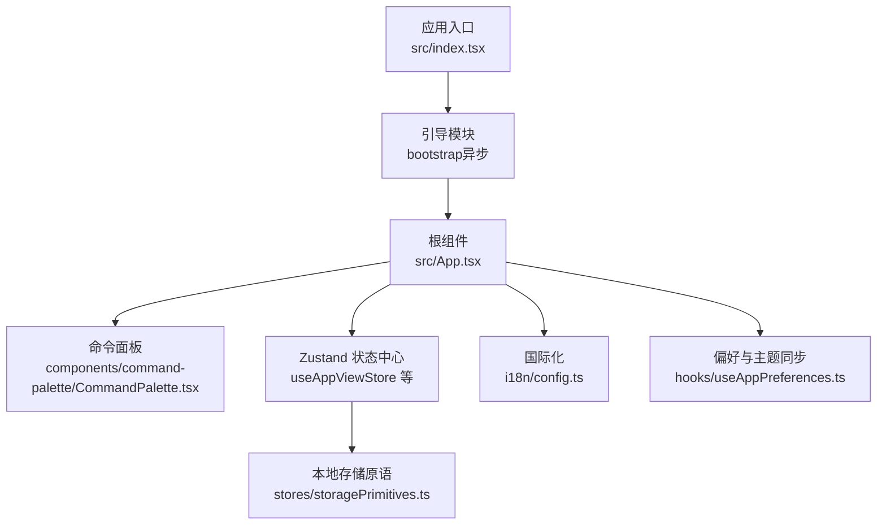
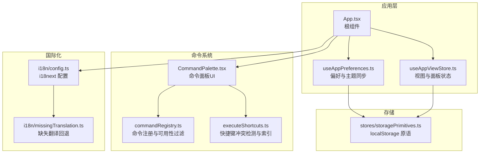
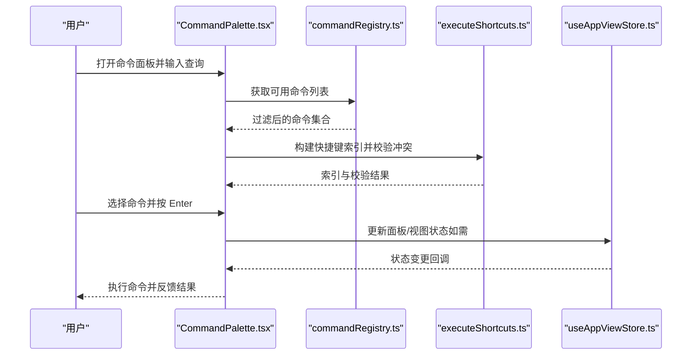
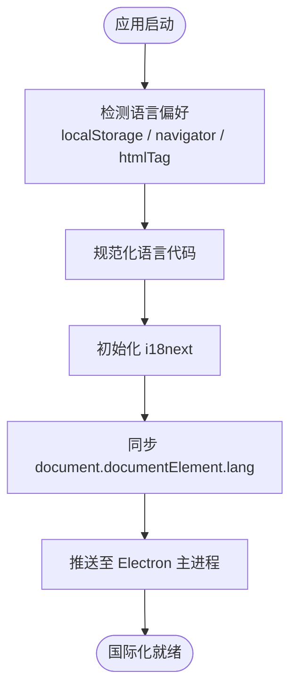
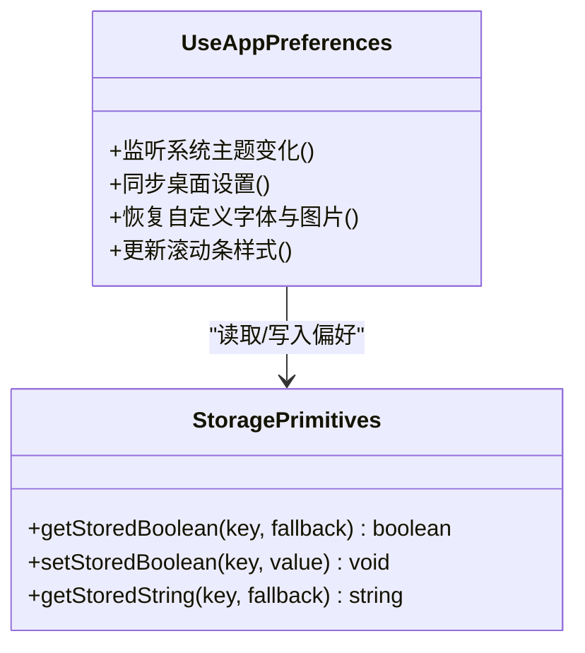
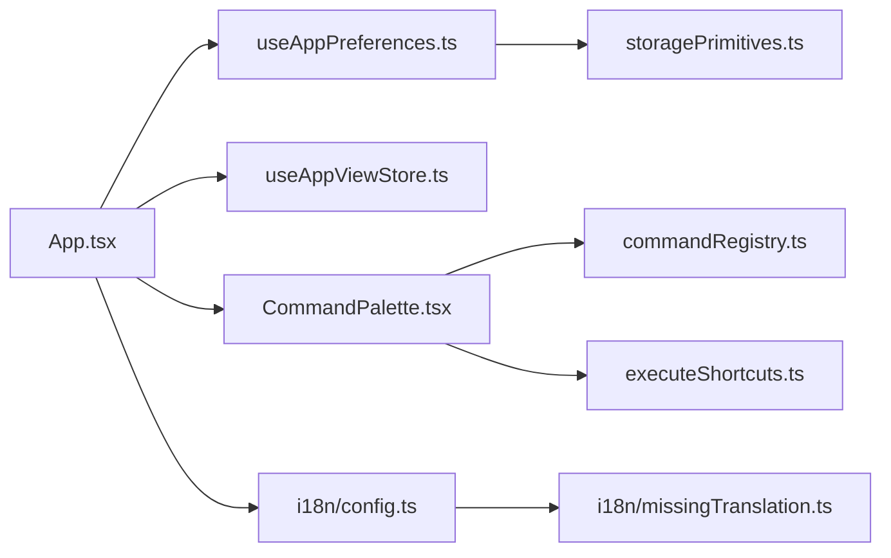

# 用户界面设计

<cite>
**本文引用的文件**   
- [src/index.tsx](file://src/index.tsx)
- [src/App.tsx](file://src/App.tsx)
- [src/components/command-palette/CommandPalette.tsx](file://src/components/command-palette/CommandPalette.tsx)
- [src/components/command-palette/commandRegistry.ts](file://src/components/command-palette/commandRegistry.ts)
- [src/components/command-palette/executeShortcuts.ts](file://src/components/command-palette/executeShortcuts.ts)
- [src/stores/useAppViewStore.ts](file://src/stores/useAppViewStore.ts)
- [src/hooks/useAppPreferences.ts](file://src/hooks/useAppPreferences.ts)
- [src/i18n/config.ts](file://src/i18n/config.ts)
- [src/i18n/missingTranslation.ts](file://src/i18n/missingTranslation.ts)
- [src/stores/storagePrimitives.ts](file://src/stores/storagePrimitives.ts)
</cite>

## 目录
1. [简介](#简介)
2. [项目结构](#项目结构)
3. [核心组件](#核心组件)
4. [架构总览](#架构总览)
5. [详细组件分析](#详细组件分析)
6. [依赖关系分析](#依赖关系分析)
7. [性能与可访问性](#性能与可访问性)
8. [故障排查指南](#故障排查指南)
9. [结论](#结论)

## 简介
本文件面向 Folia Major 的用户界面设计与实现，聚焦以下目标：
- React 组件架构：组件层次、状态提升与通信机制。
- 响应式与多端适配：自适应布局、多分辨率、触摸交互。
- 命令面板系统：命令注册、语法高亮、智能提示与执行流程。
- 国际化支持：多语言切换、文本资源与缺失回退、日期时间格式化策略。
- 设置系统：偏好存储、配置迁移与界面定制。
- 可访问性：键盘导航、屏幕阅读器兼容与高对比度模式。
- UI 开发规范与最佳实践。

## 项目结构
前端入口与初始化流程如下：
- 应用入口在 index.tsx 中完成全局调试、日志、帧率限制等基础设施安装，并异步加载 bootstrap。
- App.tsx 作为根组件，聚合播放、主题、导航、面板、可视化、命令面板等子系统，并通过多个 Zustand store 管理跨组件状态。
- 命令面板位于 components/command-palette，提供命令注册、匹配、语法提示与执行能力。
- 国际化由 i18n/config.ts 统一配置，支持系统语言检测与本地化持久化。
- 设置与偏好通过 hooks/useAppPreferences.ts 与各 settings store 协同，结合 storagePrimitives.ts 的 localStorage 读写原语。

**图表来源**
- [src/index.tsx:1-26](file://src/index.tsx#L1-L26)
- [src/App.tsx:160-200](file://src/App.tsx#L160-L200)
- [src/components/command-palette/CommandPalette.tsx:87-130](file://src/components/command-palette/CommandPalette.tsx#L87-L130)
- [src/stores/useAppViewStore.ts:75-103](file://src/stores/useAppViewStore.ts#L75-L103)
- [src/i18n/config.ts:84-113](file://src/i18n/config.ts#L84-L113)
- [src/hooks/useAppPreferences.ts:29-71](file://src/hooks/useAppPreferences.ts#L29-L71)
- [src/stores/storagePrimitives.ts:7-28](file://src/stores/storagePrimitives.ts#L7-L28)

**章节来源**
- [src/index.tsx:1-26](file://src/index.tsx#L1-L26)
- [src/App.tsx:160-200](file://src/App.tsx#L160-L200)

## 核心组件
- 根组件 App.tsx：负责装配播放控制器、主题控制器、导航、面板、可视化桥接、命令面板上下文、设置与偏好同步等。它通过多个 useXxxStore 订阅最小必要字段，避免不必要的重渲染。
- 命令面板 CommandPalette.tsx：全屏输入覆盖层，支持命令列表、语法提示、内联表面（inline surface）、固定命令行、无障碍属性与键盘导航。
- 视图与面板状态 useAppViewStore.ts：集中管理当前视图（home/player/lattice）、面板开关与标签、命令过滤器的注册与请求。
- 国际化 i18n/config.ts：基于 i18next 的多语言配置，包含语言检测、localStorage 缓存、文档 lang 同步、Electron 主进程语言推送与缺失翻译回退。
- 偏好与主题同步 hooks/useAppPreferences.ts：监听系统主题变化、桌面设置、壁纸模式、自定义字体与图片资源恢复，并与各 settings store 联动。
- 本地存储原语 stores/storagePrimitives.ts：为所有设置 store 提供布尔值与字符串的 localStorage 读写封装。

**章节来源**
- [src/App.tsx:160-200](file://src/App.tsx#L160-L200)
- [src/components/command-palette/CommandPalette.tsx:87-130](file://src/components/command-palette/CommandPalette.tsx#L87-L130)
- [src/stores/useAppViewStore.ts:75-103](file://src/stores/useAppViewStore.ts#L75-L103)
- [src/i18n/config.ts:84-113](file://src/i18n/config.ts#L84-L113)
- [src/hooks/useAppPreferences.ts:29-71](file://src/hooks/useAppPreferences.ts#L29-L71)
- [src/stores/storagePrimitives.ts:7-28](file://src/stores/storagePrimitives.ts#L7-L28)

## 架构总览
整体 UI 架构以 App.tsx 为中心，向下分发到命令面板、可视化、面板与设置；横向通过 Zustand store 共享状态；国际化与偏好同步贯穿全栈。

**图表来源**
- [src/App.tsx:160-200](file://src/App.tsx#L160-L200)
- [src/components/command-palette/CommandPalette.tsx:87-130](file://src/components/command-palette/CommandPalette.tsx#L87-L130)
- [src/components/command-palette/commandRegistry.ts:1-44](file://src/components/command-palette/commandRegistry.ts#L1-L44)
- [src/components/command-palette/executeShortcuts.ts:33-61](file://src/components/command-palette/executeShortcuts.ts#L33-L61)
- [src/i18n/config.ts:84-113](file://src/i18n/config.ts#L84-L113)
- [src/i18n/missingTranslation.ts:1-8](file://src/i18n/missingTranslation.ts#L1-L8)
- [src/stores/storagePrimitives.ts:7-28](file://src/stores/storagePrimitives.ts#L7-L28)

## 详细组件分析

### 命令面板系统
命令面板是 Folia Major 的核心交互入口，承担命令搜索、语法提示、内联表面渲染与执行。

- 命令注册与可用性
  - commandRegistry.ts 暴露 ALL_COMMAND_PALETTE_COMMANDS，并提供 isCommandPaletteCommandEnabled 与 getAvailableCommandPaletteCommands，按平台、作用域、isAvailable 与 hidden 进行过滤。
  - executeShortcuts.ts 构建快捷键索引并校验冲突与前缀关系，保证快捷键唯一且无歧义。

- 语法高亮与智能提示
  - CommandPalette.tsx 使用 parseCommandQuery 与 buildFlagSuggestions 生成 --flag 补全建议，并在输入框上方显示语法提示条。
  - 针对特定命令（如网格过滤）会禁用或启用语法补全，避免误导。

- 执行机制
  - 支持 Enter 执行当前激活项、Esc 关闭或返回“全部命令”视图、Backspace 清空并回到首关键字。
  - 支持内联表面（inline surface），将命令输入框嵌入到网格过滤器位置，保持焦点与定位一致。

- 可访问性与无障碍
  - 输入框具备 role="combobox"、aria-autocomplete="list"、aria-expanded 等属性，配合键盘导航与屏幕阅读器。
  - 按钮具备 aria-label 与 title，确保可理解性。

**图表来源**
- [src/components/command-palette/CommandPalette.tsx:271-357](file://src/components/command-palette/CommandPalette.tsx#L271-L357)
- [src/components/command-palette/commandRegistry.ts:19-43](file://src/components/command-palette/commandRegistry.ts#L19-L43)
- [src/components/command-palette/executeShortcuts.ts:33-61](file://src/components/command-palette/executeShortcuts.ts#L33-L61)
- [src/stores/useAppViewStore.ts:88-103](file://src/stores/useAppViewStore.ts#L88-L103)

**章节来源**
- [src/components/command-palette/commandRegistry.ts:1-44](file://src/components/command-palette/commandRegistry.ts#L1-L44)
- [src/components/command-palette/executeShortcuts.ts:33-61](file://src/components/command-palette/executeShortcuts.ts#L33-L61)
- [src/components/command-palette/CommandPalette.tsx:87-130](file://src/components/command-palette/CommandPalette.tsx#L87-L130)
- [src/components/command-palette/CommandPalette.tsx:271-357](file://src/components/command-palette/CommandPalette.tsx#L271-L357)
- [src/stores/useAppViewStore.ts:88-103](file://src/stores/useAppViewStore.ts#L88-L103)

### 国际化支持
- 语言检测与持久化
  - i18n/config.ts 使用 LanguageDetector 从 localStorage、navigator、htmlTag 顺序检测语言，并将选择写入 localStorage。
  - 支持 system | en | zh-CN | in 四种偏好，normalizeSupportedLanguage 对区域码进行归一化。

- 文档与主进程同步
  - languageChanged 事件触发时，同步 document.documentElement.lang，并通过 window.electron.setAppLocale 推送给 Electron 主进程。

- 缺失翻译回退
  - missingTranslation.ts 提供 resolveMissingTranslation，优先使用中文扁平化字典作为回退，再回退到 defaultValue 或 key。

**图表来源**
- [src/i18n/config.ts:52-82](file://src/i18n/config.ts#L52-L82)
- [src/i18n/config.ts:129-135](file://src/i18n/config.ts#L129-L135)
- [src/i18n/missingTranslation.ts:4-8](file://src/i18n/missingTranslation.ts#L4-L8)

**章节来源**
- [src/i18n/config.ts:52-82](file://src/i18n/config.ts#L52-L82)
- [src/i18n/config.ts:129-135](file://src/i18n/config.ts#L129-L135)
- [src/i18n/missingTranslation.ts:1-8](file://src/i18n/missingTranslation.ts#L1-L8)

### 设置系统与偏好存储
- 偏好与主题同步
  - hooks/useAppPreferences.ts 监听系统主题变化、桌面设置、壁纸模式、自定义字体与图片资源恢复，并与各 settings store 联动。
  - 根据 isDaylight 动态设置滚动条 CSS 变量，提升可读性与一致性。

- 本地存储原语
  - stores/storagePrimitives.ts 提供 getStoredBoolean、setStoredBoolean、getStoredString 等封装，屏蔽 SSR 环境差异。

**图表来源**
- [src/hooks/useAppPreferences.ts:29-71](file://src/hooks/useAppPreferences.ts#L29-L71)
- [src/stores/storagePrimitives.ts:7-28](file://src/stores/storagePrimitives.ts#L7-L28)

**章节来源**
- [src/hooks/useAppPreferences.ts:29-71](file://src/hooks/useAppPreferences.ts#L29-L71)
- [src/stores/storagePrimitives.ts:7-28](file://src/stores/storagePrimitives.ts#L7-L28)

### 响应式设计与多端适配
- 自适应布局
  - 命令面板在不同尺寸下通过 Tailwind 类名与 CSS 变量调整间距、字号与背景透明度，确保可读性与触控友好。
  - 内联表面（inline surface）根据锚点元素定位，避免浮动错位。

- 触摸交互
  - 在 iOS Safari 上，当输入框聚焦于 fixed + backdrop-blur 面板时，主动 blur 输入框以避免滚动问题。
  - 触摸事件用于关闭面板与失焦输入框，提升移动端体验。

- 多分辨率支持
  - 通过媒体查询与动态计算（如 OBS 场景缩放）适配不同分辨率与横竖屏。

**章节来源**
- [src/components/command-palette/CommandPalette.tsx:404-411](file://src/components/command-palette/CommandPalette.tsx#L404-L411)
- [src/components/command-palette/CommandPalette.tsx:477-481](file://src/components/command-palette/CommandPalette.tsx#L477-L481)

### 可访问性支持
- 键盘导航
  - 命令面板支持 ArrowUp/ArrowDown 移动、Enter 执行、Esc 关闭、Backspace 清空并回到首关键字。
  - 语法补全列表拥有独立的键盘导航逻辑，避免与命令列表冲突。

- 屏幕阅读器兼容
  - 输入框具备 role="combobox"、aria-autocomplete、aria-expanded 等属性。
  - 按钮具备 aria-label 与 title，确保可理解性。

- 高对比度模式
  - 通过 isDaylight 控制背景与边框颜色，确保在高对比度模式下仍具可读性。

**章节来源**
- [src/components/command-palette/CommandPalette.tsx:271-357](file://src/components/command-palette/CommandPalette.tsx#L271-L357)
- [src/components/command-palette/CommandPalette.tsx:181-210](file://src/components/command-palette/CommandPalette.tsx#L181-L210)
- [src/hooks/useAppPreferences.ts:60-71](file://src/hooks/useAppPreferences.ts#L60-L71)

## 依赖关系分析
- App.tsx 依赖多个 hooks 与 stores，形成松耦合的状态管理。
- 命令面板依赖 commandRegistry 与 executeShortcuts，确保命令可用性与快捷键唯一性。
- 国际化依赖 i18next 与 missingTranslation，提供健壮的回退机制。
- 偏好与主题同步依赖 storagePrimitives，确保跨环境一致性。

**图表来源**
- [src/App.tsx:160-200](file://src/App.tsx#L160-L200)
- [src/components/command-palette/CommandPalette.tsx:87-130](file://src/components/command-palette/CommandPalette.tsx#L87-L130)
- [src/components/command-palette/commandRegistry.ts:1-44](file://src/components/command-palette/commandRegistry.ts#L1-L44)
- [src/components/command-palette/executeShortcuts.ts:33-61](file://src/components/command-palette/executeShortcuts.ts#L33-L61)
- [src/i18n/config.ts:84-113](file://src/i18n/config.ts#L84-L113)
- [src/i18n/missingTranslation.ts:1-8](file://src/i18n/missingTranslation.ts#L1-L8)
- [src/hooks/useAppPreferences.ts:29-71](file://src/hooks/useAppPreferences.ts#L29-L71)
- [src/stores/storagePrimitives.ts:7-28](file://src/stores/storagePrimitives.ts#L7-L28)

**章节来源**
- [src/App.tsx:160-200](file://src/App.tsx#L160-L200)
- [src/components/command-palette/CommandPalette.tsx:87-130](file://src/components/command-palette/CommandPalette.tsx#L87-L130)
- [src/components/command-palette/commandRegistry.ts:1-44](file://src/components/command-palette/commandRegistry.ts#L1-L44)
- [src/components/command-palette/executeShortcuts.ts:33-61](file://src/components/command-palette/executeShortcuts.ts#L33-L61)
- [src/i18n/config.ts:84-113](file://src/i18n/config.ts#L84-L113)
- [src/i18n/missingTranslation.ts:1-8](file://src/i18n/missingTranslation.ts#L1-L8)
- [src/hooks/useAppPreferences.ts:29-71](file://src/hooks/useAppPreferences.ts#L29-L71)
- [src/stores/storagePrimitives.ts:7-28](file://src/stores/storagePrimitives.ts#L7-L28)

## 性能与可访问性
- 性能优化
  - App.tsx 使用 useShallow 订阅最小必要字段，减少不必要重渲染。
  - 命令面板使用 useMemo 与 useCallback 稳定引用，避免频繁重建。
  - 全局帧率限制器与调试模块在 index.tsx 中尽早安装，便于监控与优化。

- 可访问性最佳实践
  - 所有交互元素具备语义化角色与 ARIA 属性。
  - 键盘导航覆盖主要操作路径，确保无鼠标也可用。
  - 高对比度与明暗主题切换保持一致的可读性。

**章节来源**
- [src/App.tsx:160-200](file://src/App.tsx#L160-L200)
- [src/components/command-palette/CommandPalette.tsx:117-130](file://src/components/command-palette/CommandPalette.tsx#L117-L130)
- [src/index.tsx:1-26](file://src/index.tsx#L1-L26)

## 故障排查指南
- 命令面板无法打开或无响应
  - 检查 commandRegistry.ts 中的 isCommandPaletteCommandEnabled 是否因平台、作用域或 isAvailable 过滤导致命令不可用。
  - 确认 executeShortcuts.ts 未抛出快捷键冲突异常。

- 国际化文本缺失
  - 检查 i18n/config.ts 的语言检测与 localStorage 缓存是否正确。
  - 确认 missingTranslation.ts 的回退逻辑是否生效。

- 偏好设置未持久化
  - 检查 storagePrimitives.ts 的 localStorage 读写是否被浏览器安全策略阻止。
  - 确认 hooks/useAppPreferences.ts 中的副作用是否被正确清理。

**章节来源**
- [src/components/command-palette/commandRegistry.ts:19-43](file://src/components/command-palette/commandRegistry.ts#L19-L43)
- [src/components/command-palette/executeShortcuts.ts:33-61](file://src/components/command-palette/executeShortcuts.ts#L33-L61)
- [src/i18n/config.ts:52-82](file://src/i18n/config.ts#L52-L82)
- [src/i18n/missingTranslation.ts:4-8](file://src/i18n/missingTranslation.ts#L4-L8)
- [src/stores/storagePrimitives.ts:7-28](file://src/stores/storagePrimitives.ts#L7-L28)
- [src/hooks/useAppPreferences.ts:29-71](file://src/hooks/useAppPreferences.ts#L29-L71)

## 结论
Folia Major 的用户界面以 App.tsx 为核心，结合命令面板、国际化、设置与偏好同步，构建了高度模块化与可扩展的前端架构。命令面板提供强大的命令执行与语法提示能力；国际化确保多语言体验；设置系统通过统一的存储原语保障一致性；可访问性与响应式设计提升了用户体验。建议在后续开发中继续遵循现有模式，保持组件职责单一、状态提升清晰，并持续优化性能与可访问性。