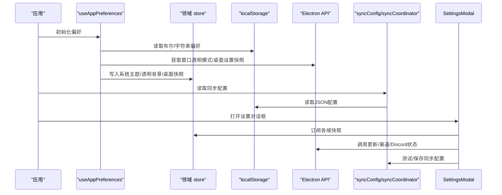
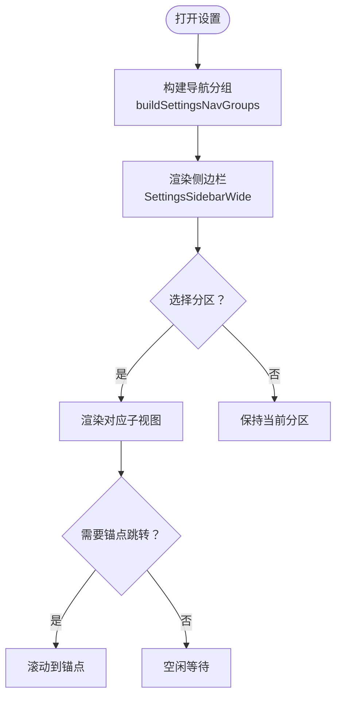
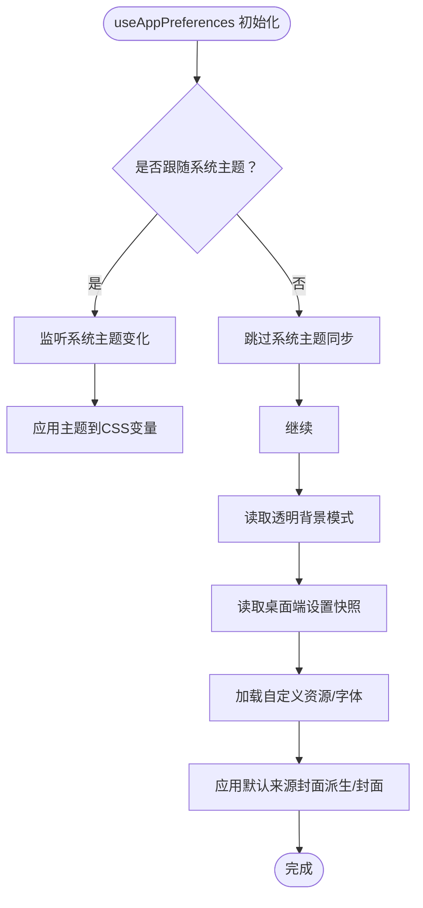
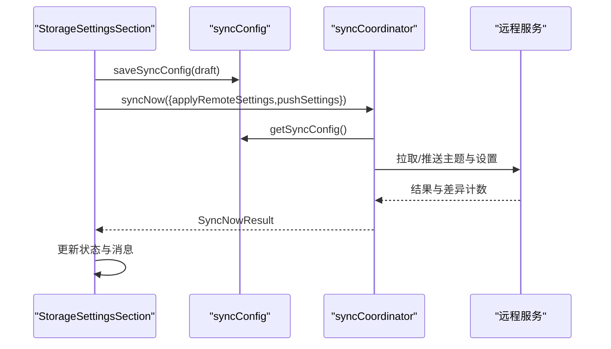
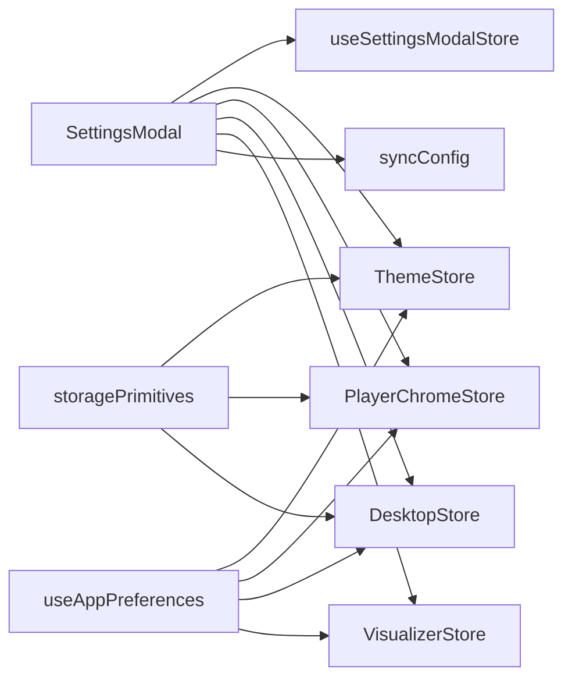

# 设置与偏好系统

<cite>
**本文引用的文件**   
- [src/hooks/useAppPreferences.ts](file://src/hooks/useAppPreferences.ts)
- [src/stores/storagePrimitives.ts](file://src/stores/storagePrimitives.ts)
- [src/components/modal/SettingsModal.tsx](file://src/components/modal/SettingsModal.tsx)
- [src/components/modal/settings/navigation/settingsNavModel.ts](file://src/components/modal/settings/navigation/settingsNavModel.ts)
- [src/components/modal/settings/navigation/SettingsSidebarWide.tsx](file://src/components/modal/settings/navigation/SettingsSidebarWide.tsx)
- [src/components/modal/settings/navigation/settingsNavSearch.ts](file://src/components/modal/settings/navigation/settingsNavSearch.ts)
- [src/stores/useSettingsModalStore.ts](file://src/stores/useSettingsModalStore.ts)
- [src/components/modal/settings/StorageSettingsSection.tsx](file://src/components/modal/settings/StorageSettingsSection.tsx)
- [src/services/sync/syncConfig.ts](file://src/services/sync/syncConfig.ts)
- [src/services/sync/syncCoordinator.ts](file://src/services/sync/syncCoordinator.ts)
- [src/mods/folium/params.ts](file://src/mods/folium/params.ts)
- [src/utils/settingLabelLookup.ts](file://src/utils/settingLabelLookup.ts)
- [skills/settings-feature-integration/SKILL.md](file://skills/settings-feature-integration/SKILL.md)
</cite>

## 目录
1. [简介](#简介)
2. [项目结构](#项目结构)
3. [核心组件](#核心组件)
4. [架构总览](#架构总览)
5. [详细组件分析](#详细组件分析)
6. [依赖关系分析](#依赖关系分析)
7. [性能考虑](#性能考虑)
8. [故障排查指南](#故障排查指南)
9. [结论](#结论)
10. [附录](#附录)

## 简介
本文件系统性梳理 Folia Major 的设置与偏好系统，覆盖以下关键主题：
- 设置存储机制：本地持久化、数据迁移与版本管理。
- 设置界面架构：SettingsModal 的组织结构、分组与导航逻辑。
- 偏好管理模式：useAppPreferences hook 的实现、默认值处理与用户覆盖。
- 配置验证机制：输入校验、类型检查与约束规则。
- 设置同步机制：本地与云端同步、冲突解决与一致性保障。
- 设置模块分类：外观、播放、集成、桌面端、图形、Mod、实验与开发者选项。
- 导入导出与批量配置：视觉配置短码压缩、导入确认与差异对比。
- 扩展机制：Mod 参数校验与自定义设置项接入规范。

## 项目结构
设置相关代码主要分布在以下位置：
- 偏好初始化与运行时同步：hooks/useAppPreferences.ts
- 本地存储原语：stores/storagePrimitives.ts
- 设置对话框与子视图装配：components/modal/SettingsModal.tsx
- 设置导航模型与侧边栏：components/modal/settings/navigation/*
- 设置对话框 UI 状态：stores/useSettingsModalStore.ts
- 存储与同步设置：components/modal/settings/StorageSettingsSection.tsx、services/sync/*
- Mod 参数校验与标签解析：mods/folium/params.ts、utils/settingLabelLookup.ts
- 功能集成规范：skills/settings-feature-integration/SKILL.md

```mermaid
graph TB
A["设置对话框<br/>SettingsModal.tsx"] --> B["导航模型<br/>settingsNavModel.ts"]
A --> C["侧边栏宽屏<br/>SettingsSidebarWide.tsx"]
A --> D["搜索过滤<br/>settingsNavSearch.ts"]
A --> E["对话框UI状态<br/>useSettingsModalStore.ts"]
A --> F["偏好初始化<br/>useAppPreferences.ts]
F --> G["本地存储原语<br/>storagePrimitives.ts"]
A --> H["存储与同步设置<br/>StorageSettingsSection.tsx"]
H --> I["同步配置<br/>syncConfig.ts"]
H --> J["同步协调器<br/>syncCoordinator.ts"]
K["Mod 参数校验<br/>params.ts"] --> L["标签解析<br/>settingLabelLookup.ts"]
```

图示来源
- [src/components/modal/SettingsModal.tsx:138-450](file://src/components/modal/SettingsModal.tsx#L138-L450)
- [src/components/modal/settings/navigation/settingsNavModel.ts:59-130](file://src/components/modal/settings/navigation/settingsNavModel.ts#L59-L130)
- [src/components/modal/settings/navigation/SettingsSidebarWide.tsx:22-56](file://src/components/modal/settings/navigation/SettingsSidebarWide.tsx#L22-L56)
- [src/components/modal/settings/navigation/settingsNavSearch.ts:53-73](file://src/components/modal/settings/navigation/settingsNavSearch.ts#L53-L73)
- [src/stores/useSettingsModalStore.ts:61-131](file://src/stores/useSettingsModalStore.ts#L61-L131)
- [src/hooks/useAppPreferences.ts:29-100](file://src/hooks/useAppPreferences.ts#L29-L100)
- [src/stores/storagePrimitives.ts:7-29](file://src/stores/storagePrimitives.ts#L7-L29)
- [src/components/modal/settings/StorageSettingsSection.tsx:129-163](file://src/components/modal/settings/StorageSettingsSection.tsx#L129-L163)
- [src/services/sync/syncConfig.ts:43-84](file://src/services/sync/syncConfig.ts#L43-L84)
- [src/services/sync/syncCoordinator.ts:84-102](file://src/services/sync/syncCoordinator.ts#L84-L102)
- [src/mods/folium/params.ts:13-58](file://src/mods/folium/params.ts#L13-L58)
- [src/utils/settingLabelLookup.ts:116-136](file://src/utils/settingLabelLookup.ts#L116-L136)

章节来源
- [src/components/modal/SettingsModal.tsx:138-450](file://src/components/modal/SettingsModal.tsx#L138-L450)
- [src/components/modal/settings/navigation/settingsNavModel.ts:59-130](file://src/components/modal/settings/navigation/settingsNavModel.ts#L59-L130)

## 核心组件
- SettingsModal：设置对话框的装配层，负责分区渲染、Electron 环境交互、更新通道、缓存清理、可视化调参台入口等。
- useAppPreferences：应用启动时统一恢复与同步偏好（系统主题跟随、透明播放器背景、桌面端设置快照、字体与资源加载）。
- storagePrimitives：跨 store 共享的 localStorage 读写原语，提供布尔与字符串类型的存取封装。
- settingsNavModel：单一事实来源，定义分区 ID、分组、图标、标题、描述与锚点，支持 Electron-only 过滤。
- SettingsSidebarWide / settingsNavSearch：宽屏侧边栏与搜索过滤，支持键盘导航与首命中跳转。
- useSettingsModalStore：设置对话框 UI 状态（打开/关闭、初始分区、语言偏好、命令面板固定项）。
- StorageSettingsSection + syncConfig + syncCoordinator：存储与同步设置 UI、配置持久化、连接测试与同步执行。
- params.ts + settingLabelLookup.ts：Mod 参数校验与枚举值标签解析，确保非法配置不进入表单或 store。

章节来源
- [src/components/modal/SettingsModal.tsx:138-450](file://src/components/modal/SettingsModal.tsx#L138-L450)
- [src/hooks/useAppPreferences.ts:29-100](file://src/hooks/useAppPreferences.ts#L29-L100)
- [src/stores/storagePrimitives.ts:7-29](file://src/stores/storagePrimitives.ts#L7-L29)
- [src/components/modal/settings/navigation/settingsNavModel.ts:59-130](file://src/components/modal/settings/navigation/settingsNavModel.ts#L59-L130)
- [src/components/modal/settings/navigation/SettingsSidebarWide.tsx:22-56](file://src/components/modal/settings/navigation/SettingsSidebarWide.tsx#L22-L56)
- [src/components/modal/settings/navigation/settingsNavSearch.ts:53-73](file://src/components/modal/settings/navigation/settingsNavSearch.ts#L53-L73)
- [src/stores/useSettingsModalStore.ts:61-131](file://src/stores/useSettingsModalStore.ts#L61-L131)
- [src/components/modal/settings/StorageSettingsSection.tsx:129-163](file://src/components/modal/settings/StorageSettingsSection.tsx#L129-L163)
- [src/services/sync/syncConfig.ts:43-84](file://src/services/sync/syncConfig.ts#L43-L84)
- [src/services/sync/syncCoordinator.ts:84-102](file://src/services/sync/syncCoordinator.ts#L84-L102)
- [src/mods/folium/params.ts:13-58](file://src/mods/folium/params.ts#L13-L58)
- [src/utils/settingLabelLookup.ts:116-136](file://src/utils/settingLabelLookup.ts#L116-L136)

## 架构总览
设置系统采用“装配层 + 领域 store + 持久化原语”的分层设计：
- 装配层：SettingsModal 根据 activeSettingsSection 渲染对应 Subview，并桥接 Electron API、更新状态、缓存管理等。
- 领域层：各设置域通过独立的 Zustand store 管理（如主题、播放器 Chrome、排版、可视化、桌面端等），由 useAppPreferences 在启动时恢复与同步。
- 持久化层：localStorage 原语用于简单键值；复杂配置（如同步）使用 JSON 序列化与事件通知。
- 导航层：settingsNavModel 作为唯一事实来源，构建分组与锚点，供侧边栏与搜索使用。
- 同步层：syncConfig 提供配置的读取/保存/有效性判断；syncCoordinator 提供一次性同步任务与结果聚合。



图示来源
- [src/hooks/useAppPreferences.ts:60-148](file://src/hooks/useAppPreferences.ts#L60-L148)
- [src/stores/storagePrimitives.ts:7-29](file://src/stores/storagePrimitives.ts#L7-L29)
- [src/components/modal/SettingsModal.tsx:507-543](file://src/components/modal/SettingsModal.tsx#L507-L543)
- [src/services/sync/syncConfig.ts:49-77](file://src/services/sync/syncConfig.ts#L49-L77)
- [src/services/sync/syncCoordinator.ts:94-102](file://src/services/sync/syncCoordinator.ts#L94-L102)

## 详细组件分析

### 设置存储机制：持久化、迁移与版本管理
- 本地持久化
  - storagePrimitives 提供 getStoredBoolean/getStoredString/setStoredBoolean，封装 localStorage 访问，包含 SSR 守卫。
  - 同步配置使用 JSON 序列化，key 包括 provider、enabled、workerBaseUrl、authToken，并通过事件通知监听者。
- 数据迁移与版本管理
  - 数据库迁移测试显示 IndexedDB 存在原生 v6/v8 版本升级路径，涉及对象存储创建与键路径定义。
  - 设置偏好本身以 localStorage 为主，未显式引入版本号字段；迁移策略集中在数据库层。
- 建议
  - 对新增复杂偏好可考虑增加 schema 版本字段，配合渐进式迁移函数。
  - 对敏感配置（如 token）应进行脱敏与最小权限存储。

章节来源
- [src/stores/storagePrimitives.ts:7-29](file://src/stores/storagePrimitives.ts#L7-L29)
- [src/services/sync/syncConfig.ts:49-84](file://src/services/sync/syncConfig.ts#L49-L84)
- [test/unit/services/appDatabaseMigration.test.ts:25-80](file://test/unit/services/appDatabaseMigration.test.ts#L25-L80)

### 设置界面架构：SettingsModal 组织、分组与导航
- SettingsModal 装配
  - 根据 activeSettingsSection 条件渲染 Appearance/General/Playback/Interaction/Integration/Storage/Desktop/Graphics/Mods/Lab 等子视图。
  - 管理 Electron 环境下的设置加载、更新通道、Discord 状态、缓存目录与清理。
- 分组与导航
  - settingsNavModel 定义分区 ID 与分组（appearance、controls、connections、system），支持 electronOnly 过滤。
  - SettingsSidebarWide 提供宽屏侧边栏，结合 searchSettingsNav 实现搜索过滤与首命中跳转。
- 锚点与滚动
  - useSettingsScrollSpy 与 useSettingsInitialAnchor 协同，支持从外部跳转到指定锚点。



图示来源
- [src/components/modal/SettingsModal.tsx:397-450](file://src/components/modal/SettingsModal.tsx#L397-L450)
- [src/components/modal/settings/navigation/settingsNavModel.ts:59-130](file://src/components/modal/settings/navigation/settingsNavModel.ts#L59-L130)
- [src/components/modal/settings/navigation/SettingsSidebarWide.tsx:22-56](file://src/components/modal/settings/navigation/SettingsSidebarWide.tsx#L22-L56)
- [src/components/modal/settings/navigation/settingsNavSearch.ts:53-73](file://src/components/modal/settings/navigation/settingsNavSearch.ts#L53-L73)

章节来源
- [src/components/modal/SettingsModal.tsx:397-450](file://src/components/modal/SettingsModal.tsx#L397-L450)
- [src/components/modal/settings/navigation/settingsNavModel.ts:59-130](file://src/components/modal/settings/navigation/settingsNavModel.ts#L59-L130)
- [src/components/modal/settings/navigation/SettingsSidebarWide.tsx:22-56](file://src/components/modal/settings/navigation/SettingsSidebarWide.tsx#L22-L56)
- [src/components/modal/settings/navigation/settingsNavSearch.ts:53-73](file://src/components/modal/settings/navigation/settingsNavSearch.ts#L53-L73)

### 偏好管理模式：useAppPreferences、默认值与用户覆盖
- 系统主题跟随
  - 当 followSystemTheme 启用时，监听 prefers-color-scheme 变化，将系统主题同步到持久化偏好。
- 透明播放器背景
  - 启动时调用 window.electron.getWindowTransparentMode，失败则保留本地回退值。
- 桌面端设置快照
  - 启动时拉取桌面端设置，并在壁纸模式变更时实时更新。
- 资源与字体恢复
  - 异步加载自定义表情包、头像包、Monet 背景/肖像图片，失败时清理并提示。
  - 上传歌词字体在恢复失败时清理并提示。
- 默认值与覆盖
  - 若未加载到 Monet 背景/肖像，自动将来源切换为封面派生/封面，保证可用默认行为。



图示来源
- [src/hooks/useAppPreferences.ts:60-100](file://src/hooks/useAppPreferences.ts#L60-L100)
- [src/hooks/useAppPreferences.ts:102-148](file://src/hooks/useAppPreferences.ts#L102-L148)
- [src/hooks/useAppPreferences.ts:175-300](file://src/hooks/useAppPreferences.ts#L175-L300)
- [src/hooks/useAppPreferences.ts:372-400](file://src/hooks/useAppPreferences.ts#L372-L400)

章节来源
- [src/hooks/useAppPreferences.ts:60-100](file://src/hooks/useAppPreferences.ts#L60-L100)
- [src/hooks/useAppPreferences.ts:102-148](file://src/hooks/useAppPreferences.ts#L102-L148)
- [src/hooks/useAppPreferences.ts:175-300](file://src/hooks/useAppPreferences.ts#L175-L300)
- [src/hooks/useAppPreferences.ts:372-400](file://src/hooks/useAppPreferences.ts#L372-L400)

### 配置验证机制：输入校验、类型检查与约束规则
- Mod 参数校验
  - sanitizeFoliumParams 对 key、type、defaultValue、options、min/max/step 等进行严格校验，拒绝 NaN、重复 key、非法选项等。
- 标签解析
  - resolveSettingValueLabelKey 基于字段 labelKey 与枚举值生成 i18n 键，找不到匹配时返回 null，避免错误命名。
- 建议
  - 对所有用户输入进行白名单校验；对数值型字段限制范围与步长；对 select 类型确保 options 非空且有效。

章节来源
- [src/mods/folium/params.ts:13-58](file://src/mods/folium/params.ts#L13-L58)
- [src/utils/settingLabelLookup.ts:116-136](file://src/utils/settingLabelLookup.ts#L116-L136)

### 设置同步机制：本地与云端、冲突解决与一致性
- 配置持久化
  - syncConfig.getSyncConfig/saveSyncConfig 读取/保存 JSON 配置，trim 与规范化 URL，触发事件通知。
- 连接测试
  - StorageSettingsSection.handleTestSync 调用 testSyncProviderConnection，成功后保存配置并更新状态。
- 同步执行
  - syncCoordinator.syncNow 防止并发执行，检查配置有效性，返回上传/下载/差异计数与应用结果。
- 冲突解决
  - 通过 diffBucketCount 与 applied/pushed flags 体现差异与推送结果；建议在 UI 中展示冲突摘要并提供合并策略。



图示来源
- [src/components/modal/settings/StorageSettingsSection.tsx:129-163](file://src/components/modal/settings/StorageSettingsSection.tsx#L129-L163)
- [src/services/sync/syncConfig.ts:49-84](file://src/services/sync/syncConfig.ts#L49-L84)
- [src/services/sync/syncCoordinator.ts:84-102](file://src/services/sync/syncCoordinator.ts#L84-L102)

章节来源
- [src/components/modal/settings/StorageSettingsSection.tsx:129-163](file://src/components/modal/settings/StorageSettingsSection.tsx#L129-L163)
- [src/services/sync/syncConfig.ts:49-84](file://src/services/sync/syncConfig.ts#L49-L84)
- [src/services/sync/syncCoordinator.ts:84-102](file://src/services/sync/syncCoordinator.ts#L84-L102)

### 设置模块分类与职责
- 外观设置（Appearance）
  - 主题、透明度、背景、字体、字号、visualizer 模式与 tuning、封面/Monet 背景等。
- 播放设置（Playback）
  - 播放行为、队列、字幕、歌词偏移等。
- 交互设置（Interaction）
  - 快捷键、手势、焦点行为等。
- 集成设置（Integration）
  - Navidrome、Lyric API、OBS Browser Source、PlayerCap 等。
- 存储设置（Storage）
  - 媒体缓存、同步配置、缓存目录与清理。
- 桌面端设置（Desktop）
  - 启动行为、托盘、壁纸模式、语音输入暂停等。
- 图形设置（Graphics）
  - 渲染性能、视觉效果开关等。
- Mod 设置（Mods）
  - Mod 管理与客户端注入。
- 实验设置（Lab）
  - 实验性功能开关。
- 开发者设置（Developer）
  - 调试工具、日志、探针等。

章节来源
- [src/components/modal/settings/navigation/settingsNavModel.ts:59-98](file://src/components/modal/settings/navigation/settingsNavModel.ts#L59-L98)
- [src/components/modal/SettingsModal.tsx:138-450](file://src/components/modal/SettingsModal.tsx#L138-L450)

### 设置导入导出与批量配置管理
- 视觉配置导入导出
  - 依据集成规范，视觉相关设置必须接入外观页的导入导出；短码压缩/解压与 JSON 白名单位于 appearanceCodec。
- 导入确认
  - ImportConfirmDialog 展示变更计划，允许逐项勾选，区分“不变项”与“衍生变更”。
- 批量管理
  - 通过 Ponder 引导场景打开导入导出区域，强调备份范围与非备份内容。

章节来源
- [skills/settings-feature-integration/SKILL.md:1-33](file://skills/settings-feature-integration/SKILL.md#L1-L33)
- [src/components/modal/settings/ImportConfirmDialog.tsx:175-195](file://src/components/modal/settings/ImportConfirmDialog.tsx#L175-L195)
- [src/components/ponder/targets/importExportSettings.target.ts:28-54](file://src/components/ponder/targets/importExportSettings.target.ts#L28-L54)
- [src/components/ponder/surfaces/PonderImportExportSurface.tsx:47-61](file://src/components/ponder/surfaces/PonderImportExportSurface.tsx#L47-L61)

### 设置扩展机制与自定义设置项开发指南
- Mod 参数声明
  - 使用 sanitizeFoliumParams 声明字段类型、默认值、选项、范围与步长，确保非法配置被拒绝。
- 标签与国际化
  - 使用 resolveSettingValueLabelKey 生成枚举值的 i18n 键，避免硬编码文本。
- 接入规范
  - 视觉设置需同时修改 Subview 与 appearanceCodec；功能性设置需接入命令面板与统一入口。
- 最佳实践
  - 所有新增设置应通过 settingsNavModel 注册分区与锚点；通过 useSettingsModalStore 控制打开与跳转。

章节来源
- [src/mods/folium/params.ts:13-58](file://src/mods/folium/params.ts#L13-L58)
- [src/utils/settingLabelLookup.ts:116-136](file://src/utils/settingLabelLookup.ts#L116-L136)
- [skills/settings-feature-integration/SKILL.md:1-33](file://skills/settings-feature-integration/SKILL.md#L1-L33)
- [src/stores/useSettingsModalStore.ts:61-131](file://src/stores/useSettingsModalStore.ts#L61-L131)

## 依赖关系分析
- 低耦合高内聚
  - SettingsModal 仅负责装配与桥接，具体领域逻辑下沉至各 store。
  - storagePrimitives 被多个 store 复用，避免重复实现。
- 直接依赖
  - SettingsModal 依赖 useSettingsModalStore、各 domain store、Electron API、syncConfig。
  - useAppPreferences 依赖 theme/playerChrome/desktop/typography/visualizer stores 与 Electron API。
- 潜在循环依赖
  - 导航模型与侧边栏之间无直接循环；search 逻辑独立于渲染。
- 外部依赖
  - Electron API（getSettings/saveSettings/onUpdateStatusChanged 等）、localStorage、IndexedDB。



图示来源
- [src/components/modal/SettingsModal.tsx:138-450](file://src/components/modal/SettingsModal.tsx#L138-L450)
- [src/hooks/useAppPreferences.ts:29-100](file://src/hooks/useAppPreferences.ts#L29-L100)
- [src/stores/storagePrimitives.ts:7-29](file://src/stores/storagePrimitives.ts#L7-L29)

章节来源
- [src/components/modal/SettingsModal.tsx:138-450](file://src/components/modal/SettingsModal.tsx#L138-L450)
- [src/hooks/useAppPreferences.ts:29-100](file://src/hooks/useAppPreferences.ts#L29-L100)
- [src/stores/storagePrimitives.ts:7-29](file://src/stores/storagePrimitives.ts#L7-L29)

## 性能考虑
- 偏好初始化
  - 使用 useEffect 与 isCancelled 标志避免卸载后状态更新；异步资源加载失败快速回退。
- 本地存储
  - 使用浅比较订阅（useShallow）减少重渲染；localStorage 读写仅在必要时触发。
- 同步任务
  - syncNow 防止并发执行；连接测试与保存操作分离，避免阻塞 UI。
- 建议
  - 对大体积资源（如自定义表情包/头像包）使用懒加载与对象 URL 释放。
  - 对高频设置变更使用防抖/节流，减少 localStorage 写入频率。

[本节为通用指导，不直接分析具体文件]

## 故障排查指南
- 系统主题不同步
  - 检查 followSystemTheme 是否启用；确认 matchMedia 可用性；查看 setDaylightPreferenceFromSystem 调用。
- 透明播放器背景无效
  - 检查 Electron API 是否存在；捕获启动同步失败的异常分支；确认 handleWallpaperTransparentRefused 处理。
- 同步配置测试失败
  - 检查 workerBaseUrl 与 authToken 是否为空；查看 testSyncProviderConnection 返回与错误信息；确认 saveSyncConfig 已调用。
- Mod 参数无效
  - 检查 sanitizeFoliumParams 是否拒绝该条目；确认 type/defaultValue/options/min/max/step 合法。
- 导入导出未生效
  - 确认视觉设置已接入 AppearanceSettingsSubview 与 appearanceCodec；检查 ImportConfirmDialog 的选择集合。

章节来源
- [src/hooks/useAppPreferences.ts:60-100](file://src/hooks/useAppPreferences.ts#L60-L100)
- [src/hooks/useAppPreferences.ts:102-148](file://src/hooks/useAppPreferences.ts#L102-L148)
- [src/components/modal/settings/StorageSettingsSection.tsx:129-163](file://src/components/modal/settings/StorageSettingsSection.tsx#L129-L163)
- [src/mods/folium/params.ts:13-58](file://src/mods/folium/params.ts#L13-L58)
- [skills/settings-feature-integration/SKILL.md:1-33](file://skills/settings-feature-integration/SKILL.md#L1-L33)

## 结论
Folia Major 的设置与偏好系统通过清晰的层次划分与严格的校验机制，实现了可维护、可扩展且用户体验友好的设置体系。SettingsModal 作为装配中心，结合 settingsNavModel 的统一导航与 useAppPreferences 的偏好恢复，确保了设置的一致性与可靠性。同步机制与导入导出能力进一步增强了配置的便携性与协作性。未来可在偏好层面引入版本化迁移策略，并对敏感配置加强安全保护。

[本节为总结性内容，不直接分析具体文件]

## 附录
- 常用分区 ID
  - appearance、general、playback、interaction、integration、storage、desktop、graphics、mods、lab、developer
- 关键 API
  - getSyncConfig/saveSyncConfig/isSyncConfigured
  - syncNow(options)
  - sanitizeFoliumParams(params)
  - resolveSettingValueLabelKey(fieldLabelKey, value, hasKey)

[本节为补充信息，不直接分析具体文件]