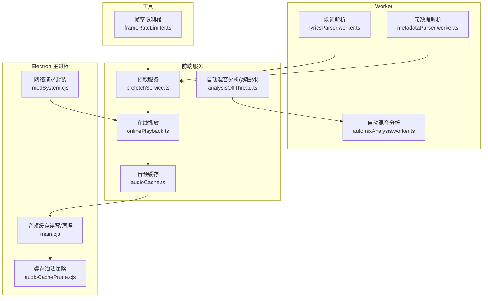
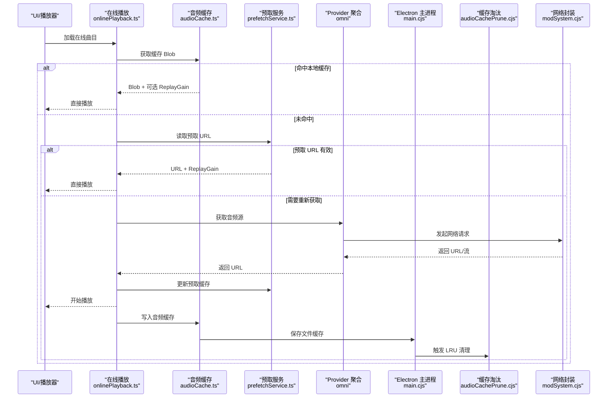
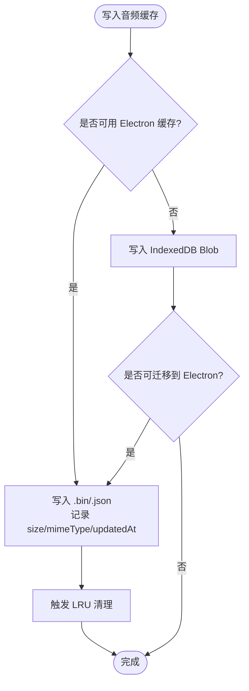
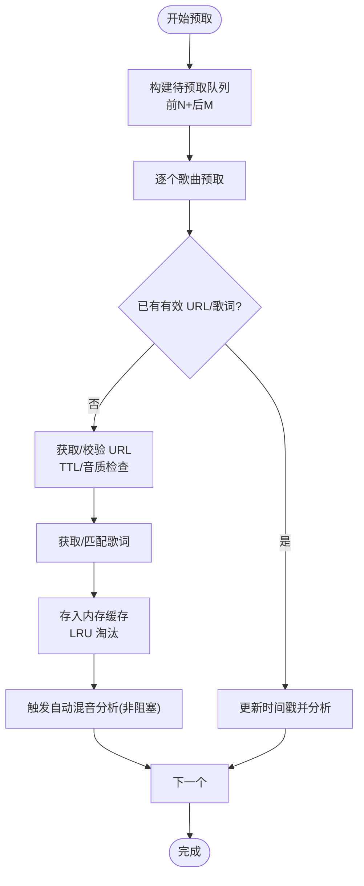
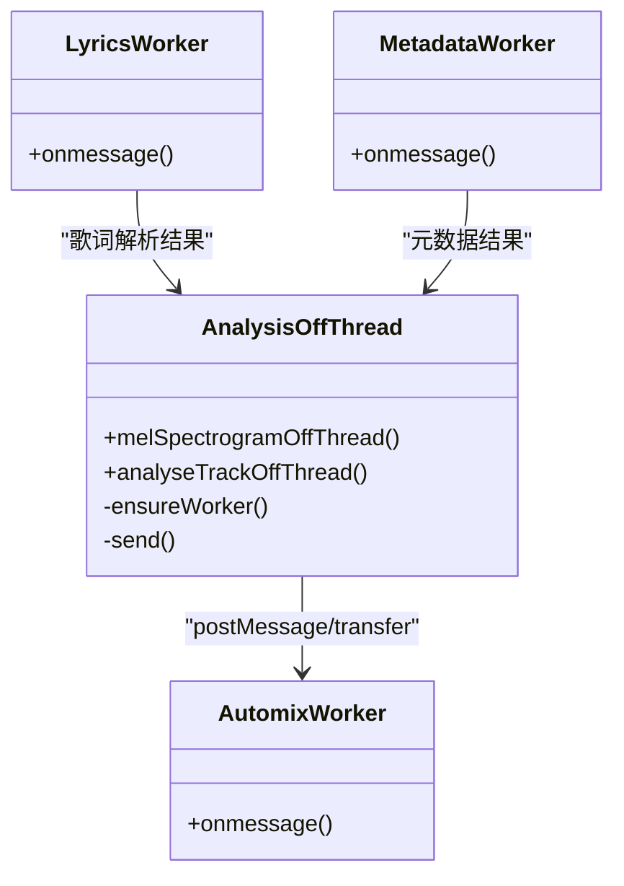
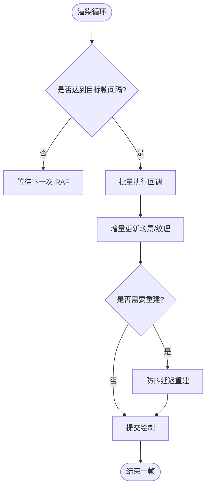
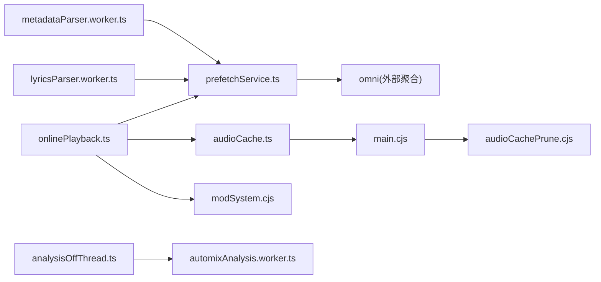

# 性能优化策略

<cite>
**本文引用的文件**   
- [audioCache.ts](file://src/services/audioCache.ts)
- [prefetchService.ts](file://src/services/prefetchService.ts)
- [onlinePlayback.ts](file://src/services/onlinePlayback.ts)
- [automixAnalysis.worker.ts](file://src/workers/automixAnalysis.worker.ts)
- [analysisOffThread.ts](file://src/services/automix/analysisOffThread.ts)
- [lyricsParser.worker.ts](file://src/workers/lyricsParser.worker.ts)
- [metadataParser.worker.ts](file://src/workers/metadataParser.worker.ts)
- [frameRateLimiter.ts](file://src/utils/frameRateLimiter.ts)
- [main.cjs](file://electron/main.cjs)
- [audioCachePrune.cjs](file://electron/audioCachePrune.cjs)
- [modSystem.cjs](file://electron/modSystem/modSystem.cjs)
</cite>

## 目录
1. [简介](#简介)
2. [项目结构](#项目结构)
3. [核心组件](#核心组件)
4. [架构总览](#架构总览)
5. [详细组件分析](#详细组件分析)
6. [依赖关系分析](#依赖关系分析)
7. [性能考量](#性能考量)
8. [故障排查指南](#故障排查指南)
9. [结论](#结论)
10. [附录](#附录)

## 简介
本技术文档聚焦 Folia Major 音乐播放引擎的性能优化，围绕以下主题展开：
- 多层缓存机制：本地文件缓存、在线流媒体缓存与内存缓存的协同。
- 预加载算法：相邻歌曲预取、URL 过期与音质匹配、智能缓存替换。
- 多线程处理：Web Workers 在音频解析、元数据处理和可视化计算中的应用。
- 内存管理：及时释放、大对象分块传输与垃圾回收优化。
- 渲染性能：帧率限制、增量更新与 WebGL 资源分配。
- 网络请求优化：连接复用、请求合并与错误重试。
- 性能监控与分析工具：定位瓶颈与调优建议。
- 跨设备与平台调优：在不同环境与硬件上获得流畅体验。

## 项目结构
本项目将播放引擎的关键性能路径拆分为多个模块：
- 服务层：音频缓存、预取、在线播放、自动混音分析。
- Worker 层：歌词解析、元数据解析、自动混音 FFT 分析。
- Electron 主进程：磁盘级音频缓存、转码缓存与清理策略。
- 工具层：帧率限制器、安全 URL 生成等。

**图表来源**
- [audioCache.ts:1-121](file://src/services/audioCache.ts#L1-L121)
- [prefetchService.ts:1-548](file://src/services/prefetchService.ts#L1-L548)
- [onlinePlayback.ts:1-251](file://src/services/onlinePlayback.ts#L1-L251)
- [automixAnalysis.worker.ts:1-47](file://src/workers/automixAnalysis.worker.ts#L1-L47)
- [analysisOffThread.ts:1-109](file://src/services/automix/analysisOffThread.ts#L1-L109)
- [lyricsParser.worker.ts:1-36](file://src/workers/lyricsParser.worker.ts#L1-L36)
- [metadataParser.worker.ts:1-287](file://src/workers/metadataParser.worker.ts#L1-L287)
- [main.cjs:3767-3959](file://electron/main.cjs#L3767-L3959)
- [audioCachePrune.cjs:1-20](file://electron/audioCachePrune.cjs#L1-L20)
- [modSystem.cjs:900-956](file://electron/modSystem/modSystem.cjs#L900-L956)
- [frameRateLimiter.ts:1-197](file://src/utils/frameRateLimiter.ts#L1-L197)

**章节来源**
- [audioCache.ts:1-121](file://src/services/audioCache.ts#L1-L121)
- [prefetchService.ts:1-548](file://src/services/prefetchService.ts#L1-L548)
- [onlinePlayback.ts:1-251](file://src/services/onlinePlayback.ts#L1-L251)
- [automixAnalysis.worker.ts:1-47](file://src/workers/automixAnalysis.worker.ts#L1-L47)
- [analysisOffThread.ts:1-109](file://src/services/automix/analysisOffThread.ts#L1-L109)
- [lyricsParser.worker.ts:1-36](file://src/workers/lyricsParser.worker.ts#L1-L36)
- [metadataParser.worker.ts:1-287](file://src/workers/metadataParser.worker.ts#L1-L287)
- [main.cjs:3767-3959](file://electron/main.cjs#L3767-L3959)
- [audioCachePrune.cjs:1-20](file://electron/audioCachePrune.cjs#L1-L20)
- [modSystem.cjs:900-956](file://electron/modSystem/modSystem.cjs#L900-L956)
- [frameRateLimiter.ts:1-197](file://src/utils/frameRateLimiter.ts#L1-L197)

## 核心组件
- 音频缓存（audioCache.ts）：统一读取 Electron 文件缓存或 IndexedDB，支持迁移与写入监听，按 GB 级上限触发主进程清理。
- 预取服务（prefetchService.ts）：维护最近 N 首歌曲的轻量资源（URL、歌词、封面），含 URL TTL、音质匹配、LRU 淘汰与空闲调度。
- 在线播放（onlinePlayback.ts）：优先使用已缓存 Blob，其次使用预取 URL，最后走 provider；回填 ReplayGain 并更新预取缓存。
- 自动混音分析（analysisOffThread.ts + automixAnalysis.worker.ts）：单 Worker 串行化分析，失败回退到主线程，避免阻塞 UI。
- 歌词解析（lyricsParser.worker.ts）：多格式歌词解析在 Worker 中执行，避免主线程卡顿。
- 元数据解析（metadataParser.worker.ts）：使用 music-metadata 解析本地文件嵌入信息，包括歌词、ReplayGain、封面哈希等。
- 帧率限制器（frameRateLimiter.ts）：全局 RAF 节流，支持关闭/60/90/120 档，批量刷新回调。
- Electron 主进程缓存（main.cjs + audioCachePrune.cjs）：磁盘级音频与转码缓存，LRU 淘汰，保护正在播放条目，统计用量。
- 网络请求封装（modSystem.cjs）：带超时、体大小限制、流式读取与错误分类。

**章节来源**
- [audioCache.ts:1-121](file://src/services/audioCache.ts#L1-L121)
- [prefetchService.ts:1-548](file://src/services/prefetchService.ts#L1-L548)
- [onlinePlayback.ts:1-251](file://src/services/onlinePlayback.ts#L1-L251)
- [automixAnalysis.worker.ts:1-47](file://src/workers/automixAnalysis.worker.ts#L1-L47)
- [analysisOffThread.ts:1-109](file://src/services/automix/analysisOffThread.ts#L1-L109)
- [lyricsParser.worker.ts:1-36](file://src/workers/lyricsParser.worker.ts#L1-L36)
- [metadataParser.worker.ts:1-287](file://src/workers/metadataParser.worker.ts#L1-L287)
- [frameRateLimiter.ts:1-197](file://src/utils/frameRateLimiter.ts#L1-L197)
- [main.cjs:3767-3959](file://electron/main.cjs#L3767-L3959)
- [audioCachePrune.cjs:1-20](file://electron/audioCachePrune.cjs#L1-L20)
- [modSystem.cjs:900-956](file://electron/modSystem/modSystem.cjs#L900-L956)

## 架构总览
下图展示从“播放启动”到“渲染输出”的关键路径，以及各层的缓存与并行化点。

**图表来源**
- [onlinePlayback.ts:18-64](file://src/services/onlinePlayback.ts#L18-L64)
- [audioCache.ts:39-67](file://src/services/audioCache.ts#L39-L67)
- [prefetchService.ts:121-158](file://src/services/prefetchService.ts#L121-L158)
- [main.cjs:3868-3887](file://electron/main.cjs#L3868-L3887)
- [audioCachePrune.cjs:17-20](file://electron/audioCachePrune.cjs#L17-L20)
- [modSystem.cjs:900-956](file://electron/modSystem/modSystem.cjs#L900-L956)

## 详细组件分析

### 多层音频缓存机制
- 层级设计
  - 内存层：IndexedDB Blob（浏览器构建）或 Electron 文件缓存（桌面端）。
  - 预取层：内存 Map，存储 URL、歌词、封面与时间戳。
  - 磁盘层：Electron 主进程维护 .bin/.json 对，记录 size、mimeType、updatedAt。
- 读取流程
  - 优先 Electron 文件缓存；否则回退 IndexedDB。
  - 首次命中 IndexedDB 后尝试迁移至 Electron 文件缓存，减少后续 IO。
- 写入与清理
  - 写入时同时落盘数据与元数据，随后触发 LRU 清理。
  - 清理策略基于“最近使用时间”，保护正在播放的转码缓存条目。
- 配置与上限
  - 通过设置项 mediaCacheLimitGb 控制上限，0 表示无上限。
  - 默认上限约 5GB，防止无限增长。

**图表来源**
- [audioCache.ts:100-121](file://src/services/audioCache.ts#L100-L121)
- [main.cjs:3868-3887](file://electron/main.cjs#L3868-L3887)
- [audioCachePrune.cjs:17-20](file://electron/audioCachePrune.cjs#L17-L20)

**章节来源**
- [audioCache.ts:1-121](file://src/services/audioCache.ts#L1-L121)
- [main.cjs:3767-3959](file://electron/main.cjs#L3767-L3959)
- [audioCachePrune.cjs:1-20](file://electron/audioCachePrune.cjs#L1-L20)

### 预加载算法与智能替换
- 预取范围
  - 向前 2 首、向后 1 首，保证“下一首”即时可用，“上一首”快速回退。
- 资源类型
  - 轻量资源：URL、歌词、封面 URL；不下载封面图片本身。
- URL 有效性
  - TTL 为 20 分钟；过期则丢弃并重取。
  - 若指定音质要求，缓存 URL 的音质不匹配则丢弃。
- 歌词与纯音乐识别
  - 优先使用预取歌词；必要时进行最佳歌词自动匹配，但不阻塞播放。
- 内存淘汰
  - 超过最大条目数时，删除最久未使用的条目。
- 空闲调度
  - 使用 requestIdleCallback 或 setTimeout 降级，避免阻塞 UI。

**图表来源**
- [prefetchService.ts:163-377](file://src/services/prefetchService.ts#L163-L377)
- [prefetchService.ts:409-497](file://src/services/prefetchService.ts#L409-L497)

**章节来源**
- [prefetchService.ts:1-548](file://src/services/prefetchService.ts#L1-L548)

### 多线程处理：Web Workers
- 自动混音分析
  - 主线程发送 melSpectrogram 与 analyseTrack 任务；Worker 完成后以 transfer 方式传回大数组，避免拷贝。
  - Worker 不可用或出错时，回退到主线程执行相同函数，保证一致性。
- 歌词解析
  - 多格式歌词在 Worker 中解析，避免主线程被长文本解析阻塞。
- 元数据解析
  - 使用 music-metadata 在 Worker 中解析本地文件，提取标题、艺术家、歌词、ReplayGain、封面哈希等。

**图表来源**
- [analysisOffThread.ts:1-109](file://src/services/automix/analysisOffThread.ts#L1-L109)
- [automixAnalysis.worker.ts:1-47](file://src/workers/automixAnalysis.worker.ts#L1-L47)
- [lyricsParser.worker.ts:1-36](file://src/workers/lyricsParser.worker.ts#L1-L36)
- [metadataParser.worker.ts:1-287](file://src/workers/metadataParser.worker.ts#L1-L287)

**章节来源**
- [analysisOffThread.ts:1-109](file://src/services/automix/analysisOffThread.ts#L1-L109)
- [automixAnalysis.worker.ts:1-47](file://src/workers/automixAnalysis.worker.ts#L1-L47)
- [lyricsParser.worker.ts:1-36](file://src/workers/lyricsParser.worker.ts#L1-L36)
- [metadataParser.worker.ts:1-287](file://src/workers/metadataParser.worker.ts#L1-L287)

### 内存管理与 GC 优化
- 大对象转移
  - 自动混音频谱数据通过 transfer 传递，避免主线程复制开销。
- 及时释放
  - 预取运行时清理：AbortController 取消进行中任务，清空内存 Map。
  - 歌词与元数据解析结果仅在需要时保留，避免长期驻留。
- 分块处理
  - 网络响应流式读取，累计字节数超过阈值即中止，避免一次性缓冲超大响应。
- 缓存迁移
  - 首次命中 IndexedDB 后迁移到 Electron 文件缓存，减少后续内存占用与 IO。

**章节来源**
- [automixAnalysis.worker.ts:29-46](file://src/workers/automixAnalysis.worker.ts#L29-L46)
- [prefetchService.ts:528-533](file://src/services/prefetchService.ts#L528-L533)
- [modSystem.cjs:900-956](file://electron/modSystem/modSystem.cjs#L900-L956)
- [audioCache.ts:57-67](file://src/services/audioCache.ts#L57-L67)

### 渲染性能优化
- 帧率限制
  - 支持关闭/60/90/120 档，RAF 回调批量刷新，降低高频重绘成本。
- 增量更新
  - 可视化工具根据画质档位动态调整分辨率与 bloom 等级，延迟重建以避免抖动。
- WebGL 资源分配
  - 场景缓存与质量参数联动，按需重建，避免频繁销毁/创建 GPU 资源。

**图表来源**
- [frameRateLimiter.ts:42-129](file://src/utils/frameRateLimiter.ts#L42-L129)

**章节来源**
- [frameRateLimiter.ts:1-197](file://src/utils/frameRateLimiter.ts#L1-L197)

### 网络请求优化
- 连接复用
  - 使用 fetch 原生连接复用能力，配合 redirect: follow 简化跳转。
- 请求合并
  - 预取阶段批量准备 URL 与歌词，减少重复请求。
- 错误重试
  - 网络封装返回结构化错误（超时、体过大等），上层可按需重试或降级。
- 体大小限制
  - 先检查 Content-Length，再流式读取累计字节，超限立即中止。

**章节来源**
- [modSystem.cjs:900-956](file://electron/modSystem/modSystem.cjs#L900-L956)
- [prefetchService.ts:163-377](file://src/services/prefetchService.ts#L163-L377)

## 依赖关系分析
- 耦合与内聚
  - onlinePlayback 依赖 audioCache 与 prefetchService，职责清晰。
  - analysisOffThread 与 worker 解耦，失败回退保证鲁棒性。
- 外部依赖
  - music-metadata 用于本地元数据解析。
  - fetch API 用于网络请求。
- 潜在循环依赖
  - 预取与在线播放之间通过接口契约交互，未见直接循环导入。

**图表来源**
- [onlinePlayback.ts:1-251](file://src/services/onlinePlayback.ts#L1-L251)
- [audioCache.ts:1-121](file://src/services/audioCache.ts#L1-L121)
- [prefetchService.ts:1-548](file://src/services/prefetchService.ts#L1-L548)
- [main.cjs:3767-3959](file://electron/main.cjs#L3767-L3959)
- [audioCachePrune.cjs:1-20](file://electron/audioCachePrune.cjs#L1-L20)
- [modSystem.cjs:900-956](file://electron/modSystem/modSystem.cjs#L900-L956)
- [analysisOffThread.ts:1-109](file://src/services/automix/analysisOffThread.ts#L1-L109)
- [automixAnalysis.worker.ts:1-47](file://src/workers/automixAnalysis.worker.ts#L1-L47)
- [lyricsParser.worker.ts:1-36](file://src/workers/lyricsParser.worker.ts#L1-L36)
- [metadataParser.worker.ts:1-287](file://src/workers/metadataParser.worker.ts#L1-L287)

**章节来源**
- [onlinePlayback.ts:1-251](file://src/services/onlinePlayback.ts#L1-L251)
- [audioCache.ts:1-121](file://src/services/audioCache.ts#L1-L121)
- [prefetchService.ts:1-548](file://src/services/prefetchService.ts#L1-L548)
- [main.cjs:3767-3959](file://electron/main.cjs#L3767-L3959)
- [audioCachePrune.cjs:1-20](file://electron/audioCachePrune.cjs#L1-L20)
- [modSystem.cjs:900-956](file://electron/modSystem/modSystem.cjs#L900-L956)
- [analysisOffThread.ts:1-109](file://src/services/automix/analysisOffThread.ts#L1-L109)
- [automixAnalysis.worker.ts:1-47](file://src/workers/automixAnalysis.worker.ts#L1-L47)
- [lyricsParser.worker.ts:1-36](file://src/workers/lyricsParser.worker.ts#L1-L36)
- [metadataParser.worker.ts:1-287](file://src/workers/metadataParser.worker.ts#L1-L287)

## 性能考量
- 缓存命中率
  - 合理设置 mediaCacheLimitGb，平衡磁盘空间与命中率。
  - 启用自动混音分析时，注意分析窗口仅覆盖当前与下一首，避免全量解码。
- 预取策略
  - 保持 PREFETCH_COUNT_NEXT=2、PREFETCH_COUNT_PREV=1，确保切换顺滑且不浪费带宽。
  - 歌词自动匹配异步进行，避免阻塞播放。
- 多线程与 GC
  - 使用 transfer 传递大数组，减少拷贝。
  - 及时调用 clearPrefetchRuntime 释放内存。
- 渲染与 GPU
  - 根据设备能力选择帧率（60/90/120），低端设备建议关闭或降至 60。
  - 避免频繁重建 WebGL 资源，使用防抖与增量更新。
- 网络
  - 利用连接复用与请求合并，减少握手与 DNS 开销。
  - 对超时与大体响应进行保护，避免 OOM 与卡顿。

[本节为通用指导，无需具体文件引用]

## 故障排查指南
- 音频无法播放
  - 检查 Electron 文件缓存是否存在且未被 LRU 清理。
  - 确认预取 URL 是否过期或音质不匹配。
- 卡顿或掉帧
  - 查看帧率限制器是否设置为 off 或过高帧率。
  - 检查自动混音分析是否在 Worker 中运行，失败是否回退到主线程。
- 内存泄漏
  - 确认预取运行时清理是否调用。
  - 检查歌词与元数据解析结果是否长期驻留。
- 网络异常
  - 查看 modSystem 的错误分类（超时、体过大等），在上层实现重试或降级。

**章节来源**
- [main.cjs:3833-3887](file://electron/main.cjs#L3833-L3887)
- [prefetchService.ts:121-158](file://src/services/prefetchService.ts#L121-L158)
- [frameRateLimiter.ts:42-129](file://src/utils/frameRateLimiter.ts#L42-L129)
- [analysisOffThread.ts:30-45](file://src/services/automix/analysisOffThread.ts#L30-L45)
- [modSystem.cjs:900-956](file://electron/modSystem/modSystem.cjs#L900-L956)

## 结论
Folia Major 的音乐播放引擎通过多层缓存、智能预取、Worker 并行与严格的内存/GC 管理，实现了高吞吐与低延迟的播放体验。结合帧率限制与增量渲染，系统在复杂可视化场景下仍能保持稳定。在网络侧，连接复用、请求合并与体大小限制进一步提升了鲁棒性。开发者可根据设备能力与业务需求，灵活调整缓存上限、预取窗口与帧率档位，以获得最佳体验。

[本节为总结，无需具体文件引用]

## 附录
- 关键配置项
  - mediaCacheLimitGb：磁盘缓存上限（GB），0 表示无上限。
  - VISUALIZER_FRAME_RATE_OPTIONS：可视化帧率选项（off/60/90/120）。
  - URL_TTL_MS：预取 URL 有效期（毫秒）。
  - MAX_PREFETCH_CACHE_SIZE：预取内存缓存最大条目数。
- 常用 API
  - getCachedAudioBlob/saveAudioBlob：音频缓存读写。
  - prefetchNearbySongs/cleanupPrefetchCache：预取与清理。
  - setGlobalVisualizerFrameRate：设置可视化帧率。
  - createFrameRateLimitedRaf：创建受限 RAF。

**章节来源**
- [audioCache.ts:12-13](file://src/services/audioCache.ts#L12-L13)
- [frameRateLimiter.ts:22-24](file://src/utils/frameRateLimiter.ts#L22-L24)
- [prefetchService.ts:26-40](file://src/services/prefetchService.ts#L26-L40)