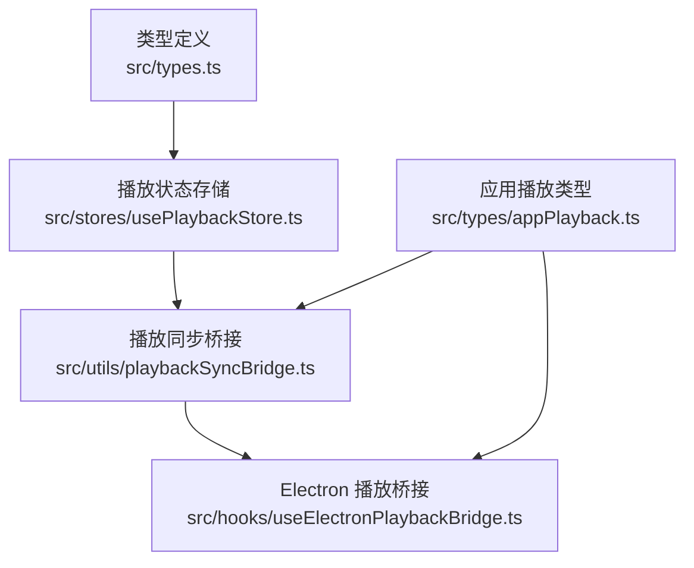
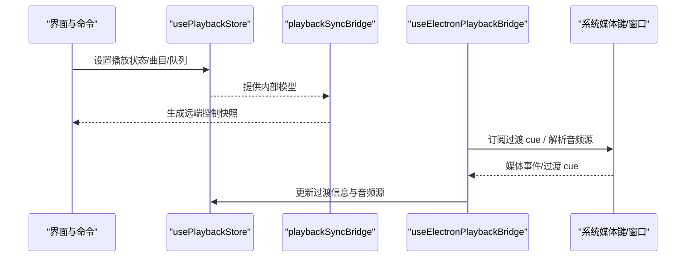
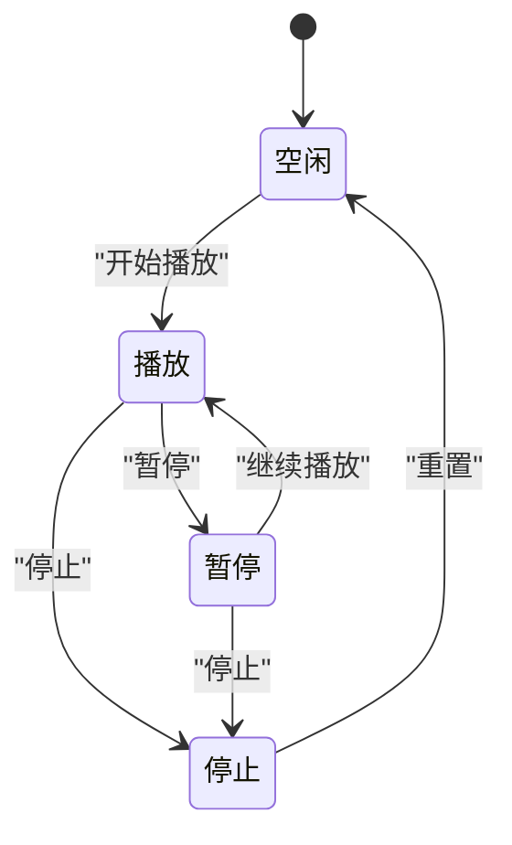
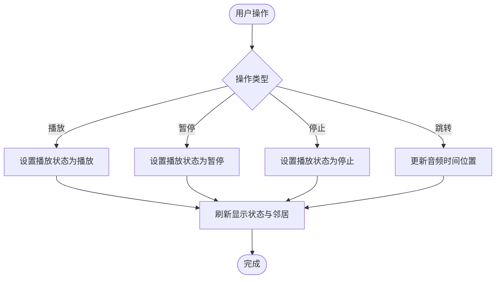
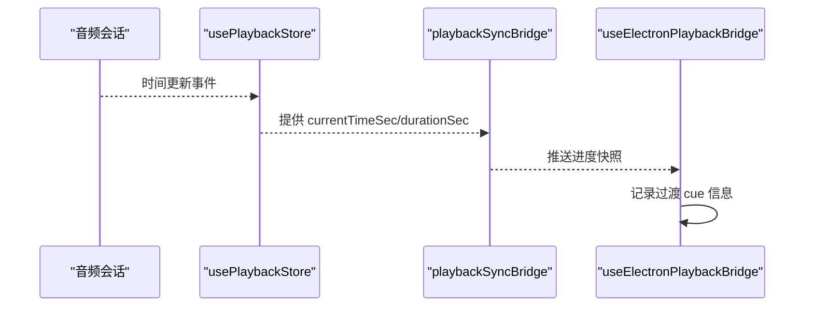
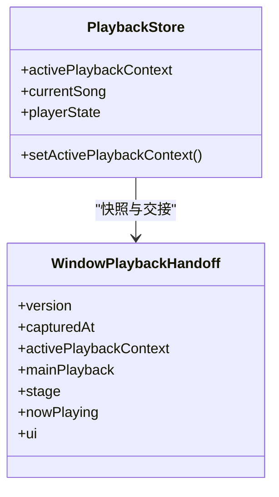
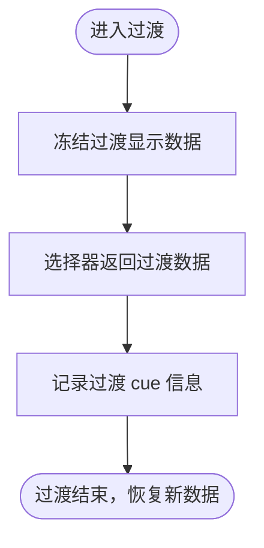
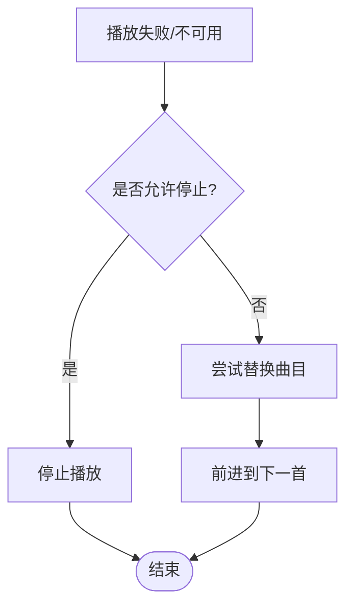
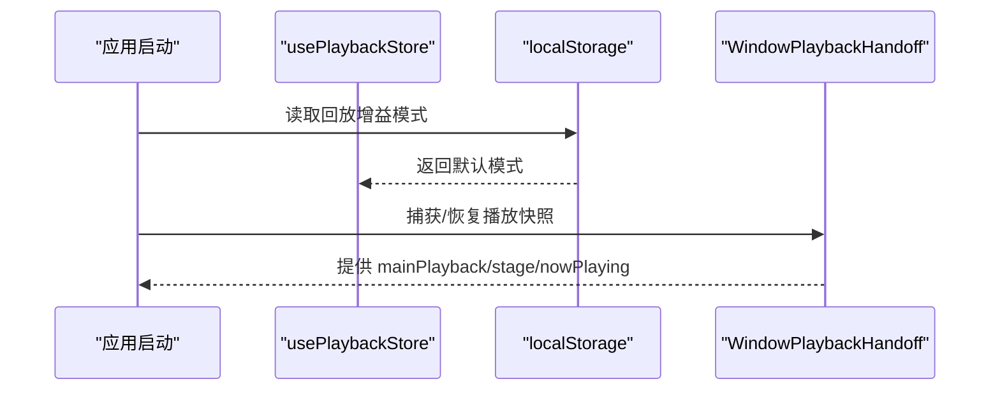
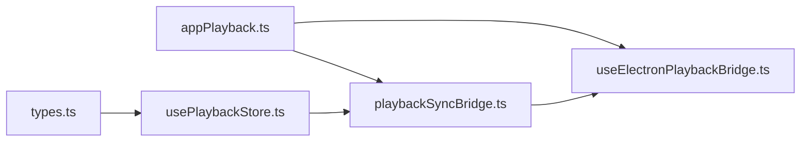

# 播放控制逻辑

<cite>
**本文引用的文件**   
- [src/types.ts](file://src/types.ts)
- [src/stores/usePlaybackStore.ts](file://src/stores/usePlaybackStore.ts)
- [src/utils/playbackSyncBridge.ts](file://src/utils/playbackSyncBridge.ts)
- [src/hooks/useElectronPlaybackBridge.ts](file://src/hooks/useElectronPlaybackBridge.ts)
- [src/types/appPlayback.ts](file://src/types/appPlayback.ts)
</cite>

## 目录
1. [简介](#简介)
2. [项目结构](#项目结构)
3. [核心组件](#核心组件)
4. [架构总览](#架构总览)
5. [详细组件分析](#详细组件分析)
6. [依赖关系分析](#依赖关系分析)
7. [性能考量](#性能考量)
8. [故障排查指南](#故障排查指南)
9. [结论](#结论)
10. [附录](#附录)

## 简介
本文聚焦 Folia Major 的播放控制逻辑，围绕以下目标展开：
- 播放状态管理机制与 PlayerState 枚举定义、状态转换规则。
- 播放、暂停、停止、跳转等基础操作的实现原理。
- 播放进度跟踪与时间同步机制，包括 seek 精确控制与更新频率。
- 音量控制、静音切换与音频输出设备管理。
- 播放上下文（主播放器与浮动/舞台播放器）协调。
- 过渡动画（歌曲切换淡入淡出、视觉反馈）。
- 错误处理策略（网络中断、文件损坏、播放失败恢复）。
- 状态持久化方案（应用重启后恢复播放状态）。

## 项目结构
播放控制相关代码主要分布在类型定义、状态存储、桥接层与 Electron 桥接钩子中：
- 类型定义：PlayerState、PlaybackContext、PlaybackSnapshot、WindowPlaybackHandoff 等。
- 状态存储：usePlaybackStore 维护 raw/display 双层状态与过渡显示。
- 同步桥接：playbackSyncBridge 将内部模型映射为远端/外部控制器可见的快照。
- Electron 桥接：useElectronPlaybackBridge 负责与系统媒体键、窗口交接、过渡 cue 等交互。

**图示来源**
- [src/types.ts:1199-1210](file://src/types.ts#L1199-L1210)
- [src/stores/usePlaybackStore.ts:1-177](file://src/stores/usePlaybackStore.ts#L1-L177)
- [src/utils/playbackSyncBridge.ts:184-227](file://src/utils/playbackSyncBridge.ts#L184-L227)
- [src/hooks/useElectronPlaybackBridge.ts:168-206](file://src/hooks/useElectronPlaybackBridge.ts#L168-L206)
- [src/types/appPlayback.ts:53-111](file://src/types/appPlayback.ts#L53-L111)

**章节来源**
- [src/types.ts:1199-1210](file://src/types.ts#L1199-L1210)
- [src/stores/usePlaybackStore.ts:1-177](file://src/stores/usePlaybackStore.ts#L1-L177)
- [src/utils/playbackSyncBridge.ts:184-227](file://src/utils/playbackSyncBridge.ts#L184-L227)
- [src/hooks/useElectronPlaybackBridge.ts:168-206](file://src/hooks/useElectronPlaybackBridge.ts#L168-L206)
- [src/types/appPlayback.ts:53-111](file://src/types/appPlayback.ts#L53-L111)

## 核心组件
- PlayerState 枚举：定义播放器的离散状态，如空闲、播放、暂停等。
- usePlaybackStore：维护当前曲目、音频源、歌词、封面、时长、队列、回放增益模式、歌词时间轴偏移、过渡显示等；提供 setter 与选择器。
- playbackSyncBridge：将内部模型转换为远端控制快照，包含邻居曲目、过渡标记、控件禁用态、舞台激活态、透明模式等。
- useElectronPlaybackPlaybackBridge：订阅过渡 cue，维护远程过渡信息，解析音频源 href，并与系统媒体键、窗口交接联动。

**章节来源**
- [src/types.ts:1199-1210](file://src/types.ts#L1199-L1210)
- [src/stores/usePlaybackStore.ts:1-177](file://src/stores/usePlaybackStore.ts#L1-L177)
- [src/utils/playbackSyncBridge.ts:184-227](file://src/utils/playbackSyncBridge.ts#L184-L227)
- [src/hooks/useElectronPlaybackBridge.ts:168-206](file://src/hooks/useElectronPlaybackBridge.ts#L168-L206)

## 架构总览
播放控制采用“内部模型 + 对外快照”的分层设计：
- 内部模型由 usePlaybackStore 维护，区分 raw（机器真实状态）与 display（用户感知状态），并通过 selectDisplay* 系列选择器暴露。
- playbackSyncBridge 将内部模型映射为 RemoteControlSnapshot，供远端控制器、任务栏、命令面板等消费。
- useElectronPlaybackBridge 作为 Electron 侧桥接，订阅过渡 cue，驱动窗口与系统媒体键行为，并解析音频源。

**图示来源**
- [src/stores/usePlaybackStore.ts:1-177](file://src/stores/usePlaybackStore.ts#L1-L177)
- [src/utils/playbackSyncBridge.ts:184-227](file://src/utils/playbackSyncBridge.ts#L184-L227)
- [src/hooks/useElectronPlaybackBridge.ts:168-206](file://src/hooks/useElectronPlaybackBridge.ts#L168-L206)

## 详细组件分析

### 播放状态管理与转换
- PlayerState 枚举定义了播放器的离散状态，是状态机的基础。
- usePlaybackStore 维护 playerState 字段，并提供 setPlayerState 进行状态变更。
- selectDisplayPlayerState 在过渡期间将 IDLE 修正为 PLAYING，保证用户看到的播放态与实际听感一致。

**图示来源**
- [src/types.ts:1199-1210](file://src/types.ts#L1199-L1210)
- [src/stores/usePlaybackStore.ts:85-117](file://src/stores/usePlaybackStore.ts#L85-L117)
- [src/stores/usePlaybackStore.ts:165-176](file://src/stores/usePlaybackStore.ts#L165-L176)

**章节来源**
- [src/types.ts:1199-1210](file://src/types.ts#L1199-L1210)
- [src/stores/usePlaybackStore.ts:85-117](file://src/stores/usePlaybackStore.ts#L85-L117)
- [src/stores/usePlaybackStore.ts:165-176](file://src/stores/usePlaybackStore.ts#L165-L176)

### 播放、暂停、停止、跳转操作
- 播放/暂停/停止通过 setPlayerState 与底层音频会话协作，结合 transitionDisplay 确保过渡期间的显示一致性。
- 跳转（seek）通常由进度条或媒体键触发，最终落到音频会话的时间位置更新；播放同步桥接会刷新 currentTimeSec 与 durationSec。
- 邻居曲目（prev/next）由 resolvePlaybackNeighbors 计算，用于前一首/下一首导航与预读。

**图示来源**
- [src/stores/usePlaybackStore.ts:85-117](file://src/stores/usePlaybackStore.ts#L85-L117)
- [src/utils/playbackSyncBridge.ts:184-227](file://src/utils/playbackSyncBridge.ts#L184-L227)

**章节来源**
- [src/stores/usePlaybackStore.ts:85-117](file://src/stores/usePlaybackStore.ts#L85-L117)
- [src/utils/playbackSyncBridge.ts:184-227](file://src/utils/playbackSyncBridge.ts#L184-L227)

### 播放进度跟踪与时间同步
- 进度值（currentTimeSec/durationSec）由内部模型提供，playbackSyncBridge 将其映射到远端快照。
- 过渡期间，selectDisplayDuration 使用过渡显示的 duration，避免进度条对旧长度与新长度的不一致。
- Electron 桥接层订阅过渡 cue，记录 startedAtMs、durationSec、crossover，用于跨窗口/系统的视觉反馈。

**图示来源**
- [src/utils/playbackSyncBridge.ts:184-227](file://src/utils/playbackSyncBridge.ts#L184-L227)
- [src/hooks/useElectronPlaybackBridge.ts:168-206](file://src/hooks/useElectronPlaybackBridge.ts#L168-L206)

**章节来源**
- [src/utils/playbackSyncBridge.ts:184-227](file://src/utils/playbackSyncBridge.ts#L184-L227)
- [src/hooks/useElectronPlaybackBridge.ts:168-206](file://src/hooks/useElectronPlaybackBridge.ts#L168-L206)

### 音量控制、静音切换与音频输出设备管理
- 音量与静音通常由音频图（audio graph）或系统媒体会话控制；本仓库中与播放相关的桥接层会暴露 controlsDisabled、isStageActive、transparentModeEnabled 等标志，供上层 UI 调整交互。
- 音频输出设备选择可通过 hooks/useAudioOutputDevice 与 useAudioOutputDevices 获取与切换，具体实现位于 hooks 层（不在本节直接分析）。

**章节来源**
- [src/utils/playbackSyncBridge.ts:184-227](file://src/utils/playbackSyncBridge.ts#L184-L227)

### 播放上下文（主播放器与浮动/舞台播放器）
- activePlaybackContext 标识当前活跃上下文（main 或 stage），usePlaybackStore 维护该字段。
- WindowPlaybackHandoff 与 PlaybackSnapshot 用于窗口间交接与快照保存，支持主播放器与舞台播放器的状态传递。

**图示来源**
- [src/stores/usePlaybackStore.ts:85-117](file://src/stores/usePlaybackStore.ts#L85-L117)
- [src/types/appPlayback.ts:102-111](file://src/types/appPlayback.ts#L102-L111)

**章节来源**
- [src/stores/usePlaybackStore.ts:85-117](file://src/stores/usePlaybackStore.ts#L85-L117)
- [src/types/appPlayback.ts:102-111](file://src/types/appPlayback.ts#L102-L111)

### 过渡动画与视觉反馈
- transitionDisplay 在过渡期间冻结 outgoing deck 的封面、歌词与时长，确保视觉连贯性。
- selectIsShowingTail 与 selectDisplay* 系列选择器在过渡期间返回 outgoing deck 的数据。
- Electron 桥接层订阅过渡 cue，记录 crossover 与 durationSec，用于跨窗口的过渡边框与标签切换。

**图示来源**
- [src/stores/usePlaybackStore.ts:6-14](file://src/stores/usePlaybackStore.ts#L6-L14)
- [src/stores/usePlaybackStore.ts:146-163](file://src/stores/usePlaybackStore.ts#L146-L163)
- [src/hooks/useElectronPlaybackBridge.ts:168-206](file://src/hooks/useElectronPlaybackBridge.ts#L168-L206)

**章节来源**
- [src/stores/usePlaybackStore.ts:6-14](file://src/stores/usePlaybackStore.ts#L6-L14)
- [src/stores/usePlaybackStore.ts:146-163](file://src/stores/usePlaybackStore.ts#L146-L163)
- [src/hooks/useElectronPlaybackBridge.ts:168-206](file://src/hooks/useElectronPlaybackBridge.ts#L168-L206)

### 错误处理与恢复策略
- 当曲目不可用或播放失败时，NextTrackOptions.allowStopOnMissing 与 fromSong 参数用于决定从哪首曲目步进以及是否允许停止。
- UnavailableReplacementRequest 表示替换请求，包含原始曲目、替换曲目、队列与选项，用于在线曲目的替代策略。
- playbackSyncBridge 暴露 controlsDisabled 与 isStageActive，便于 UI 在错误状态下禁用控件或切换到舞台模式。

**图示来源**
- [src/types/appPlayback.ts:16-49](file://src/types/appPlayback.ts#L16-L49)
- [src/utils/playbackSyncBridge.ts:184-227](file://src/utils/playbackSyncBridge.ts#L184-L227)

**章节来源**
- [src/types/appPlayback.ts:16-49](file://src/types/appPlayback.ts#L16-L49)
- [src/utils/playbackSyncBridge.ts:184-227](file://src/utils/playbackSyncBridge.ts#L184-L227)

### 状态持久化方案
- replayGainMode 从 localStorage 读取默认值，并在 store 中维护，支持 track/album/off 三种模式。
- PlaybackSnapshot 与 WindowPlaybackHandoff 可用于保存与恢复播放状态，包括 currentSong、lyrics、audioSrc、playQueue、playerState、currentTime、duration 等。

**图示来源**
- [src/stores/usePlaybackStore.ts:79-83](file://src/stores/usePlaybackStore.ts#L79-L83)
- [src/types/appPlayback.ts:53-111](file://src/types/appPlayback.ts#L53-L111)

**章节来源**
- [src/stores/usePlaybackStore.ts:79-83](file://src/stores/usePlaybackStore.ts#L79-L83)
- [src/types/appPlayback.ts:53-111](file://src/types/appPlayback.ts#L53-L111)

## 依赖关系分析
- usePlaybackStore 依赖 types.ts 中的 PlayerState、PlaybackContext、LyricData、SongResult 等类型。
- playbackSyncBridge 依赖 appPlayback.ts 中的 PlaybackNavigationOptions、NextTrackOptions、UnavailableReplacementRequest 等类型，以构建远端控制快照。
- useElectronPlaybackBridge 依赖 appPlayback.ts 中的 WindowPlaybackHandoff 与 NowPlayingTrackSnapshot，用于窗口交接与系统媒体键集成。

**图示来源**
- [src/types.ts:1199-1210](file://src/types.ts#L1199-L1210)
- [src/types/appPlayback.ts:16-49](file://src/types/appPlayback.ts#L16-L49)
- [src/stores/usePlaybackStore.ts:1-177](file://src/stores/usePlaybackStore.ts#L1-L177)
- [src/utils/playbackSyncBridge.ts:184-227](file://src/utils/playbackSyncBridge.ts#L184-L227)
- [src/hooks/useElectronPlaybackBridge.ts:168-206](file://src/hooks/useElectronPlaybackBridge.ts#L168-L206)

**章节来源**
- [src/types.ts:1199-1210](file://src/types.ts#L1199-L1210)
- [src/types/appPlayback.ts:16-49](file://src/types/appPlayback.ts#L16-L49)
- [src/stores/usePlaybackStore.ts:1-177](file://src/stores/usePlaybackStore.ts#L1-L177)
- [src/utils/playbackSyncBridge.ts:184-227](file://src/utils/playbackSyncBridge.ts#L184-L227)
- [src/hooks/useElectronPlaybackBridge.ts:168-206](file://src/hooks/useElectronPlaybackBridge.ts#L168-L206)

## 性能考量
- 使用 MotionValues 与 ref 避免高频渲染：播放进度、歌词时钟与分析带保持在 motionSignals 中，store 仅维护低频字段。
- 过渡显示冻结：transitionDisplay 在混音期间保持 outgoing deck 的数据，减少不必要的重渲染与资源竞争。
- 选择器模式：display 层通过选择器导出，避免二次拷贝导致的漂移问题。

[本节为通用指导，不直接分析具体文件]

## 故障排查指南
- 若出现播放状态不一致：检查 selectDisplayPlayerState 与 transitionDisplay 的设置是否正确，确保过渡期间显示态与听感一致。
- 若远端控制不同步：确认 playbackSyncBridge 的 neighbors 与 trackTransition 字段是否正确填充。
- 若系统媒体键无效：检查 useElectronPlaybackBridge 的过渡 cue 订阅与音频源解析逻辑。

**章节来源**
- [src/stores/usePlaybackStore.ts:165-176](file://src/stores/usePlaybackStore.ts#L165-L176)
- [src/utils/playbackSyncBridge.ts:184-227](file://src/utils/playbackSyncBridge.ts#L184-L227)
- [src/hooks/useElectronPlaybackBridge.ts:168-206](file://src/hooks/useElectronPlaybackBridge.ts#L168-L206)

## 结论
Folia Major 的播放控制逻辑通过分层设计与选择器模式，实现了稳健的状态管理与一致的视觉反馈。内部模型与远端快照解耦，过渡期间冻结显示数据，确保用户体验流畅。Electron 桥接层与系统媒体键、窗口交接集成良好，错误处理与状态持久化方案完备，适合复杂的多上下文播放场景。

[本节为总结性内容，不直接分析具体文件]

## 附录
- 关键类型与接口路径参考：
  - PlayerState 枚举：[src/types.ts:1199-1210](file://src/types.ts#L1199-L1210)
  - 播放状态存储：[src/stores/usePlaybackStore.ts:1-177](file://src/stores/usePlaybackStore.ts#L1-L177)
  - 远端控制快照构建：[src/utils/playbackSyncBridge.ts:184-227](file://src/utils/playbackSyncBridge.ts#L184-L227)
  - Electron 桥接与过渡 cue：[src/hooks/useElectronPlaybackBridge.ts:168-206](file://src/hooks/useElectronPlaybackBridge.ts#L168-L206)
  - 应用播放类型与快照：[src/types/appPlayback.ts:53-111](file://src/types/appPlayback.ts#L53-L111)