# 队列管理系统

<cite>
**本文引用的文件**   
- [usePlaybackQueueController.ts](file://src/hooks/usePlaybackQueueController.ts)
- [queueAddBehavior.ts](file://src/utils/queueAddBehavior.ts)
- [queueBatchOperations.ts](file://src/utils/queueBatchOperations.ts)
- [appPlaybackGuards.ts](file://src/utils/appPlaybackGuards.ts)
- [appPlayback.ts](file://src/types/appPlayback.ts)
- [types.ts](file://src/types.ts)
- [queueQuery.ts](file://src/components/command-palette/queueQuery.ts)
- [resolveNextUpTrack.ts](file://src/components/app/overlays/n now-playing-toast/resolveNextUpTrack.ts)
- [playbackNeighbors.test.ts](file://test/unit/playback/playbackNeighbors.test.ts)
- [resolveNextUpTrack.test.ts](file://test/unit/playback/resolveNextUpTrack.test.ts)
- [queueAddBehavior.test.ts](file://test/unit/utils/queueAddBehavior.test.ts)
- [queueBatchOperations.test.ts](file://test/unit/utils/queueBatchOperations.test.ts)
</cite>

## 目录
1. [引言](#引言)
2. [项目结构](#项目结构)
3. [核心组件](#核心组件)
4. [架构总览](#架构总览)
5. [详细组件分析](#详细组件分析)
6. [依赖关系分析](#依赖关系分析)
7. [性能与优化](#性能与优化)
8. [故障排查指南](#故障排查指南)
9. [结论](#结论)

## 引言
本文件面向 Folia Major 的队列管理系统，聚焦以下目标：
- 解释播放队列的数据结构设计，尤其是 SongResult 数组的管理、去重键与索引维护。
- 说明队列操作模式：顺序播放、列表循环、单曲循环的实现逻辑；随机打乱算法。
- 阐述动态修改能力：添加、删除、移动、批量操作的实现与性能考量。
- 解释智能队列行为：自动下一首判断、不可用歌曲替换、推荐“下一首”预览。
- 描述与外部源的集成：在线搜索结果直接加入、本地库与 Navidrome 的桥接。
- 说明队列状态持久化与同步机制：主进程/舞台上下文、增量差异与快照。
- 提供导航能力：快速跳转、搜索过滤、排序选项（命令面板）。
- 给出性能优化策略：虚拟滚动、懒加载、预取与缓存。

## 项目结构
队列管理相关代码主要分布在以下位置：
- 播放控制与队列生命周期：`src/hooks/usePlaybackQueueController.ts`
- 队列插入策略与批量操作工具：`src/utils/queueAddBehavior.ts`、`src/utils/queueBatchOperations.ts`
- 歌曲标识与来源守卫：`src/utils/appPlaybackGuards.ts`
- 类型定义与播放选项：`src/types/appPlayback.ts`、`src/types.ts`
- 命令面板队列查询语法：`src/components/command-palette/queueQuery.ts`
- “下一首”推荐与邻居计算：`src/components/app/overlays/n now-playing-toast/resolveNextUpTrack.ts`
- 单元测试覆盖关键行为：`test/unit/playback/*.test.ts`、`test/unit/utils/queue*.test.ts`

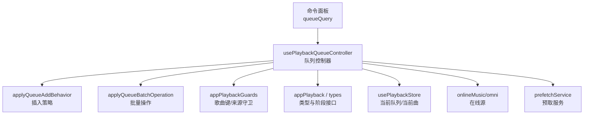

**图示来源**
- [usePlaybackQueueController.ts:144-173](file://src/hooks/usePlaybackQueueController.ts#L144-L173)
- [queueAddBehavior.ts:14-83](file://src/utils/queueAddBehavior.ts#L14-L83)
- [queueBatchOperations.ts:23-68](file://src/utils/queueBatchOperations.ts#L23-L68)
- [appPlaybackGuards.ts:80-119](file://src/utils/appPlaybackGuards.ts#L80-L119)
- [appPlayback.ts:16-64](file://src/types/appPlayback.ts#L16-L64)
- [types.ts:126-129](file://src/types.ts#L126-L129)

**章节来源**
- [usePlaybackQueueController.ts:144-173](file://src/hooks/usePlaybackQueueController.ts#L144-L173)
- [queueAddBehavior.ts:14-83](file://src/utils/queueAddBehavior.ts#L14-L83)
- [queueBatchOperations.ts:23-68](file://src/utils/queueBatchOperations.ts#L23-L68)
- [appPlaybackGuards.ts:80-119](file://src/utils/appPlaybackGuards.ts#L80-L119)
- [appPlayback.ts:16-64](file://src/types/appPlayback.ts#L16-L64)
- [types.ts:126-129](file://src/types.ts#L126-L129)

## 核心组件
- 队列控制器 `usePlaybackQueueController`：统一负责播放请求、队列构建、下一首/上一首、随机打乱、清空、外部源集成、阶段队列编辑等。
- 插入策略 `applyQueueAddBehavior`：根据用户偏好将新歌曲追加到队尾或当前曲之后，并去重。
- 批量操作 `applyQueueBatchOperation`：对选中项执行删除、移动到“下一位”、移动到“队尾”，保护当前曲不被误删。
- 歌曲守卫 `appPlaybackGuards`：跨来源稳定键 `getPlaybackSongKey`、同曲判断、队列内替换、混合来源检测。
- 类型系统：`SongResult`、`QueueAddBehavior`、`StageLoopMode`、`PlaybackNavigationOptions`、`StagePlayerQueueRequest` 等。

**章节来源**
- [usePlaybackQueueController.ts:144-173](file://src/hooks/usePlaybackQueueController.ts#L144-L173)
- [queueAddBehavior.ts:14-83](file://src/utils/queueAddBehavior.ts#L14-L83)
- [queueBatchOperations.ts:23-68](file://src/utils/queueBatchOperations.ts#L23-L68)
- [appPlaybackGuards.ts:80-119](file://src/utils/appPlaybackGuards.ts#L80-L119)
- [appPlayback.ts:16-64](file://src/types/appPlayback.ts#L16-L64)
- [types.ts:126-129](file://src/types.ts#L126-L129)

## 架构总览
队列管理以控制器为中心，向上暴露播放与队列操作 API，向下对接存储、在线源、预取与歌词服务。

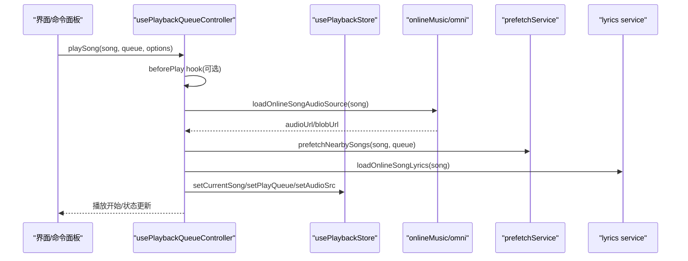

**图示来源**
- [usePlaybackQueueController.ts:440-690](file://src/hooks/usePlaybackQueueController.ts#L440-L690)

## 详细组件分析

### 数据结构与索引维护
- 队列主体为 `SongResult[]`，通过 `getPlaybackSongKey` 生成跨来源的稳定键，避免仅凭数字 id 造成的冲突。
- 去重策略：在插入时基于键集合过滤重复项；在替换时按键定位并替换。
- 索引维护：多处使用 `findIndex` 定位当前曲，结合 `loopMode` 决定边界回绕。

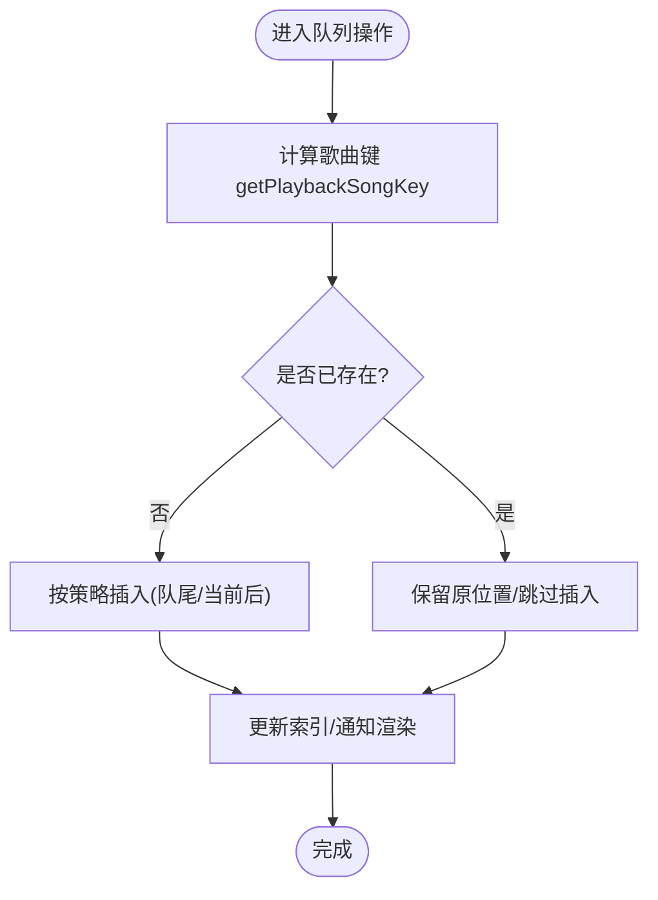

**图示来源**
- [queueAddBehavior.ts:14-83](file://src/utils/queueAddBehavior.ts#L14-L83)
- [appPlaybackGuards.ts:89-115](file://src/utils/appPlaybackGuards.ts#L89-L115)

**章节来源**
- [appPlaybackGuards.ts:80-119](file://src/utils/appPlaybackGuards.ts#L80-L119)
- [queueAddBehavior.ts:14-83](file://src/utils/queueAddBehavior.ts#L14-L83)

### 播放模式与下一首算法
- 顺序播放：默认从当前索引 +1 前进；无下一首则停止。
- 列表循环（loopMode=all）：到达末尾回到队首；上一首同理。
- 单曲循环（loopMode=one）：不推进到下一首，保持当前曲。
- FM 模式：接近队尾时自动拉取新歌并追加，继续播放新增的首条。
- 下一首推荐：当处于最后一首且非单曲循环时，返回队首作为“下一首”预览；FM 模式下最后一首不推荐队首。

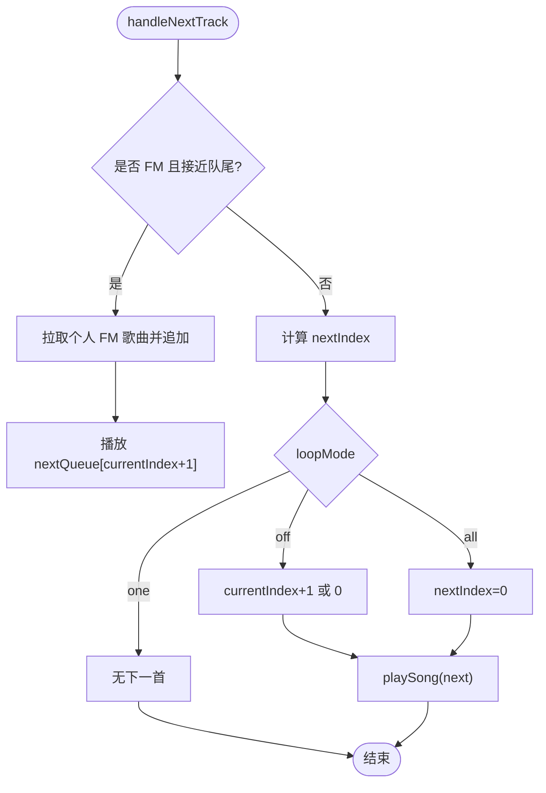

**图示来源**
- [usePlaybackQueueController.ts:845-916](file://src/hooks/usePlaybackQueueController.ts#L845-L916)
- [resolveNextUpTrack.ts:12-53](file://src/components/app/overlays/n now-playing-toast/resolveNextUpTrack.ts#L12-L53)

**章节来源**
- [usePlaybackQueueController.ts:845-916](file://src/hooks/usePlaybackQueueController.ts#L845-L916)
- [resolveNextUpTrack.ts:12-53](file://src/components/app/overlays/n now-playing-toast/resolveNextUpTrack.ts#L12-L53)
- [playbackNeighbors.test.ts:33-56](file://test/unit/playback/playbackNeighbors.test.ts#L33-L56)
- [resolveNextUpTrack.test.ts:42-69](file://test/unit/playback/resolveNextUpTrack.test.ts#L42-L69)

### 随机播放与队列打乱
- 随机打乱使用 Fisher-Yates 算法对除当前曲外的队列进行洗牌，并将当前曲保持在首位，保证“正在播放”的位置不变。
- 打乱后刷新附近资源预取，提升后续切换体验。

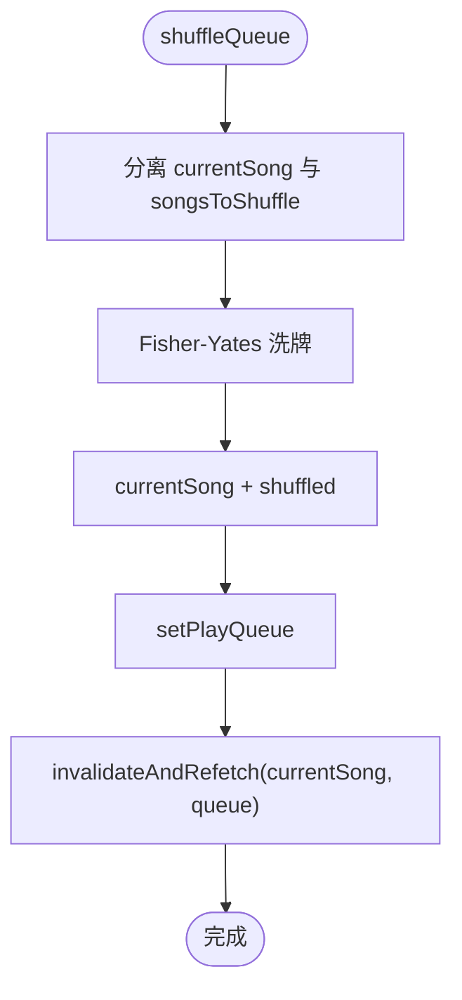

**图示来源**
- [usePlaybackQueueController.ts:1261-1289](file://src/hooks/usePlaybackQueueController.ts#L1261-L1289)

**章节来源**
- [usePlaybackQueueController.ts:1261-1289](file://src/hooks/usePlaybackQueueController.ts#L1261-L1289)

### 动态修改：添加、删除、移动与批量操作
- 添加：支持“追加到队尾”和“插入到当前曲之后”，依据 `queueAddBehavior` 配置。
- 删除：移除指定索引项；若命中当前曲则跳过并报告。
- 移动：支持“移动到下一位”、“移动到队尾”，保持重复项独立处理与相对顺序。
- 批量操作：原子性应用，保护当前曲，输出受影响数量与变更标记。

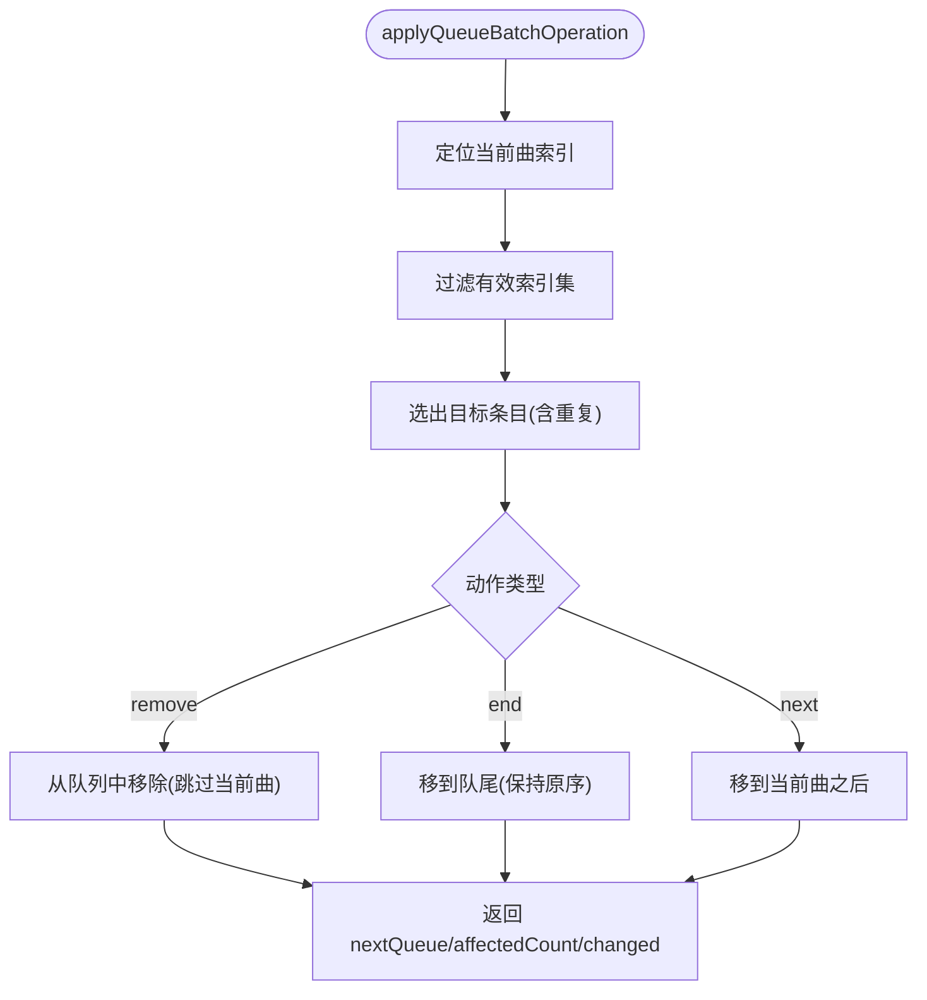

**图示来源**
- [queueBatchOperations.ts:23-68](file://src/utils/queueBatchOperations.ts#L23-L68)

**章节来源**
- [queueBatchOperations.ts:23-68](file://src/utils/queueBatchOperations.ts#L23-L68)
- [queueBatchOperations.test.ts:16-69](file://test/unit/utils/queueBatchOperations.test.ts#L16-L69)

### 智能队列行为：不可用歌曲与替换
- 当在线歌曲不可用时，尝试获取替代曲目；若失败则提示错误。
- 若可自动跳过且未达上限，显示倒计时提示，允许用户确认跳过。
- 替换成功后重建队列，确保替换项唯一且不丢失其他可用项。

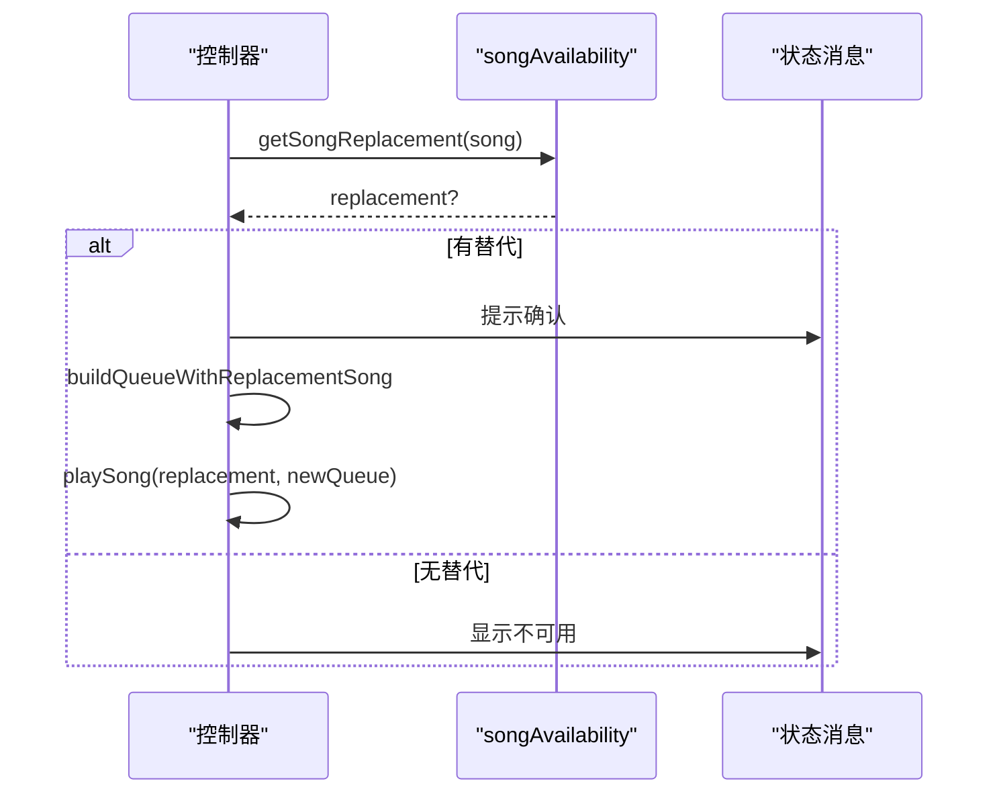

**图示来源**
- [usePlaybackQueueController.ts:357-389](file://src/hooks/usePlaybackQueueController.ts#L357-L389)
- [usePlaybackQueueController.ts:809-829](file://src/hooks/usePlaybackQueueController.ts#L809-L829)
- [usePlaybackQueueController.ts:322-355](file://src/hooks/usePlaybackQueueController.ts#L322-L355)

**章节来源**
- [usePlaybackQueueController.ts:357-389](file://src/hooks/usePlaybackQueueController.ts#L357-L389)
- [usePlaybackQueueController.ts:809-829](file://src/hooks/usePlaybackQueueController.ts#L809-L829)
- [usePlaybackQueueController.ts:322-355](file://src/hooks/usePlaybackQueueController.ts#L322-L355)

### 与外部源的集成
- 在线音乐：通过 `omni.getSongDetail` 拉取详情并加入队列；支持批量导入。
- 本地库与 Navidrome：通过回调 `onPlayLocalSong`、`onPlayNavidromeSong`、`onAddLocalSongToQueue`、`onAddNavidromeSongsToQueue` 桥接。
- 阶段/外部播放器：通过 `StagePlayerQueueRequest` 支持 append/insert-next/remove/move/select/clear，并返回增量 diff 与快照。

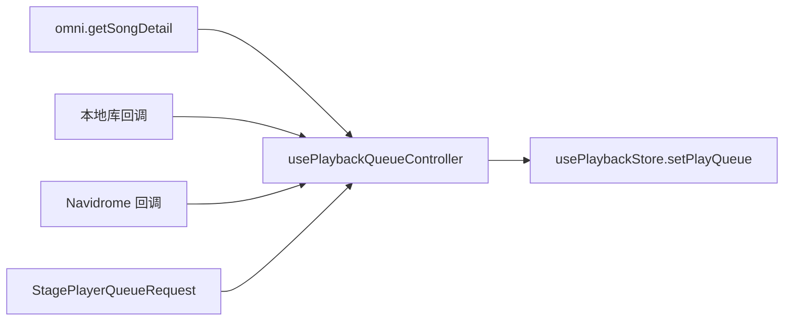

**图示来源**
- [usePlaybackQueueController.ts:1114-1141](file://src/hooks/usePlaybackQueueController.ts#L1114-L1141)
- [usePlaybackQueueController.ts:1143-1249](file://src/hooks/usePlaybackQueueController.ts#L1143-L1249)
- [types.ts:343-353](file://src/types.ts#L343-L353)

**章节来源**
- [usePlaybackQueueController.ts:1114-1141](file://src/hooks/usePlaybackQueueController.ts#L1114-L1141)
- [usePlaybackQueueController.ts:1143-1249](file://src/hooks/usePlaybackQueueController.ts#L1143-L1249)
- [types.ts:343-353](file://src/types.ts#L343-L353)

### 队列状态的持久化与同步
- 每次队列变化后调用 `persistLastPlaybackCache(currentSong, queue)` 持久化最近播放缓存。
- 主进程/窗口间通过 `WindowPlaybackHandoff` 与 `StagePlayerSnapshot` 同步播放状态与队列快照。
- 阶段队列编辑返回 `StagePlayerQueueDiff`，客户端可增量应用 insert/move/remove/clear/select。

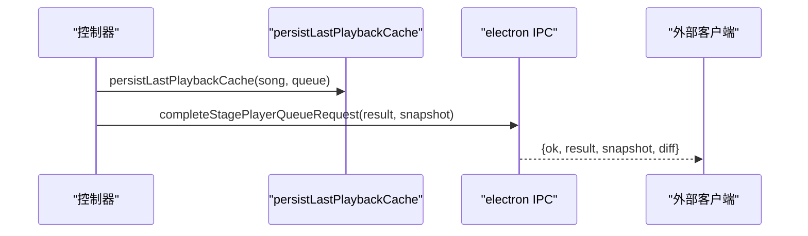

**图示来源**
- [usePlaybackQueueController.ts:1234-1249](file://src/hooks/usePlaybackQueueController.ts#L1234-L1249)
- [appPlayback.ts:53-64](file://src/types/appPlayback.ts#L53-L64)
- [types.ts:317-322](file://src/types.ts#L317-L322)

**章节来源**
- [usePlaybackQueueController.ts:1234-1249](file://src/hooks/usePlaybackQueueController.ts#L1234-L1249)
- [appPlayback.ts:53-64](file://src/types/appPlayback.ts#L53-L64)
- [types.ts:317-322](file://src/types.ts#L317-L322)

### 队列导航：快速跳转、搜索过滤与排序
- 命令面板支持队列查询语法，解析出批量动作与筛选条件，驱动 `applyQueueBatchOperation`。
- 搜索面板提交后，可将结果直接加入队列或播放。
- 排序选项可通过命令面板 facet 与队列视图交互实现（由上层 UI 与 store 配合）。

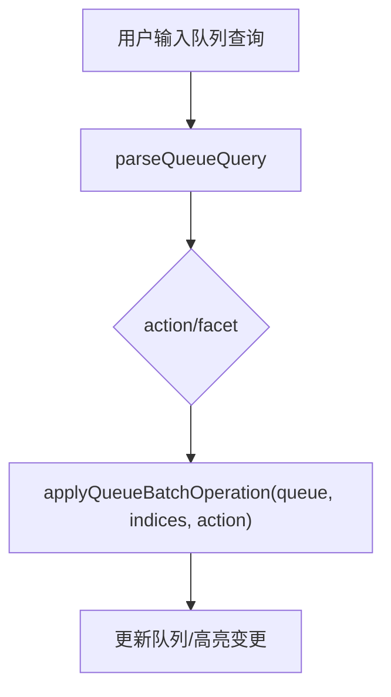

**图示来源**
- [queueQuery.ts:32-66](file://src/components/command-palette/queueQuery.ts#L32-L66)
- [queueBatchOperations.ts:23-68](file://src/utils/queueBatchOperations.ts#L23-L68)

**章节来源**
- [queueQuery.ts:32-66](file://src/components/command-palette/queueQuery.ts#L32-L66)
- [queueBatchOperations.ts:23-68](file://src/utils/queueBatchOperations.ts#L23-L68)

## 依赖关系分析
- 控制器依赖：
  - 播放状态与队列：`usePlaybackStore`（currentSong、playQueue、playerState、isFmMode）。
  - 音频设置：`useAudioSettingsStore`（audioQuality、queueAddBehavior、loopMode）。
  - 在线源：`services/onlineMusic/omni`、`songAvailability`、`resourceCache`。
  - 预取与歌词：`prefetchService`、`onlineLyricsState`。
  - 宿主扩展钩子：`hostExtensionHooks`（beforePlay）。
- 工具依赖：
  - `appPlaybackGuards`：歌曲键、来源判断、队列替换。
  - `queueAddBehavior`：插入策略。
  - `queueBatchOperations`：批量操作。
- 类型依赖：
  - `appPlayback.ts`：播放导航选项、快照、窗口交接。
  - `types.ts`：阶段队列请求、差异、枚举。

```mermaid
graph TB
usePlaybackQueueController --> usePlaybackStore
usePlaybackQueueController --> useAudioSettingsStore
usePlaybackQueueController --> omni
usePlaybackQueueController --> songAvailability
usePlaybackQueueController --> resourceCache
usePlaybackQueueController --> prefetchService
usePlaybackQueueController --> onlineLyricsState
usePlaybackQueueController --> hostExtensionHooks
usePlaybackQueueController --> appPlaybackGuards
usePlaybackQueueController --> queueAddBehavior
usePlaybackQueueController --> queueBatchOperations
usePlaybackQueueController --> appPlayback_types
usePlaybackQueueController --> types_stage
```

**图示来源**
- [usePlaybackQueueController.ts:1-41](file://src/hooks/usePlaybackQueueController.ts#L1-L41)
- [appPlayback.ts:16-64](file://src/types/appPlayback.ts#L16-L64)
- [types.ts:126-129](file://src/types.ts#L126-L129)

**章节来源**
- [usePlaybackQueueController.ts:1-41](file://src/hooks/usePlaybackQueueController.ts#L1-L41)
- [appPlayback.ts:16-64](file://src/types/appPlayback.ts#L16-L64)
- [types.ts:126-129](file://src/types.ts#L126-L129)

## 性能与优化
- 预取与缓存：
  - 播放前检查预取数据与本地缓存，减少首次加载延迟。
  - 播放成功后对邻近歌曲发起预取，降低切换开销。
- 去重与最小化变更：
  - 基于稳定键去重，避免重复项导致冗余渲染。
  - 批量操作返回 `changed` 标志，便于上层按需更新。
- 虚拟滚动与懒加载：
  - 队列视图建议使用虚拟滚动以减少长列表渲染压力。
  - 封面与元数据懒加载，优先展示轻量信息。
- 资源释放：
  - 播放切换时及时回收 blob URL，避免内存泄漏。
- 网络与重试：
  - 不可用歌曲自动跳过与重试上限，避免无限等待。

[本节为通用指导，不直接分析具体文件]

## 故障排查指南
- 歌曲不可用：
  - 现象：提示“歌曲不可用”或自动跳过。
  - 排查：检查在线源可用性、替代曲目获取、跳过计数上限。
  - 参考路径：[usePlaybackQueueController.ts:560-578](file://src/hooks/usePlaybackQueueController.ts#L560-L578)、[usePlaybackQueueController.ts:357-389](file://src/hooks/usePlaybackQueueController.ts#L357-L389)
- 无法下一首：
  - 现象：点击下一首无响应或停止。
  - 排查：检查 loopMode、FM 模式、队列是否为空、当前索引是否正确。
  - 参考路径：[usePlaybackQueueController.ts:845-916](file://src/hooks/usePlaybackQueueController.ts#L845-L916)
- 队列操作无效：
  - 现象：删除/移动未生效。
  - 排查：检查目标索引有效性、是否命中当前曲被保护、批量操作返回值。
  - 参考路径：[queueBatchOperations.ts:23-68](file://src/utils/queueBatchOperations.ts#L23-L68)、[queueBatchOperations.test.ts:16-69](file://test/unit/utils/queueBatchOperations.test.ts#L16-L69)
- 外部源集成失败：
  - 现象：Stage 队列编辑报错。
  - 排查：检查请求参数、上下文限制、diff 构建是否匹配 nextQueue。
  - 参考路径：[usePlaybackQueueController.ts:1143-1249](file://src/hooks/usePlaybackQueueController.ts#L1143-L1249)

**章节来源**
- [usePlaybackQueueController.ts:560-578](file://src/hooks/usePlaybackQueueController.ts#L560-L578)
- [usePlaybackQueueController.ts:357-389](file://src/hooks/usePlaybackQueueController.ts#L357-L389)
- [usePlaybackQueueController.ts:845-916](file://src/hooks/usePlaybackQueueController.ts#L845-L916)
- [queueBatchOperations.ts:23-68](file://src/utils/queueBatchOperations.ts#L23-L68)
- [queueBatchOperations.test.ts:16-69](file://test/unit/utils/queueBatchOperations.test.ts#L16-L69)
- [usePlaybackQueueController.ts:1143-1249](file://src/hooks/usePlaybackQueueController.ts#L1143-L1249)

## 结论
Folia Major 的队列管理系统以 `usePlaybackQueueController` 为核心，围绕 SongResult 数组构建了稳健的播放与编辑能力。通过稳定的歌曲键、灵活的插入策略、原子化的批量操作、完善的循环与随机模式、以及对外部源与阶段上下文的深度集成，系统在功能性与性能之间取得平衡。建议在实际使用中结合虚拟滚动与懒加载进一步优化长队列体验，并通过测试用例验证关键路径的正确性。