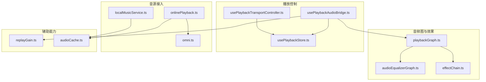
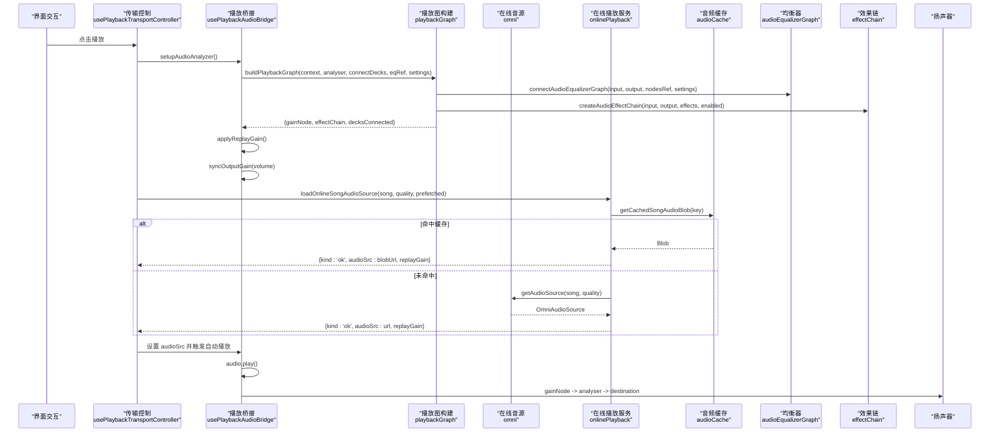
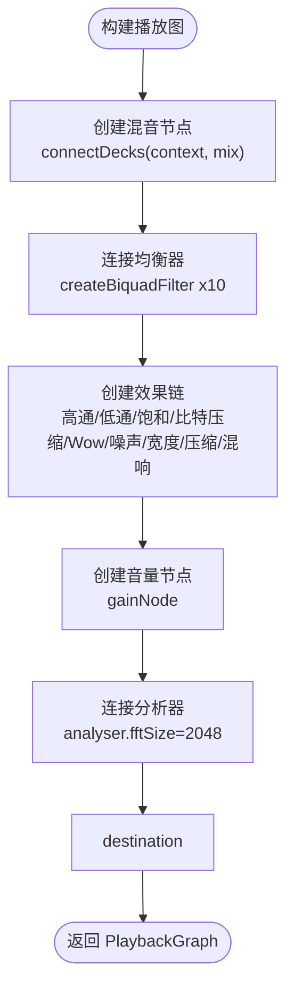
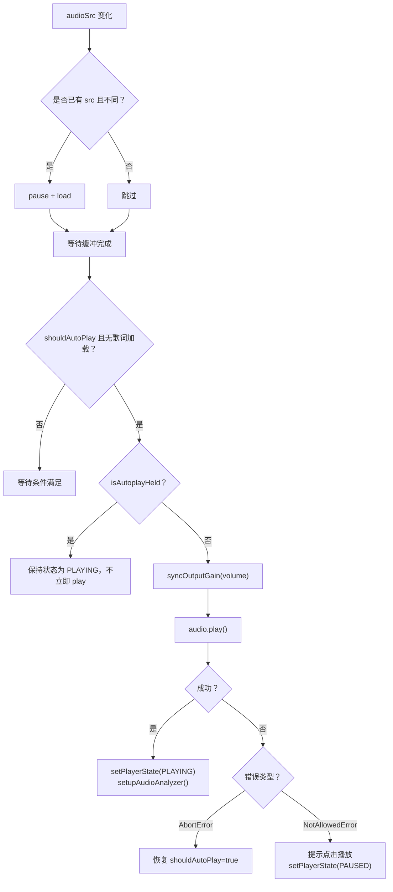
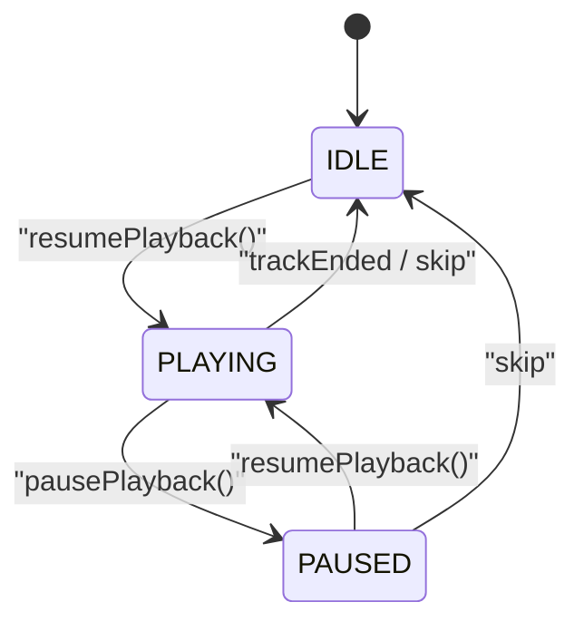
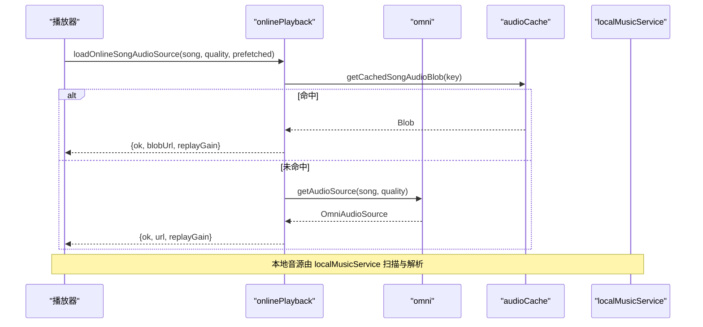
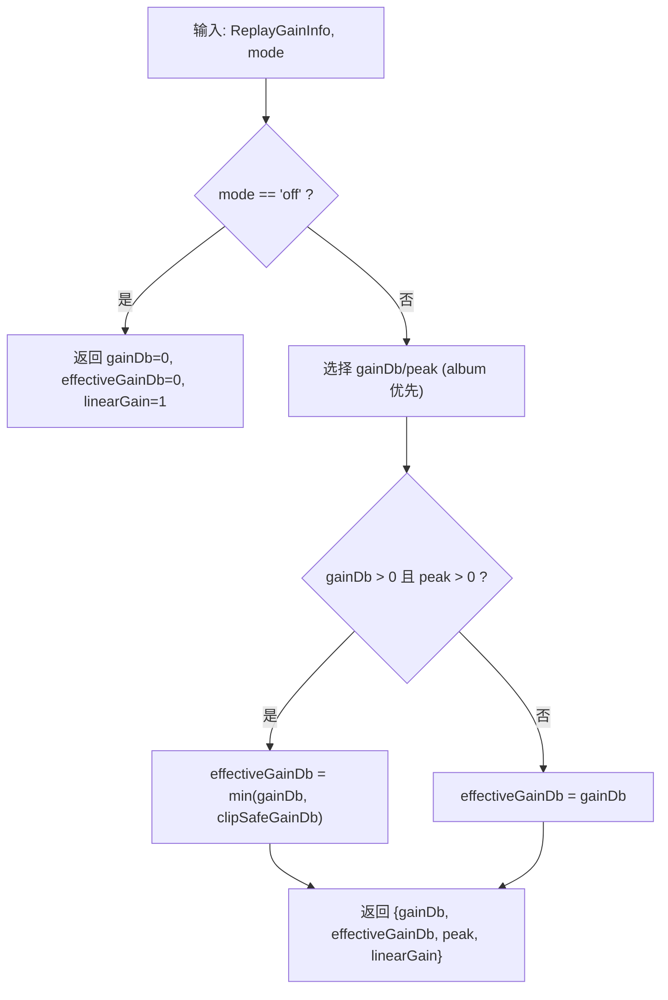
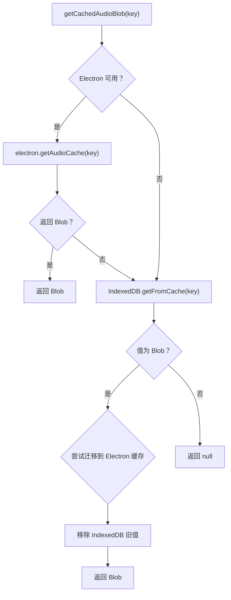
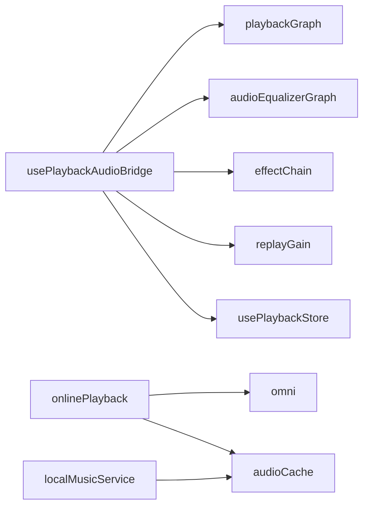

# 音乐播放引擎

<cite>
**本文引用的文件**   
- [playbackGraph.ts](file://src/services/playbackGraph.ts)
- [audioEqualizerGraph.ts](file://src/services/audioEqualizerGraph.ts)
- [effectChain.ts](file://src/services/audioEffects/effectChain.ts)
- [usePlaybackAudioBridge.ts](file://src/hooks/usePlaybackAudioBridge.ts)
- [usePlaybackTransportController.ts](file://src/hooks/usePlaybackTransportController.ts)
- [usePlaybackStore.ts](file://src/stores/usePlaybackStore.ts)
- [onlinePlayback.ts](file://src/services/onlinePlayback.ts)
- [omni.ts](file://src/services/onlineMusic/omni.ts)
- [localMusicService.ts](file://src/services/localMusicService.ts)
- [replayGain.ts](file://src/utils/replayGain.ts)
- [audioCache.ts](file://src/services/audioCache.ts)
</cite>

## 目录
1. [简介](#简介)
2. [项目结构](#项目结构)
3. [核心组件](#核心组件)
4. [架构总览](#架构总览)
5. [详细组件分析](#详细组件分析)
6. [依赖关系分析](#依赖关系分析)
7. [性能与优化建议](#性能与优化建议)
8. [故障排查指南](#故障排查指南)
9. [结论](#结论)

## 简介
本技术文档面向 Folia Major 的音乐播放引擎，系统性阐述其音频处理架构、Web Audio API 使用方式、音频解码与多源统一播放接口、重放增益处理、播放状态管理、队列与缓存策略、错误恢复机制，以及音频效果链（均衡器、音效）的实现细节。文档同时提供可视化架构图与流程图，帮助读者从高层到代码层全面理解系统。

## 项目结构
播放引擎相关代码主要分布在以下模块：
- 音频图构建与节点编排：services/playbackGraph.ts、services/audioEqualizerGraph.ts、services/audioEffects/effectChain.ts
- 播放桥接与传输控制：hooks/usePlaybackAudioBridge.ts、hooks/usePlaybackTransportController.ts
- 播放状态与显示层：stores/usePlaybackStore.ts
- 在线音乐与本地音乐统一接入：services/onlinePlayback.ts、services/onlineMusic/omni.ts、services/localMusicService.ts
- 重放增益计算：utils/replayGain.ts
- 音频缓存与预取：services/audioCache.ts

图表来源
- [playbackGraph.ts:31-98](file://src/services/playbackGraph.ts#L31-L98)
- [audioEqualizerGraph.ts:20-45](file://src/services/audioEqualizerGraph.ts#L20-L45)
- [effectChain.ts:31-93](file://src/services/audioEffects/effectChain.ts#L31-L93)
- [usePlaybackAudioBridge.ts:133-164](file://src/hooks/usePlaybackAudioBridge.ts#L133-L164)
- [usePlaybackTransportController.ts:68-132](file://src/hooks/usePlaybackTransportController.ts#L68-L132)
- [usePlaybackStore.ts:85-117](file://src/stores/usePlaybackStore.ts#L85-L117)
- [onlinePlayback.ts:18-64](file://src/services/onlinePlayback.ts#L18-L64)
- [omni.ts:452-460](file://src/services/onlineMusic/omni.ts#L452-L460)
- [localMusicService.ts:86-89](file://src/services/localMusicService.ts#L86-L89)
- [replayGain.ts:25-51](file://src/utils/replayGain.ts#L25-L51)
- [audioCache.ts:39-81](file://src/services/audioCache.ts#L39-L81)

章节来源
- [playbackGraph.ts:1-99](file://src/services/playbackGraph.ts#L1-L99)
- [audioEqualizerGraph.ts:1-59](file://src/services/audioEqualizerGraph.ts#L1-L59)
- [effectChain.ts:1-94](file://src/services/audioEffects/effectChain.ts#L1-L94)
- [usePlaybackAudioBridge.ts:1-343](file://src/hooks/usePlaybackAudioBridge.ts#L1-L343)
- [usePlaybackTransportController.ts:1-170](file://src/hooks/usePlaybackTransportController.ts#L1-L170)
- [usePlaybackStore.ts:1-177](file://src/stores/usePlaybackStore.ts#L1-L177)
- [onlinePlayback.ts:1-251](file://src/services/onlinePlayback.ts#L1-L251)
- [omni.ts:1-663](file://src/services/onlineMusic/omni.ts#L1-L663)
- [localMusicService.ts:1-800](file://src/services/localMusicService.ts#L1-L800)
- [replayGain.ts:1-53](file://src/utils/replayGain.ts#L1-L53)
- [audioCache.ts:1-120](file://src/services/audioCache.ts#L1-L120)

## 核心组件
- 音频图构建器：负责将混音点、均衡器、效果链、音量节点与分析器按固定顺序连接，确保视觉效果与听感一致，并保证音量节点位于效果之后以避免绝对型效果失真。
- 均衡器图：创建稳定的十段滤波器链，支持平滑参数更新，避免 React 渲染路径进入音频处理循环。
- 效果链：封装高通/低通、饱和度、比特压缩、Wow/Flutter、黑胶噪声、立体声宽度、动态压缩与混响等效果，并提供 apply/dispose 接口。
- 播放桥接 Hook：负责 HTMLAudioElement 生命周期、自动播放、ReplayGain 应用、媒体缓存、分析器初始化与音量同步。
- 传输控制 Hook：封装播放/暂停逻辑，处理自动播放被抑制、过渡期暂停、在线源恢复与状态同步。
- 播放状态 Store：维护“机器真实状态”和“用户感知显示状态”，在自动混音过渡期间保持封面、歌词与时长的一致性。
- 在线播放服务：统一获取在线音源、歌词与元数据，结合缓存与预取策略，返回可播放 URL 与 ReplayGain。
- 本地音乐服务：扫描、导入、解析本地音频与侧边歌词、封面，支持多种浏览器与 Electron 扩展格式。
- 重放增益工具：根据模式选择专辑或曲目增益，防止正增益削波，输出线性增益供 Deck 级调节。
- 音频缓存：优先 Electron 文件缓存，回退 IndexedDB Blob；支持迁移与存在性检查。

章节来源
- [playbackGraph.ts:31-98](file://src/services/playbackGraph.ts#L31-L98)
- [audioEqualizerGraph.ts:20-58](file://src/services/audioEqualizerGraph.ts#L20-L58)
- [effectChain.ts:31-93](file://src/services/audioEffects/effectChain.ts#L31-L93)
- [usePlaybackAudioBridge.ts:46-343](file://src/hooks/usePlaybackAudioBridge.ts#L46-L343)
- [usePlaybackTransportController.ts:47-169](file://src/hooks/usePlaybackTransportController.ts#L47-L169)
- [usePlaybackStore.ts:35-117](file://src/stores/usePlaybackStore.ts#L35-L117)
- [onlinePlayback.ts:18-64](file://src/services/onlinePlayback.ts#L18-L64)
- [localMusicService.ts:86-89](file://src/services/localMusicService.ts#L86-L89)
- [replayGain.ts:25-51](file://src/utils/replayGain.ts#L25-L51)
- [audioCache.ts:39-81](file://src/services/audioCache.ts#L39-L81)

## 架构总览
播放引擎以 Web Audio API 为核心，HTMLAudioElement 作为媒体源，通过桥接 Hook 建立 AudioContext、AnalyserNode、GainNode，并调用播放图构建器生成稳定节点拓扑。在线与本地音源经统一接口转换为安全 URL，配合预取与缓存策略降低首开延迟。重放增益在 Deck 级进行平滑调整，避免混音过程中的音量跳变。效果链置于均衡器之后、主音量之前，确保所有效果对最终听感一致响应。

图表来源
- [usePlaybackTransportController.ts:68-132](file://src/hooks/usePlaybackTransportController.ts#L68-L132)
- [usePlaybackAudioBridge.ts:133-164](file://src/hooks/usePlaybackAudioBridge.ts#L133-L164)
- [playbackGraph.ts:31-98](file://src/services/playbackGraph.ts#L31-L98)
- [audioEqualizerGraph.ts:20-45](file://src/services/audioEqualizerGraph.ts#L20-L45)
- [effectChain.ts:31-93](file://src/services/audioEffects/effectChain.ts#L31-L93)
- [onlinePlayback.ts:18-64](file://src/services/onlinePlayback.ts#L18-L64)
- [omni.ts:452-460](file://src/services/onlineMusic/omni.ts#L452-L460)
- [audioCache.ts:39-81](file://src/services/audioCache.ts#L39-L81)

## 详细组件分析

### 音频图与效果链
- 播放图构建：
  - 混音点：两个自动混音 Deck 汇入同一混音节点，确保均衡器与分析器只存在一份，视觉与听感一致。
  - 均衡器：十段滤波器链，低频和高频段分别使用 lowshelf/highshelf，中间为 peaking，Q=1.4，频率上限受采样率限制。
  - 效果链：高通/低通、饱和度、比特压缩、Wow/Flutter、黑胶噪声、立体声宽度、动态压缩与混响，参数通过 rampParam 平滑更新。
  - 音量节点：位于效果链之后，避免绝对型效果（如黑胶噪声、比特压缩、压缩阈值）受上游音量影响而改变特性。
  - 分析器：位于最后，用于可视化，直接连接 destination。

图表来源
- [playbackGraph.ts:31-98](file://src/services/playbackGraph.ts#L31-L98)
- [audioEqualizerGraph.ts:20-45](file://src/services/audioEqualizerGraph.ts#L20-L45)
- [effectChain.ts:31-93](file://src/services/audioEffects/effectChain.ts#L31-L93)

章节来源
- [playbackGraph.ts:31-98](file://src/services/playbackGraph.ts#L31-L98)
- [audioEqualizerGraph.ts:20-58](file://src/services/audioEqualizerGraph.ts#L20-L58)
- [effectChain.ts:31-93](file://src/services/audioEffects/effectChain.ts#L31-L93)

### 播放桥接与自动播放
- HTMLAudioElement 生命周期：
  - 当 audioSrc 变化时，先 pause/load 再重新加载，避免重复加载与状态错乱。
  - 自动播放逻辑考虑歌词加载、过渡期 hold、禁止策略与 AbortError 等边界情况。
- 分析器与图初始化：
  - 首次 play 成功后创建 AudioContext、AnalyserNode，构建播放图，应用 ReplayGain，同步输出音量。
- 媒体缓存：
  - 根据设置决定是否缓存已完整播放的音轨与封面，并在账户面板中刷新缓存大小。

图表来源
- [usePlaybackAudioBridge.ts:226-325](file://src/hooks/usePlaybackAudioBridge.ts#L226-L325)

章节来源
- [usePlaybackAudioBridge.ts:46-343](file://src/hooks/usePlaybackAudioBridge.ts#L46-L343)

### 传输控制与状态管理
- 播放/暂停：
  - 区分 Stage 纯歌词播放与主播放上下文。
  - 在自动混音过渡期暂停时，先取消过渡回到正在发声的 Deck，再暂停，避免误停下一轨道。
  - 在线源失败时尝试 recoverOnlinePlaybackSource，必要时刷新当前在线音源。
- 状态存储：
  - 维护 raw 与 display 两层状态，过渡期间显示层冻结 outgoing 歌曲信息，避免 UI 抖动。
  - 导出 selectDisplay* 选择器，确保控制面板、命令面板、任务栏等读取的是用户感知状态。

图表来源
- [usePlaybackTransportController.ts:68-169](file://src/hooks/usePlaybackTransportController.ts#L68-L169)
- [usePlaybackStore.ts:85-117](file://src/stores/usePlaybackStore.ts#L85-L117)

章节来源
- [usePlaybackTransportController.ts:47-169](file://src/hooks/usePlaybackTransportController.ts#L47-L169)
- [usePlaybackStore.ts:35-177](file://src/stores/usePlaybackStore.ts#L35-L177)

### 在线音乐与本地音乐统一播放
- 在线音源：
  - onlinePlayback.loadOnlineSongAudioSource 优先读取缓存 Blob，其次使用预取 URL，最后通过 omni.getAudioSource 获取流式 URL，并附带 ReplayGain。
  - omni 提供统一接口，屏蔽各平台差异，支持质量偏好、歌词、收藏、歌单等操作。
- 本地音乐：
  - localMusicService 定义浏览器与 Electron 支持的音频扩展名，扫描目录、解析嵌入元数据、匹配侧边歌词与封面，构建本地歌曲实体。

图表来源
- [onlinePlayback.ts:18-64](file://src/services/onlinePlayback.ts#L18-L64)
- [omni.ts:452-460](file://src/services/onlineMusic/omni.ts#L452-L460)
- [audioCache.ts:39-81](file://src/services/audioCache.ts#L39-L81)
- [localMusicService.ts:86-89](file://src/services/localMusicService.ts#L86-L89)

章节来源
- [onlinePlayback.ts:18-64](file://src/services/onlinePlayback.ts#L18-L64)
- [omni.ts:452-460](file://src/services/onlineMusic/omni.ts#L452-L460)
- [localMusicService.ts:86-89](file://src/services/localMusicService.ts#L86-L89)

### 重放增益处理
- 模式选择：
  - off：禁用增益。
  - track：使用曲目增益。
  - album：优先专辑增益，回退曲目增益。
- 防削波：
  - 若增益为正且有峰值信息，则计算 clipSafeGainDb，取 min(gainDb, clipSafeGainDb)，避免溢出。
- 应用位置：
  - 在 Deck 级通过 rampGain 平滑调整，避免混音过程中两 Deck 增益不一致导致听感突变。

图表来源
- [replayGain.ts:25-51](file://src/utils/replayGain.ts#L25-L51)

章节来源
- [replayGain.ts:25-51](file://src/utils/replayGain.ts#L25-L51)
- [usePlaybackAudioBridge.ts:79-131](file://src/hooks/usePlaybackAudioBridge.ts#L79-L131)

### 音频缓存与预加载
- 缓存优先级：
  - Electron 文件缓存优先，回退 IndexedDB Blob。
  - 首次从 IndexedDB 读取后尝试迁移至 Electron 文件缓存，失败仅记录警告。
- 存在性检查：
  - hasCachedAudio 同样优先 Electron 缓存，再查 IndexedDB，清理无效条目。

图表来源
- [audioCache.ts:39-81](file://src/services/audioCache.ts#L39-L81)

章节来源
- [audioCache.ts:39-81](file://src/services/audioCache.ts#L39-L81)

## 依赖关系分析
- 组件耦合：
  - usePlaybackAudioBridge 依赖 playbackGraph、audioEqualizerGraph、effectChain、replayGain 与 stores。
  - onlinePlayback 依赖 omni 与 audioCache。
  - localMusicService 独立于在线链路，提供本地音源实体。
- 外部依赖：
  - Web Audio API（AudioContext、AnalyserNode、GainNode、BiquadFilterNode）。
  - HTMLMediaElement（HTMLAudioElement）。
  - Electron IPC（可选，用于文件缓存与转码回退）。

图表来源
- [usePlaybackAudioBridge.ts:1-343](file://src/hooks/usePlaybackAudioBridge.ts#L1-L343)
- [playbackGraph.ts:1-99](file://src/services/playbackGraph.ts#L1-L99)
- [audioEqualizerGraph.ts:1-59](file://src/services/audioEqualizerGraph.ts#L1-L59)
- [effectChain.ts:1-94](file://src/services/audioEffects/effectChain.ts#L1-L94)
- [replayGain.ts:1-53](file://src/utils/replayGain.ts#L1-L53)
- [usePlaybackStore.ts:1-177](file://src/stores/usePlaybackStore.ts#L1-L177)
- [onlinePlayback.ts:1-251](file://src/services/onlinePlayback.ts#L1-L251)
- [omni.ts:1-663](file://src/services/onlineMusic/omni.ts#L1-L663)
- [audioCache.ts:1-120](file://src/services/audioCache.ts#L1-L120)
- [localMusicService.ts:1-800](file://src/services/localMusicService.ts#L1-L800)

章节来源
- [usePlaybackAudioBridge.ts:1-343](file://src/hooks/usePlaybackAudioBridge.ts#L1-L343)
- [onlinePlayback.ts:1-251](file://src/services/onlinePlayback.ts#L1-L251)
- [localMusicService.ts:1-800](file://src/services/localMusicService.ts#L1-L800)

## 性能与优化建议
- 音频缓冲策略：
  - 利用 HTMLAudioElement 原生缓冲与在线流式播放，结合预取服务减少首开延迟。
  - 在自动混音场景下提前装载下一轨道，但避免在过渡 hold 期间触发 play，以免浪费意图。
- 内存管理：
  - 效果链与均衡器节点复用，避免频繁重建；在卸载时调用 dispose 释放资源。
  - 音频缓存优先 Electron 文件缓存，IndexedDB 仅作回退，减少大对象驻留内存。
- GPU 加速：
  - 可视化与频谱分析使用 AnalyserNode，避免在主线程进行重型 FFT；FFT 仅在后台分析中使用（如 automix 信号分析），不影响播放路径。
- 参数平滑：
  - 均衡器与效果参数使用 setTargetAtTime/rampParam 平滑更新，避免量化跳变与爆音。
- 音量控制：
  - 音量节点位于效果链之后，确保绝对型效果行为一致；Deck 级 ReplayGain 平滑过渡，避免混音阶段音量突变。

[本节为通用指导，无需具体文件引用]

## 故障排查指南
- 自动播放被阻止：
  - 捕获 NotAllowedError，提示用户点击播放，并将状态置为 PAUSED。
- 在线源不可用：
  - 捕获 provider 暂时不可用错误，返回 unavailable；在 resumePlayback 中尝试 recoverOnlinePlaybackSource 刷新源。
- 过渡期误操作：
  - 在自动混音过渡期暂停或跳转时，先 cancel 过渡回到实际发声 Deck，再执行操作，避免误停下一轨道。
- 缓存异常：
  - 若 IndexedDB 缓存损坏，hasCachedAudio 会清理无效条目；迁移失败仅记录警告，不影响后续读取。
- 效果链未生效：
  - 确认效果链已正确连接在均衡器之后、音量节点之前；检查 settings.enabled 与 normalizeAudioEffects 返回值。

章节来源
- [usePlaybackAudioBridge.ts:293-325](file://src/hooks/usePlaybackAudioBridge.ts#L293-L325)
- [usePlaybackTransportController.ts:91-132](file://src/hooks/usePlaybackTransportController.ts#L91-L132)
- [audioCache.ts:39-81](file://src/services/audioCache.ts#L39-L81)
- [effectChain.ts:31-93](file://src/services/audioEffects/effectChain.ts#L31-L93)

## 结论
Folia Major 的音乐播放引擎以 Web Audio API 为核心，通过稳定的音频图构建、分层的状态管理与统一的音源接入，实现了在线与本地音乐的无缝播放。重放增益与效果链保证了音质一致性，缓存与预取提升了首开体验，错误恢复与过渡期保护增强了鲁棒性。建议在大规模曲库与复杂可视化场景下继续优化缓冲策略与资源释放，进一步提升性能与稳定性。