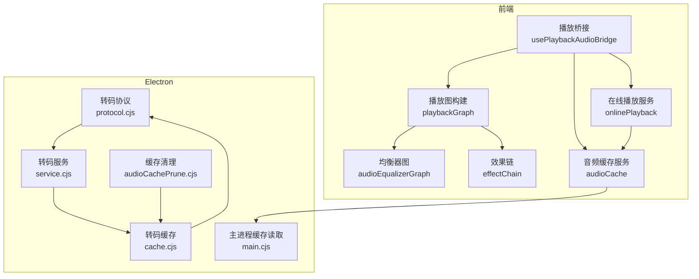
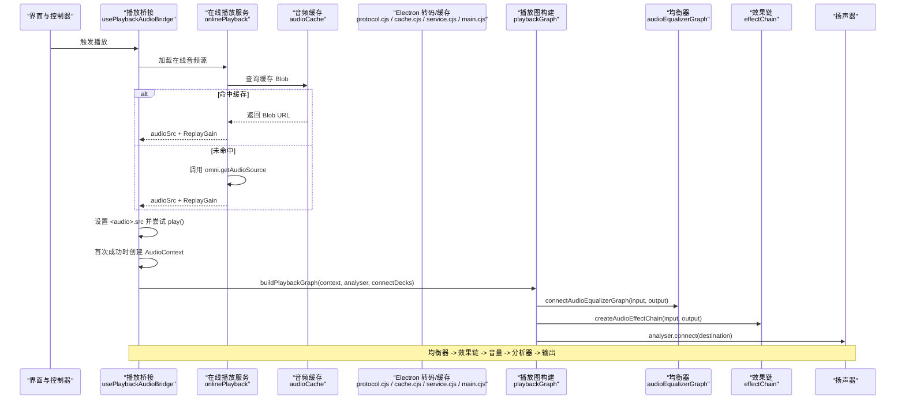
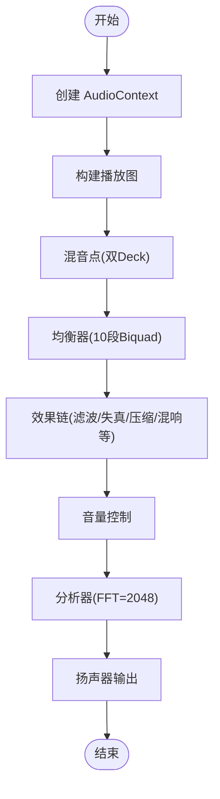
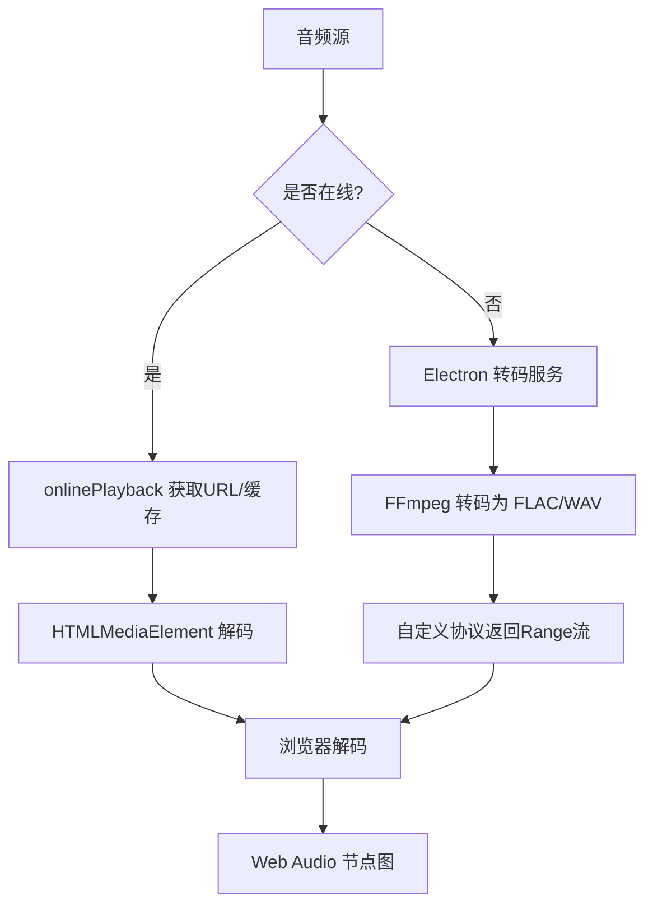
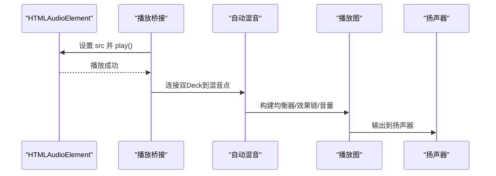
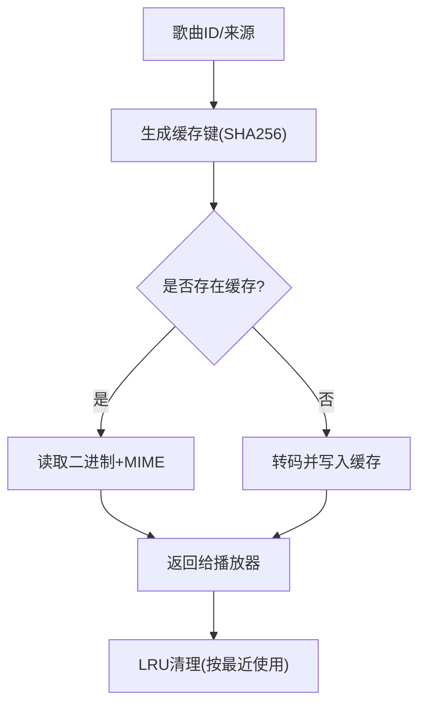
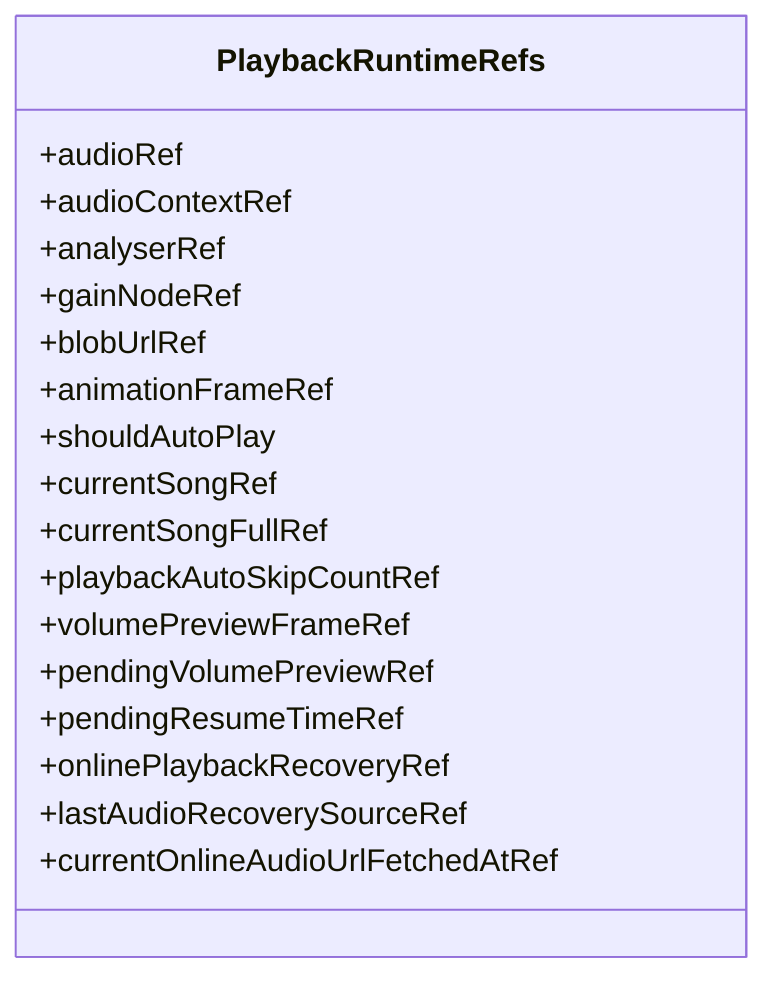
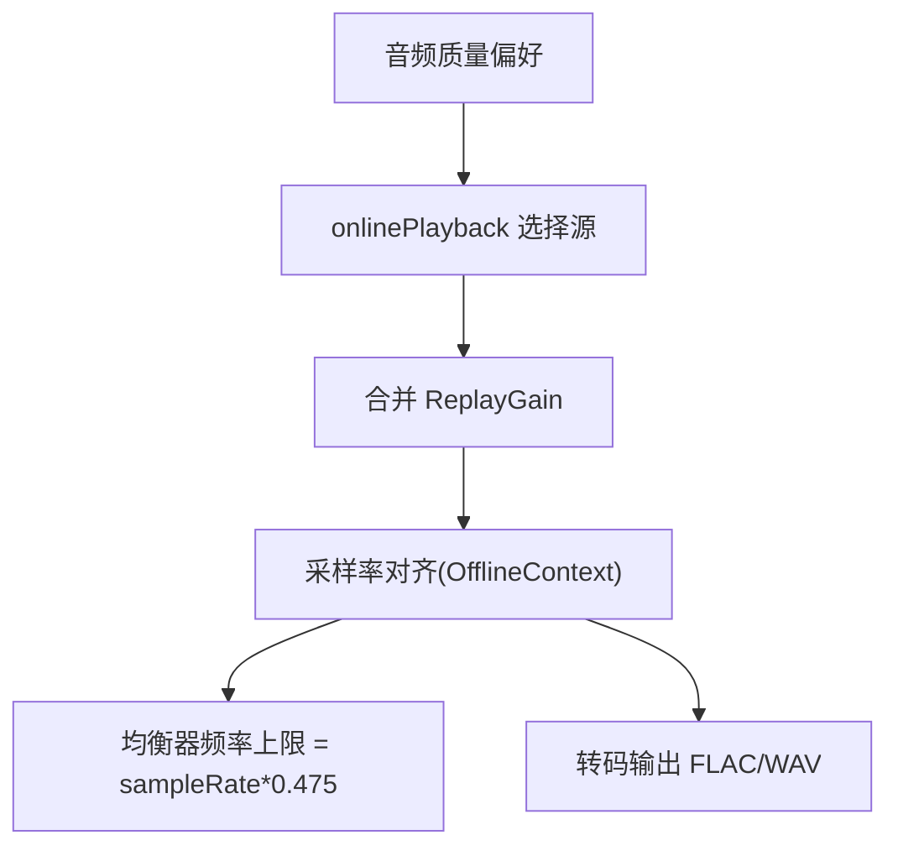
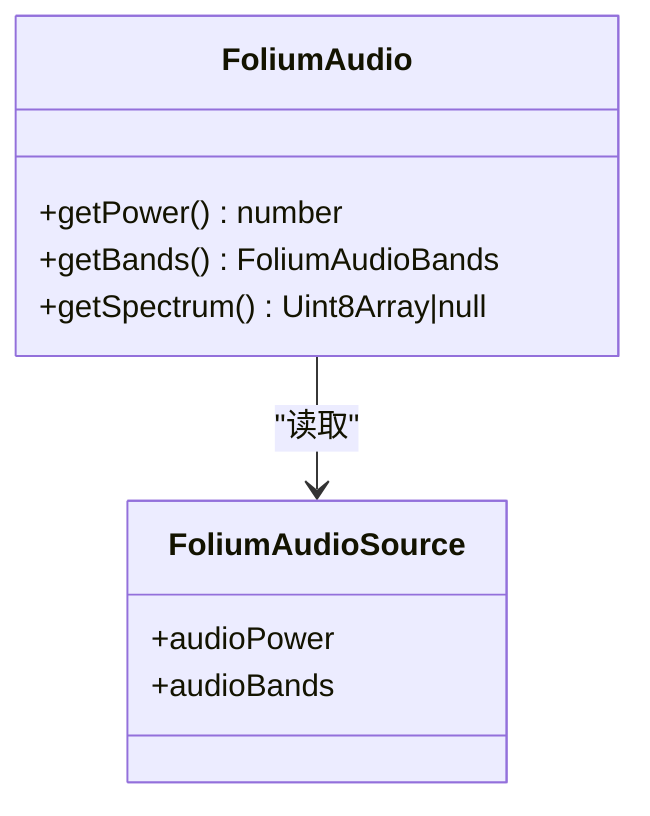
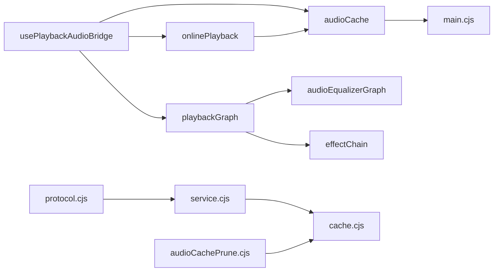

# 音频处理架构

<cite>
**本文引用的文件**   
- [usePlaybackAudioBridge.ts](file://src/hooks/usePlaybackAudioBridge.ts)
- [usePlaybackRuntimeRefs.ts](file://src/hooks/usePlaybackRuntimeRefs.ts)
- [playbackGraph.ts](file://src/services/playbackGraph.ts)
- [audioEqualizerGraph.ts](file://src/services/audioEqualizerGraph.ts)
- [effectChain.ts](file://src/services/audioEffects/effectChain.ts)
- [onlinePlayback.ts](file://src/services/onlinePlayback.ts)
- [audioCache.ts](file://src/services/audioCache.ts)
- [protocol.cjs](file://electron/transcode/protocol.cjs)
- [cache.cjs](file://electron/transcode/cache.cjs)
- [service.cjs](file://electron/transcode/service.cjs)
- [main.cjs](file://electron/main.cjs)
- [audioCachePrune.cjs](file://electron/audioCachePrune.cjs)
- [automixSession.ts](file://src/services/automix/automixSession.ts)
- [crossfadeGraph.ts](file://src/services/automix/crossfadeGraph.ts)
- [profileService.ts](file://src/services/automix/profileService.ts)
- [stems.ts](file://src/services/automix/stems.ts)
- [foliumAudio.test.ts](file://test/unit/mod-system/foliumAudio.test.ts)
- [audio.ts](file://src/mods/folium/audio.ts)
- [contract.ts](file://src/mods/folium/contract.ts)
</cite>

## 目录
1. [简介](#简介)
2. [项目结构](#项目结构)
3. [核心组件](#核心组件)
4. [架构总览](#架构总览)
5. [详细组件分析](#详细组件分析)
6. [依赖关系分析](#依赖关系分析)
7. [性能与内存优化](#性能与内存优化)
8. [故障排查指南](#故障排查指南)
9. [结论](#结论)

## 简介
本技术文档聚焦 Folia Major 的音频处理架构，围绕 Web Audio API 的使用方式、音频解码策略、流式播放链路、缓冲与缓存机制、多平台兼容性（浏览器与 Electron）、音频质量与采样率控制，以及性能优化与错误恢复进行系统化说明。目标是帮助开发者快速理解从数据源到扬声器的完整路径，并掌握关键节点的设计意图与扩展点。

## 项目结构
Folia Major 的音频系统由前端 React Hook 层、Web Audio 节点图构建层、在线播放与缓存服务层、Electron 转码与本地缓存层共同组成：
- 前端播放桥接层负责创建和管理 AudioContext、连接媒体元素、构建均衡器与效果链、驱动自动混音与可视化。
- 在线播放服务负责选择音频源、合并 ReplayGain 元数据、管理预取与缓存。
- Electron 侧提供转码协议、FLAC/WAV 缓存、基于文件的 LRU 清理与 MIME 类型分发。
- 自动混音子系统负责双 Deck 切换、交叉淡入淡出、分轨分析与采样率对齐。

**图示来源**
- [usePlaybackAudioBridge.ts:133-164](file://src/hooks/usePlaybackAudioBridge.ts#L133-L164)
- [playbackGraph.ts:31-98](file://src/services/playbackGraph.ts#L31-L98)
- [audioEqualizerGraph.ts:20-45](file://src/services/audioEqualizerGraph.ts#L20-L45)
- [effectChain.ts:31-93](file://src/services/audioEffects/effectChain.ts#L31-L93)
- [onlinePlayback.ts:18-64](file://src/services/onlinePlayback.ts#L18-L64)
- [audioCache.ts:39-81](file://src/services/audioCache.ts#L39-L81)
- [protocol.cjs:30-59](file://electron/transcode/protocol.cjs#L30-L59)
- [cache.cjs:1-32](file://electron/transcode/cache.cjs#L1-L32)
- [service.cjs:33-59](file://electron/transcode/service.cjs#L33-L59)
- [main.cjs:3767-3806](file://electron/main.cjs#L3767-L3806)
- [audioCachePrune.cjs:1-20](file://electron/audioCachePrune.cjs#L1-L20)

**章节来源**
- [usePlaybackAudioBridge.ts:1-343](file://src/hooks/usePlaybackAudioBridge.ts#L1-L343)
- [playbackGraph.ts:1-99](file://src/services/playbackGraph.ts#L1-L99)
- [audioEqualizerGraph.ts:1-59](file://src/services/audioEqualizerGraph.ts#L1-L59)
- [effectChain.ts:1-94](file://src/services/audioEffects/effectChain.ts#L1-L94)
- [onlinePlayback.ts:1-251](file://src/services/onlinePlayback.ts#L1-L251)
- [audioCache.ts:1-81](file://src/services/audioCache.ts#L1-L81)
- [protocol.cjs:30-59](file://electron/transcode/protocol.cjs#L30-L59)
- [cache.cjs:1-32](file://electron/transcode/cache.cjs#L1-L32)
- [service.cjs:33-59](file://electron/transcode/service.cjs#L33-L59)
- [main.cjs:3767-3806](file://electron/main.cjs#L3767-L3806)
- [audioCachePrune.cjs:1-20](file://electron/audioCachePrune.cjs#L1-L20)

## 核心组件
- 播放桥接 Hook：负责 HTMLAudioElement 生命周期、自动播放、ReplayGain 应用、AudioContext 初始化与节点图构建、输出增益同步、资源释放。
- 播放图构建器：将两个自动混音 Deck 接入共享混音点，串联均衡器、效果链、音量节点、分析器与输出设备。
- 均衡器图：十段 BiquadFilter 链，低频/高频使用 shelf，中间使用 peaking；参数平滑更新避免音频路径中的 React 重渲染。
- 效果链：高通/低通滤波、饱和失真、比特压缩、Wow/Flutter、黑胶噪声、立体声宽度、动态压缩与混响；支持启用/禁用与参数渐变。
- 在线播放服务：优先使用缓存 Blob URL，否则通过统一入口获取音频源，合并 ReplayGain 元数据，并更新预取信息。
- Electron 转码与缓存：自定义协议解析 FLAC/WAV 请求，按 source+revision 生成确定性缓存键，原子写入并返回 Range 响应；主进程读取带 MIME 类型的二进制缓存。
- 自动混音：双 Deck 切换、交叉淡入淡出、分轨分析、采样率对齐与 Mid/Side 分离用于特征提取。

**章节来源**
- [usePlaybackAudioBridge.ts:45-164](file://src/hooks/usePlaybackAudioBridge.ts#L45-L164)
- [playbackGraph.ts:31-98](file://src/services/playbackGraph.ts#L31-L98)
- [audioEqualizerGraph.ts:20-59](file://src/services/audioEqualizerGraph.ts#L20-L59)
- [effectChain.ts:31-93](file://src/services/audioEffects/effectChain.ts#L31-L93)
- [onlinePlayback.ts:18-64](file://src/services/onlinePlayback.ts#L18-L64)
- [protocol.cjs:30-59](file://electron/transcode/protocol.cjs#L30-L59)
- [cache.cjs:1-32](file://electron/transcode/cache.cjs#L1-L32)
- [service.cjs:33-59](file://electron/transcode/service.cjs#L33-L59)
- [main.cjs:3767-3806](file://electron/main.cjs#L3767-L3806)
- [automixSession.ts:676-700](file://src/services/automix/automixSession.ts#L676-L700)
- [crossfadeGraph.ts:105-105](file://src/services/automix/crossfadeGraph.ts#L105-L105)
- [profileService.ts:119-142](file://src/services/automix/profileService.ts#L119-L142)
- [stems.ts:149-171](file://src/services/automix/stems.ts#L149-L171)

## 架构总览
下图展示从数据源到扬声器的端到端流程，包括在线/本地/转码路径、缓存、Web Audio 节点图与自动混音。

**图示来源**
- [usePlaybackAudioBridge.ts:133-164](file://src/hooks/usePlaybackAudioBridge.ts#L133-L164)
- [onlinePlayback.ts:18-64](file://src/services/onlinePlayback.ts#L18-L64)
- [audioCache.ts:39-81](file://src/services/audioCache.ts#L39-L81)
- [playbackGraph.ts:31-98](file://src/services/playbackGraph.ts#L31-L98)
- [audioEqualizerGraph.ts:20-45](file://src/services/audioEqualizerGraph.ts#L20-L45)
- [effectChain.ts:31-93](file://src/services/audioEffects/effectChain.ts#L31-L93)

## 详细组件分析

### Web Audio API 使用与节点图构建
- AudioContext 创建与复用：在首次成功播放时创建，兼容 webkitAudioContext；避免重复创建导致 MediaElementSource 异常。
- 节点顺序：Deck 输入 -> 混音点 -> 均衡器 -> 效果链 -> 音量 -> 分析器 -> 输出。该顺序确保视觉效果与实际听感一致，且体积控制对绝对型效果（如黑胶噪声、比特压缩、压缩阈值）影响正确。
- 分析器配置：FFT 大小 2048，平滑系数 0.6，用于频谱与能量可视化。
- 输出增益：通过 GainNode 平滑调节，避免突变。

**图示来源**
- [usePlaybackAudioBridge.ts:133-164](file://src/hooks/usePlaybackAudioBridge.ts#L133-L164)
- [playbackGraph.ts:31-98](file://src/services/playbackGraph.ts#L31-L98)
- [audioEqualizerGraph.ts:20-45](file://src/services/audioEqualizerGraph.ts#L20-L45)
- [effectChain.ts:31-93](file://src/services/audioEffects/effectChain.ts#L31-L93)

**章节来源**
- [usePlaybackAudioBridge.ts:133-164](file://src/hooks/usePlaybackAudioBridge.ts#L133-L164)
- [playbackGraph.ts:31-98](file://src/services/playbackGraph.ts#L31-L98)

### 音频解码器与格式支持
- 在线音频：优先使用缓存 Blob URL；若未命中则通过统一入口获取远程 URL，并合并 ReplayGain 元数据。
- Electron 转码：支持 FLAC 与 WAV 两种输出格式；当编码器不支持或失败时回退为 WAV。
- 解码策略：
  - 在线路径：浏览器原生解码（HTMLMediaElement），结合缓存减少网络开销。
  - 本地/远端转码：Electron 侧使用 FFmpeg 转码为 FLAC/WAV，并通过自定义协议以 Range 响应流式传输。
  - 自动混音分析：OfflineAudioContext 在固定采样率下解码，保证测量一致性。

**图示来源**
- [onlinePlayback.ts:18-64](file://src/services/onlinePlayback.ts#L18-L64)
- [protocol.cjs:30-59](file://electron/transcode/protocol.cjs#L30-L59)
- [service.cjs:47-59](file://electron/transcode/service.cjs#L47-L59)
- [profileService.ts:147-156](file://src/services/automix/profileService.ts#L147-L156)

**章节来源**
- [onlinePlayback.ts:18-64](file://src/services/onlinePlayback.ts#L18-L64)
- [protocol.cjs:30-59](file://electron/transcode/protocol.cjs#L30-L59)
- [service.cjs:47-59](file://electron/transcode/service.cjs#L47-L59)
- [profileService.ts:147-156](file://src/services/automix/profileService.ts#L147-L156)

### 音频流处理链路
- 数据源：在线 URL、本地文件、Electron 转码协议 URL。
- 播放器：HTMLAudioElement 作为媒体源，自动播放受用户手势与状态机约束。
- 节点图：Deck 输入 -> 混音 -> 均衡器 -> 效果链 -> 音量 -> 分析器 -> 输出。
- 自动混音：双 Deck 切换，交叉淡入淡出，过渡期间保持音量与音色稳定。

**图示来源**
- [usePlaybackAudioBridge.ts:226-325](file://src/hooks/usePlaybackAudioBridge.ts#L226-L325)
- [automixSession.ts:676-700](file://src/services/automix/automixSession.ts#L676-L700)
- [crossfadeGraph.ts:105-105](file://src/services/automix/crossfadeGraph.ts#L105-L105)

**章节来源**
- [usePlaybackAudioBridge.ts:226-325](file://src/hooks/usePlaybackAudioBridge.ts#L226-L325)
- [automixSession.ts:676-700](file://src/services/automix/automixSession.ts#L676-L700)

### 音频缓冲与缓存机制
- 前端缓存：IndexedDB 存储 Blob，Electron 可用时迁移至文件系统缓存；提供 hasCachedAudio 与 getCachedAudioBlob。
- Electron 缓存：按 source+revision 生成 SHA256 键，目录包含 audio.flac/wav 与 metadata.json；支持 Range 请求与 mtime 访问更新。
- 清理策略：默认上限约 5GB，按最近使用时间淘汰；显式 0 表示无上限。
- 预加载：在线播放支持 prefetched audioUrl，避免二次请求；歌词与封面也具备缓存与预取逻辑。

**图示来源**
- [audioCache.ts:39-81](file://src/services/audioCache.ts#L39-L81)
- [cache.cjs:15-32](file://electron/transcode/cache.cjs#L15-L32)
- [main.cjs:3767-3806](file://electron/main.cjs#L3767-L3806)
- [audioCachePrune.cjs:1-20](file://electron/audioCachePrune.cjs#L1-L20)

**章节来源**
- [audioCache.ts:39-81](file://src/services/audioCache.ts#L39-L81)
- [cache.cjs:15-32](file://electron/transcode/cache.cjs#L15-L32)
- [main.cjs:3767-3806](file://electron/main.cjs#L3767-L3806)
- [audioCachePrune.cjs:1-20](file://electron/audioCachePrune.cjs#L1-L20)

### 多平台兼容性处理
- 浏览器差异：兼容 webkitAudioContext；根据 setSinkId 可用性选择 AudioContext 或 HTMLAudioElement 作为输出目标。
- Electron 环境：提供音频缓存迁移、转码协议、窗口与显示相关能力；主进程读取缓存并返回 MIME 类型。
- 运行时引用：集中管理 audioRef、audioContextRef、analyserRef、gainNodeRef 等可变引用，供多个控制器在同一 tick 内协作。

**图示来源**
- [usePlaybackRuntimeRefs.ts:22-68](file://src/hooks/usePlaybackRuntimeRefs.ts#L22-L68)

**章节来源**
- [usePlaybackAudioBridge.ts:133-164](file://src/hooks/usePlaybackAudioBridge.ts#L133-L164)
- [usePlaybackRuntimeRefs.ts:22-68](file://src/hooks/usePlaybackRuntimeRefs.ts#L22-L68)
- [main.cjs:3767-3806](file://electron/main.cjs#L3767-L3806)

### 音频质量、采样率转换与比特率
- 在线音频质量：通过 AudioQualityPreference 选择不同质量；在线服务合并 ReplayGain 元数据。
- 采样率：
  - 自动混音分析使用 OfflineAudioContext 固定采样率，保证测量一致性。
  - 均衡器频率上限限制为 context.sampleRate * 0.475，防止超奈奎斯特频率。
- 比特率：Electron 转码输出 FLAC/WAV；WAV 作为编码器不可用时的回退格式。

**图示来源**
- [onlinePlayback.ts:18-64](file://src/services/onlinePlayback.ts#L18-L64)
- [profileService.ts:147-156](file://src/services/automix/profileService.ts#L147-L156)
- [audioEqualizerGraph.ts:15-17](file://src/services/audioEqualizerGraph.ts#L15-L17)
- [service.cjs:47-59](file://electron/transcode/service.cjs#L47-L59)

**章节来源**
- [onlinePlayback.ts:18-64](file://src/services/onlinePlayback.ts#L18-L64)
- [profileService.ts:147-156](file://src/services/automix/profileService.ts#L147-L156)
- [audioEqualizerGraph.ts:15-17](file://src/services/audioEqualizerGraph.ts#L15-L17)
- [service.cjs:47-59](file://electron/transcode/service.cjs#L47-L59)

### 可视化与 Mod 接口
- Folium 1.2 音频接口：提供 getPower、getBands、getSpectrum；实时分析器值范围 0..255，预览信号 0..1；测试覆盖映射与空谱处理。
- 宿主适配：createFoliumAudio 将 MotionValue 包装为标准化数值，避免每次调用分配新对象。

**图示来源**
- [contract.ts:364-376](file://src/mods/folium/contract.ts#L364-L376)
- [audio.ts:25-47](file://src/mods/folium/audio.ts#L25-L47)
- [foliumAudio.test.ts:19-49](file://test/unit/mod-system/foliumAudio.test.ts#L19-L49)

**章节来源**
- [contract.ts:364-376](file://src/mods/folium/contract.ts#L364-L376)
- [audio.ts:25-47](file://src/mods/folium/audio.ts#L25-L47)
- [foliumAudio.test.ts:19-49](file://test/unit/mod-system/foliumAudio.test.ts#L19-L49)

## 依赖关系分析
- 播放桥接依赖：
  - playbackGraph：构建节点图与连接 Deck。
  - audioEqualizerGraph：均衡器链路与参数平滑。
  - effectChain：效果链管理与参数渐变。
  - onlinePlayback：在线音频源与 ReplayGain。
  - audioCache：缓存读写与迁移。
- Electron 依赖：
  - protocol.cjs：解析转码 URL 与 Range 响应。
  - cache.cjs：缓存键与路径管理。
  - service.cjs：任务调度、FFmpeg 调用与回退策略。
  - main.cjs：读取缓存并返回 MIME 类型。
  - audioCachePrune.cjs：容量上限与淘汰策略。

**图示来源**
- [usePlaybackAudioBridge.ts:1-343](file://src/hooks/usePlaybackAudioBridge.ts#L1-L343)
- [playbackGraph.ts:1-99](file://src/services/playbackGraph.ts#L1-L99)
- [audioEqualizerGraph.ts:1-59](file://src/services/audioEqualizerGraph.ts#L1-L59)
- [effectChain.ts:1-94](file://src/services/audioEffects/effectChain.ts#L1-L94)
- [onlinePlayback.ts:1-251](file://src/services/onlinePlayback.ts#L1-L251)
- [audioCache.ts:1-81](file://src/services/audioCache.ts#L1-L81)
- [protocol.cjs:30-59](file://electron/transcode/protocol.cjs#L30-L59)
- [service.cjs:33-59](file://electron/transcode/service.cjs#L33-L59)
- [cache.cjs:1-32](file://electron/transcode/cache.cjs#L1-L32)
- [main.cjs:3767-3806](file://electron/main.cjs#L3767-L3806)
- [audioCachePrune.cjs:1-20](file://electron/audioCachePrune.cjs#L1-L20)

**章节来源**
- [usePlaybackAudioBridge.ts:1-343](file://src/hooks/usePlaybackAudioBridge.ts#L1-L343)
- [playbackGraph.ts:1-99](file://src/services/playbackGraph.ts#L1-L99)
- [audioEqualizerGraph.ts:1-59](file://src/services/audioEqualizerGraph.ts#L1-L59)
- [effectChain.ts:1-94](file://src/services/audioEffects/effectChain.ts#L1-L94)
- [onlinePlayback.ts:1-251](file://src/services/onlinePlayback.ts#L1-L251)
- [audioCache.ts:1-81](file://src/services/audioCache.ts#L1-L81)
- [protocol.cjs:30-59](file://electron/transcode/protocol.cjs#L30-L59)
- [service.cjs:33-59](file://electron/transcode/service.cjs#L33-L59)
- [cache.cjs:1-32](file://electron/transcode/cache.cjs#L1-L32)
- [main.cjs:3767-3806](file://electron/main.cjs#L3767-L3806)
- [audioCachePrune.cjs:1-20](file://electron/audioCachePrune.cjs#L1-L20)

## 性能与内存优化
- 节点复用：
  - 均衡器与效果链在 AudioContext 生命周期内复用，避免频繁重建。
  - 效果链 apply 方法仅更新必要参数，降低 CPU 抖动。
- 资源释放：
  - 效果链 dispose 断开节点并释放子分支（噪声、混响、Wow）。
  - blobUrl 在播放结束后撤销，避免内存泄漏。
- 错误恢复：
  - 自动混音 settle 路径确保停止所有 stem 链与总线，重置 autoplay hold，避免“已加载但未播放”的静默状态。
  - 播放桥接捕获 NotAllowedError 与 AbortError，恢复自动播放意图或提示用户交互。
- 缓存优化：
  - IndexedDB 与 Electron 文件缓存协同，迁移旧缓存并标记最近使用，提升命中率。
  - 转码缓存按 source+revision 去重，避免重复转码。
- 采样率与频率限制：
  - 均衡器频率上限为 sampleRate * 0.475，避免高频失真。
  - OfflineAudioContext 固定采样率用于分析，保证测量稳定性。

**章节来源**
- [effectChain.ts:82-93](file://src/services/audioEffects/effectChain.ts#L82-L93)
- [automixSession.ts:676-700](file://src/services/automix/automixSession.ts#L676-L700)
- [usePlaybackAudioBridge.ts:293-325](file://src/hooks/usePlaybackAudioBridge.ts#L293-L325)
- [audioCache.ts:39-81](file://src/services/audioCache.ts#L39-L81)
- [cache.cjs:15-32](file://electron/transcode/cache.cjs#L15-L32)
- [audioEqualizerGraph.ts:15-17](file://src/services/audioEqualizerGraph.ts#L15-L17)
- [profileService.ts:147-156](file://src/services/automix/profileService.ts#L147-L156)

## 故障排查指南
- 无法自动播放：
  - 检查浏览器是否允许自动播放；捕获 NotAllowedError 并提示用户点击播放。
  - 确认 AudioContext 已 resume；在用户交互后恢复上下文。
- 无声或延迟：
  - 检查 Deck 连接状态；decksConnected 为 false 时自动混音保持空闲但音频仍可流动。
  - 验证音量节点与效果链参数；确保 volume 非零且效果未关闭。
- 缓存问题：
  - 检查 Electron 缓存是否存在；hasCachedAudio 与 getCachedAudioBlob 返回结果。
  - 查看转码协议是否返回 404 或 416；确认 Range 头与文件大小匹配。
- 采样率与音质异常：
  - 确认 OfflineAudioContext 采样率设置与分析路径一致。
  - 检查均衡器频率上限与上下文 sampleRate 的关系。

**章节来源**
- [usePlaybackAudioBridge.ts:293-325](file://src/hooks/usePlaybackAudioBridge.ts#L293-L325)
- [playbackGraph.ts:31-98](file://src/services/playbackGraph.ts#L31-L98)
- [audioCache.ts:39-81](file://src/services/audioCache.ts#L39-L81)
- [protocol.cjs:30-59](file://electron/transcode/protocol.cjs#L30-L59)
- [profileService.ts:147-156](file://src/services/automix/profileService.ts#L147-L156)

## 结论
Folia Major 的音频架构以 Web Audio API 为核心，通过播放桥接、节点图构建、在线播放与 Electron 转码缓存形成完整链路。设计强调节点复用、参数平滑、错误恢复与跨平台兼容，同时兼顾可视化与 Mod 生态。建议在扩展新功能时遵循现有节点顺序与参数渐变模式，并确保缓存与采样率策略的一致性。