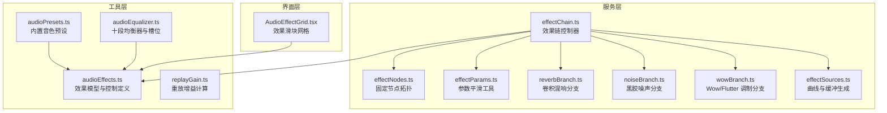
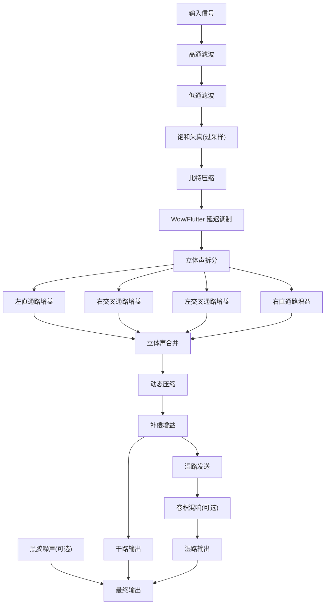
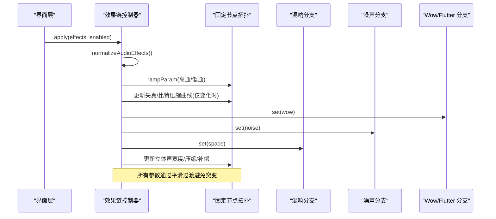
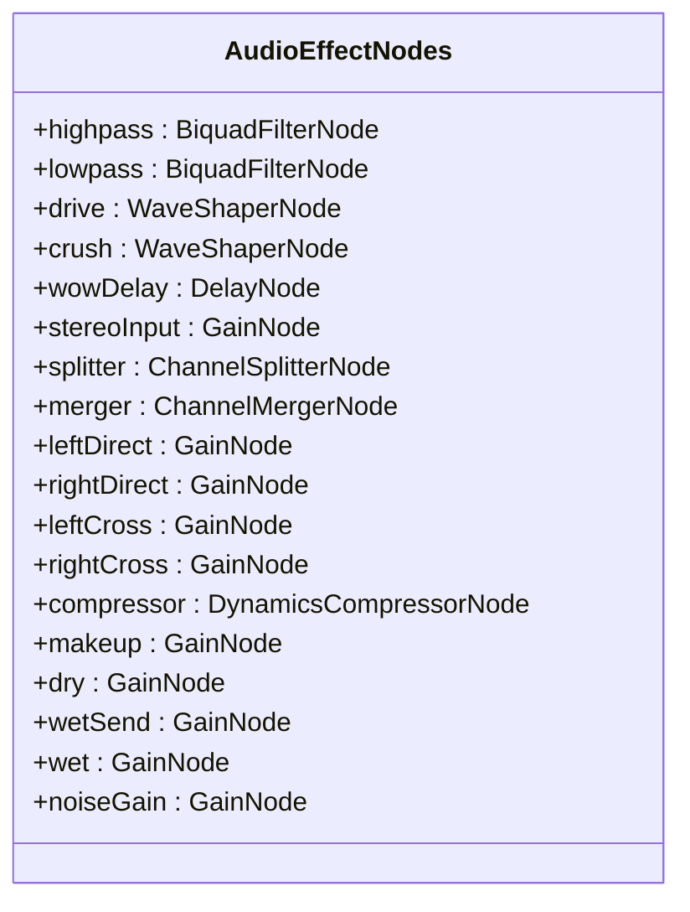
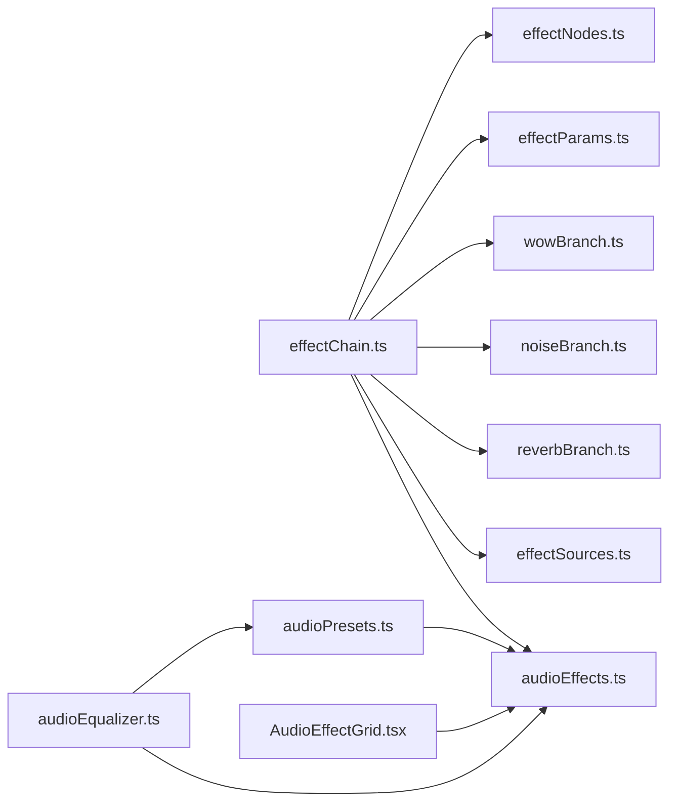
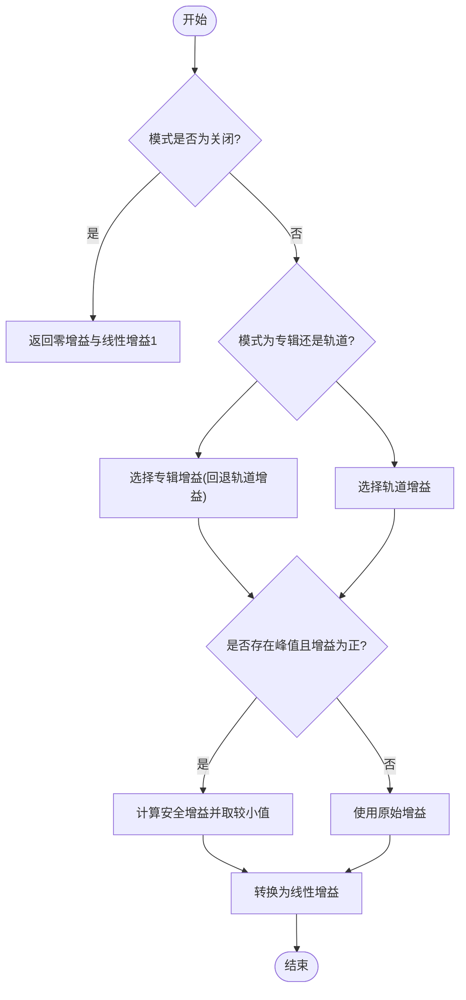
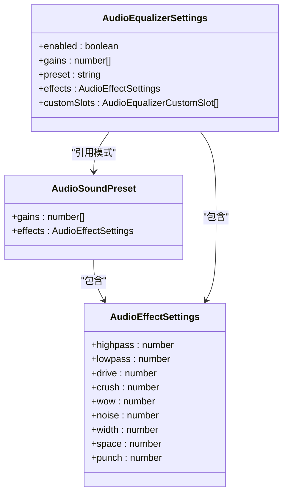
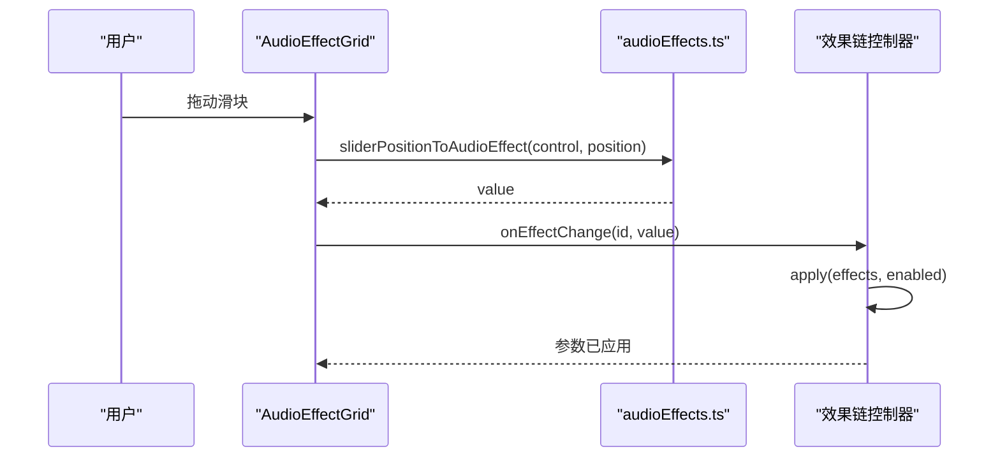

# 音频效果处理

<cite>
**本文引用的文件**   
- [effectChain.ts](file://src/services/audioEffects/effectChain.ts)
- [effectNodes.ts](file://src/services/audioEffects/effectNodes.ts)
- [effectParams.ts](file://src/services/audioEffects/effectParams.ts)
- [reverbBranch.ts](file://src/services/audioEffects/reverbBranch.ts)
- [noiseBranch.ts](file://src/services/audioEffects/noiseBranch.ts)
- [wowBranch.ts](file://src/services/audioEffects/wowBranch.ts)
- [effectSources.ts](file://src/services/audioEffects/effectSources.ts)
- [audioEffects.ts](file://src/utils/audioEffects.ts)
- [audioEqualizer.ts](file://src/utils/audioEqualizer.ts)
- [audioPresets.ts](file://src/utils/audioPresets.ts)
- [replayGain.ts](file://src/utils/replayGain.ts)
- [AudioEffectGrid.tsx](file://src/components/panelTab/equalizer/AudioEffectGrid.tsx)
- [audioEffectChain.test.ts](file://test/unit/services/audioEffectChain.test.ts)
</cite>

## 目录
1. [简介](#简介)
2. [项目结构](#项目结构)
3. [核心组件](#核心组件)
4. [架构总览](#架构总览)
5. [详细组件分析](#详细组件分析)
6. [依赖关系分析](#依赖关系分析)
7. [性能与实时性优化](#性能与实时性优化)
8. [重放增益功能](#重放增益功能)
9. [状态管理与预设系统](#状态管理与预设系统)
10. [可视化界面与参数调节](#可视化界面与参数调节)
11. [开发指南：扩展新效果](#开发指南扩展新效果)
12. [故障排查](#故障排查)
13. [结论](#结论)

## 简介
本技术文档围绕 Folia Major 的音频效果处理系统展开，重点说明以下方面：
- 音频效果链的串联、并联与路由机制
- 内置效果的实现原理与参数含义（高通/低通滤波、失真/饱和、比特压缩、Wow/Flutter、噪声、立体声宽度、动态压缩、混响）
- 实时音频处理的性能优化策略（延迟控制、按需分配、平滑过渡、过采样）
- 重放增益（ReplayGain）专辑模式与轨道模式的音量标准化逻辑
- 效果状态管理、预设系统与用户自定义槽位
- 效果参数的实时调节机制与可视化控件
- 开发者扩展新效果的实践指南

## 项目结构
音频效果相关代码主要分布在 services 层与 utils 层，并在 UI 层提供可视化控件。

**图表来源**
- [effectChain.ts:1-94](file://src/services/audioEffects/effectChain.ts#L1-L94)
- [effectNodes.ts:1-126](file://src/services/audioEffects/effectNodes.ts#L1-L126)
- [effectParams.ts:1-17](file://src/services/audioEffects/effectParams.ts#L1-L17)
- [reverbBranch.ts:1-49](file://src/services/audioEffects/reverbBranch.ts#L1-L49)
- [noiseBranch.ts:1-60](file://src/services/audioEffects/noiseBranch.ts#L1-L60)
- [wowBranch.ts:1-76](file://src/services/audioEffects/wowBranch.ts#L1-L76)
- [effectSources.ts:1-95](file://src/services/audioEffects/effectSources.ts#L1-L95)
- [audioEffects.ts:1-122](file://src/utils/audioEffects.ts#L1-L122)
- [audioPresets.ts:1-83](file://src/utils/audioPresets.ts#L1-L83)
- [audioEqualizer.ts:1-228](file://src/utils/audioEqualizer.ts#L1-L228)
- [AudioEffectGrid.tsx:27-89](file://src/components/panelTab/equalizer/AudioEffectGrid.tsx#L27-L89)

**章节来源**
- [effectChain.ts:1-94](file://src/services/audioEffects/effectChain.ts#L1-L94)
- [audioEffects.ts:1-122](file://src/utils/audioEffects.ts#L1-L122)
- [audioPresets.ts:1-83](file://src/utils/audioPresets.ts#L1-L83)
- [audioEqualizer.ts:1-228](file://src/utils/audioEqualizer.ts#L1-L228)
- [AudioEffectGrid.tsx:27-89](file://src/components/panelTab/equalizer/AudioEffectGrid.tsx#L27-L89)

## 核心组件
- 效果链控制器：负责将归一化后的效果参数映射到各 DSP 阶段，并维护可选分支的生命周期。
- 固定节点拓扑：创建并连接始终存在的滤波器、失真、压缩、干湿路等节点。
- 参数平滑工具：提供 AudioParam 的平滑过渡函数，避免突变。
- 可选分支：混响、噪声、Wow/Flutter 在需要时分配，在不需要时释放。
- 效果模型与控制：定义效果 ID、范围、步长、中性值、对数/线性刻度、单位等。
- 内置预设：每个预设包含十段均衡增益与完整的效果链状态。
- 均衡器设置：保存启用状态、增益曲线、当前模式、效果链状态与自定义槽位。
- 重放增益：根据专辑或轨道模式选择增益，并防止正增益削波。
- 可视化控件：以滑块网格展示效果参数，支持对数刻度映射与数值格式化。

**章节来源**
- [effectChain.ts:17-94](file://src/services/audioEffects/effectChain.ts#L17-L94)
- [effectNodes.ts:4-126](file://src/services/audioEffects/effectNodes.ts#L4-L126)
- [effectParams.ts:1-17](file://src/services/audioEffects/effectParams.ts#L1-L17)
- [audioEffects.ts:4-122](file://src/utils/audioEffects.ts#L4-L122)
- [audioPresets.ts:1-83](file://src/utils/audioPresets.ts#L1-L83)
- [audioEqualizer.ts:9-228](file://src/utils/audioEqualizer.ts#L9-L228)
- [replayGain.ts:1-53](file://src/utils/replayGain.ts#L1-L53)
- [AudioEffectGrid.tsx:27-89](file://src/components/panelTab/equalizer/AudioEffectGrid.tsx#L27-L89)

## 架构总览
效果链采用“固定串行路径 + 并行可选分支”的架构：
- 串行路径：高通滤波 → 低通滤波 → 饱和失真 → 比特压缩 → Wow/Flutter 延迟调制 → 立体声拆分/合并 → 动态压缩 → 补偿增益 → 干湿路输出
- 并行分支：卷积混响（wet/dry）、黑胶噪声（直接输出）、Wow/Flutter（延迟时间调制）

**图表来源**
- [effectNodes.ts:90-116](file://src/services/audioEffects/effectNodes.ts#L90-L116)
- [effectChain.ts:47-80](file://src/services/audioEffects/effectChain.ts#L47-L80)
- [reverbBranch.ts:10-49](file://src/services/audioEffects/reverbBranch.ts#L10-L49)
- [noiseBranch.ts:10-60](file://src/services/audioEffects/noiseBranch.ts#L10-L60)
- [wowBranch.ts:9-76](file://src/services/audioEffects/wowBranch.ts#L9-L76)

## 详细组件分析

### 效果链控制器（effectChain.ts）
- 职责：接收上下文、输入/输出节点与效果设置，创建并连接固定节点，按需创建可选分支，提供 apply/dispose 接口。
- 关键行为：
  - 归一化效果设置；禁用时回退到中性值
  - 平滑更新高通/低通截止频率
  - 仅在驱动/比特压缩变化时重建波形曲线
  - 调用可选分支的 set 方法更新混响、噪声、Wow/Flutter
  - 计算立体声宽度（直通路/交叉通路增益）
  - 动态压缩阈值、比率、膝点与补偿增益随 punch 参数调整
- 生命周期：dispose 中释放可选分支并断开输入连接

**图表来源**
- [effectChain.ts:31-94](file://src/services/audioEffects/effectChain.ts#L31-L94)
- [effectParams.ts:6-14](file://src/services/audioEffects/effectParams.ts#L6-L14)

**章节来源**
- [effectChain.ts:17-94](file://src/services/audioEffects/effectChain.ts#L17-L94)

### 固定节点拓扑（effectNodes.ts）
- 职责：创建并连接始终存在的 DSP 节点，保证中性默认值与稳定拓扑。
- 关键点：
  - 高通/低通 Q=0.7，低通上限不超过奈奎斯特频率的 0.475 倍
  - 饱和失真使用 4x 过采样以减少高频混叠
  - 立体声拆分/合并确保单声道源也能进入 Mid/Side 路径
  - 动态压缩默认参数为中性，便于后续按 punch 参数调整
  - 干湿路与噪声输出节点分离，便于并行分支接入

**图表来源**
- [effectNodes.ts:4-23](file://src/services/audioEffects/effectNodes.ts#L4-L23)

**章节来源**
- [effectNodes.ts:28-126](file://src/services/audioEffects/effectNodes.ts#L28-L126)

### 参数平滑工具（effectParams.ts）
- 职责：统一 AudioParam 的平滑更新方式，避免跳变。
- 关键点：
  - 使用 setTargetAtTime 进行指数平滑
  - 默认平滑时间 0.03 秒，兼顾响应速度与听感平滑
  - 提供 dB 到线性增益的转换函数

**章节来源**
- [effectParams.ts:1-17](file://src/services/audioEffects/effectParams.ts#L1-L17)

### 混响分支（reverbBranch.ts）
- 职责：并行卷积混响，湿路增益提升时降低干路增益以保持总体电平稳定。
- 关键点：
  - 首次激活时创建 ConvolverNode 并加载脉冲响应
  - 使用释放定时器在湿路关闭后延迟销毁资源
  - 平滑切换 wet/dry 增益

**章节来源**
- [reverbBranch.ts:10-49](file://src/services/audioEffects/reverbBranch.ts#L10-L49)

### 噪声分支（noiseBranch.ts）
- 职责：循环播放黑胶噪声缓冲，经带通滤波后混合到输出。
- 关键点：
  - 首次激活时创建 BufferSource 与带通滤波器
  - 噪声增益使用非线性映射增强听感
  - 释放定时器延迟销毁噪声源与滤波器

**章节来源**
- [noiseBranch.ts:10-60](file://src/services/audioEffects/noiseBranch.ts#L10-L60)

### Wow/Flutter 分支（wowBranch.ts）
- 职责：通过两个低频振荡器（慢速 Wow 与快速 Flutter）调制延迟时间，模拟磁带/黑胶音高漂移。
- 关键点：
  - 首次激活时创建两个振荡器及其深度增益节点
  - 通过 delayTime 参数实现延迟线调制
  - 关闭时平滑归零并延迟销毁振荡器

**章节来源**
- [wowBranch.ts:9-76](file://src/services/audioEffects/wowBranch.ts#L9-L76)

### 波形与缓冲生成（effectSources.ts）
- 职责：生成失真曲线、比特压缩曲线、黑胶噪声缓冲与混响脉冲响应。
- 关键点：
  - 饱和失真曲线经过能量测量补偿，保持响度一致
  - 比特压缩曲线基于平方根映射，使可听区间位于滑块中部
  - 黑胶噪声缓冲由稳态嘶声与稀疏衰减爆裂组成
  - 混响脉冲响应为指数衰减噪声

**章节来源**
- [effectSources.ts:1-95](file://src/services/audioEffects/effectSources.ts#L1-L95)

## 依赖关系分析
- effectChain.ts 依赖：
  - audioEffects.ts：效果模型与归一化
  - effectSources.ts：失真/比特压缩曲线
  - reverbBranch.ts / noiseBranch.ts / wowBranch.ts：可选分支
  - effectParams.ts：参数平滑
  - effectNodes.ts：固定节点拓扑
- audioPresets.ts 依赖 audioEffects.ts：预设携带完整效果链状态
- audioEqualizer.ts 依赖 audioEffects.ts 与 audioPresets.ts：均衡器设置包含效果链与槽位
- AudioEffectGrid.tsx 依赖 audioEffects.ts：UI 控件渲染与交互

**图表来源**
- [effectChain.ts:1-11](file://src/services/audioEffects/effectChain.ts#L1-L11)
- [audioPresets.ts:1-16](file://src/utils/audioPresets.ts#L1-L16)
- [audioEqualizer.ts:1-8](file://src/utils/audioEqualizer.ts#L1-L8)
- [AudioEffectGrid.tsx:27-34](file://src/components/panelTab/equalizer/AudioEffectGrid.tsx#L27-L34)

**章节来源**
- [effectChain.ts:1-11](file://src/services/audioEffects/effectChain.ts#L1-L11)
- [audioPresets.ts:1-16](file://src/utils/audioPresets.ts#L1-L16)
- [audioEqualizer.ts:1-8](file://src/utils/audioEqualizer.ts#L1-L8)
- [AudioEffectGrid.tsx:27-34](file://src/components/panelTab/equalizer/AudioEffectGrid.tsx#L27-L34)

## 性能与实时性优化
- 延迟控制：
  - 参数平滑时间约 0.03 秒，避免突变导致的爆音
  - 混响/噪声/Wow 分支在关闭时使用释放定时器延迟销毁，减少抖动
- 按需分配：
  - 混响、噪声、Wow/Flutter 仅在需要时创建，避免空闲开销
  - 测试验证中性链不分配可选分支
- 过采样：
  - 饱和失真使用 4x 过采样，抑制高频混叠
- 带宽限制：
  - 低通截止频率上限不超过奈奎斯特频率的 0.475 倍，防止数字混叠
- 电平一致性：
  - 饱和失真曲线经过响度补偿
  - 混响湿路提升时同步降低干路增益，保持总体电平稳定

**章节来源**
- [effectParams.ts:4-14](file://src/services/audioEffects/effectParams.ts#L4-L14)
- [effectNodes.ts:39-42](file://src/services/audioEffects/effectNodes.ts#L39-L42)
- [effectNodes.ts:34-37](file://src/services/audioEffects/effectNodes.ts#L34-L37)
- [effectSources.ts:24-41](file://src/services/audioEffects/effectSources.ts#L24-L41)
- [reverbBranch.ts:22-41](file://src/services/audioEffects/reverbBranch.ts#L22-L41)
- [audioEffectChain.test.ts:84-131](file://test/unit/services/audioEffectChain.test.ts#L84-L131)

## 重放增益功能
- 模式选择：
  - 专辑模式优先使用专辑增益，否则回退到轨道增益
  - 轨道模式直接使用轨道增益
- 防削波：
  - 当增益为正且存在峰值信息时，计算安全增益以避免削波
- 输出：
  - 返回分贝增益、有效增益、峰值与线性增益

**图表来源**
- [replayGain.ts:24-52](file://src/utils/replayGain.ts#L24-L52)

**章节来源**
- [replayGain.ts:1-53](file://src/utils/replayGain.ts#L1-L53)

## 状态管理与预设系统
- 效果模型：
  - 定义效果 ID、范围、步长、中性值、刻度类型与单位
  - 提供归一化、比较、中性值创建、滑块位置映射与数值格式化
- 内置预设：
  - 每个预设包含十段均衡增益与完整效果链状态
  - 覆盖 flat、lofi、radio、hall、vocal、bass 等风格
- 均衡器设置：
  - 保存启用状态、增益曲线、当前模式、效果链状态与自定义槽位
  - 支持从旧版数据迁移至双槽位结构
  - 提供本地存储读写接口

**图表来源**
- [audioEffects.ts:4-61](file://src/utils/audioEffects.ts#L4-L61)
- [audioPresets.ts:8-16](file://src/utils/audioPresets.ts#L8-L16)
- [audioEqualizer.ts:9-20](file://src/utils/audioEqualizer.ts#L9-L20)

**章节来源**
- [audioEffects.ts:4-122](file://src/utils/audioEffects.ts#L4-L122)
- [audioPresets.ts:1-83](file://src/utils/audioPresets.ts#L1-L83)
- [audioEqualizer.ts:9-228](file://src/utils/audioEqualizer.ts#L9-L228)

## 可视化界面与参数调节
- 效果滑块网格：
  - 遍历 AUDIO_EFFECT_CONTROLS 渲染每个效果的标签、数值显示与滑块
  - 使用 audioEffectToSliderPosition 将实际值映射到 0-1000 滑块域
  - 使用 sliderPositionToAudioEffect 将滑块位置反解为实际值
  - 使用 formatAudioEffectValue 显示 Hz 或百分比
  - 对 addsNoise 标记的效果提供提示，帮助用户识别噪声来源
- 交互事件：
  - onInput/onChange 实时更新效果值
  - onPointerUp/onPointerCancel/onKeyUp/onBlur 触发提交

**图表来源**
- [AudioEffectGrid.tsx:34-83](file://src/components/panelTab/equalizer/AudioEffectGrid.tsx#L34-L83)
- [audioEffects.ts:92-122](file://src/utils/audioEffects.ts#L92-L122)
- [effectChain.ts:47-80](file://src/services/audioEffects/effectChain.ts#L47-L80)

**章节来源**
- [AudioEffectGrid.tsx:27-89](file://src/components/panelTab/equalizer/AudioEffectGrid.tsx#L27-L89)
- [audioEffects.ts:92-122](file://src/utils/audioEffects.ts#L92-L122)

## 开发指南：扩展新效果
步骤建议：
1. 定义效果模型
   - 在 audioEffects.ts 中添加新的 AudioEffectId 与对应控制项（范围、步长、中性值、刻度、单位）
   - 如需新增噪声底噪，标记 addsNoise 以便 UI 提示
2. 实现 DSP 节点或分支
   - 若为串行阶段：在 effectNodes.ts 中增加节点并在 connectAudioEffectNodes 中连线
   - 若为并行分支：新建 branch 文件，遵循 createXxxBranch(context, nodes) 模式，实现 set/dispose
3. 在效果链中集成
   - 在 effectChain.ts 的 apply 中映射新参数到节点或分支
   - 如需资源分配，复用 effectBranchRelease 的释放定时器模式
4. 生成波形/缓冲（如需要）
   - 在 effectSources.ts 中新增曲线或缓冲生成函数
5. 更新预设与 UI
   - 在 audioPresets.ts 中为新预设配置 effects
   - 在 AudioEffectGrid.tsx 中自动渲染新控制项（无需额外改动）
6. 编写测试
   - 参考 audioEffectChain.test.ts，验证中性链、按需分配、禁用旁路与 dispose 释放

注意事项：
- 所有参数更新必须通过 rampParam 平滑过渡
- 可选分支需实现 set/dispose，并使用释放定时器避免频繁创建销毁
- 对可能引入噪声的效果，务必在 UI 中标注 addsNoise
- 对高频失真类效果，考虑过采样与带宽限制

**章节来源**
- [audioEffects.ts:4-61](file://src/utils/audioEffects.ts#L4-L61)
- [effectNodes.ts:28-126](file://src/services/audioEffects/effectNodes.ts#L28-L126)
- [effectChain.ts:47-94](file://src/services/audioEffects/effectChain.ts#L47-L94)
- [effectSources.ts:1-95](file://src/services/audioEffects/effectSources.ts#L1-L95)
- [audioPresets.ts:18-76](file://src/utils/audioPresets.ts#L18-L76)
- [AudioEffectGrid.tsx:34-83](file://src/components/panelTab/equalizer/AudioEffectGrid.tsx#L34-L83)
- [audioEffectChain.test.ts:84-131](file://test/unit/services/audioEffectChain.test.ts#L84-L131)

## 故障排查
- 出现爆音或突变：
  - 检查是否绕过 rampParam 直接设置 AudioParam
  - 确认 EFFECT_RAMP_SECONDS 与 setTargetAtTime 的使用
- 资源泄漏或卡顿：
  - 检查可选分支是否在 set(amount > 0) 时创建，在 amount <= 0 时调度释放
  - 确认 dispose 中调用了分支的 dispose 并断开节点连接
- 高频刺耳或失真异常：
  - 确认饱和失真使用过采样
  - 检查低通截止频率是否超过奈奎斯特限制
- 噪声来源不明：
  - 查看 UI 中对 addsNoise 标记的效果提示
  - 检查噪声分支的带通滤波参数与增益映射
- 混响电平波动：
  - 确认湿路增益提升时同步降低干路增益
- 重放增益导致削波：
  - 检查峰值信息与有效增益计算逻辑

**章节来源**
- [effectParams.ts:6-14](file://src/services/audioEffects/effectParams.ts#L6-L14)
- [reverbBranch.ts:22-41](file://src/services/audioEffects/reverbBranch.ts#L22-L41)
- [noiseBranch.ts:30-52](file://src/services/audioEffects/noiseBranch.ts#L30-L52)
- [wowBranch.ts:46-68](file://src/services/audioEffects/wowBranch.ts#L46-L68)
- [effectNodes.ts:39-42](file://src/services/audioEffects/effectNodes.ts#L39-L42)
- [effectNodes.ts:34-37](file://src/services/audioEffects/effectNodes.ts#L34-L37)
- [audioEffects.ts:25-38](file://src/utils/audioEffects.ts#L25-L38)
- [replayGain.ts:33-50](file://src/utils/replayGain.ts#L33-L50)

## 结论
Folia Major 的音频效果处理系统以清晰的模块化设计实现了高性能的实时音频处理：
- 固定串行路径与并行可选分支结合，兼顾音质与资源效率
- 参数平滑与按需分配确保低延迟与稳定体验
- 内置效果覆盖常见听感需求，并通过预设与自定义槽位提供灵活配置
- 重放增益提供安全的音量标准化
- UI 控件与工具函数协同，实现直观的参数调节与可视化反馈
- 扩展新效果的路径清晰，便于开发者在不破坏现有架构的前提下增强系统能力