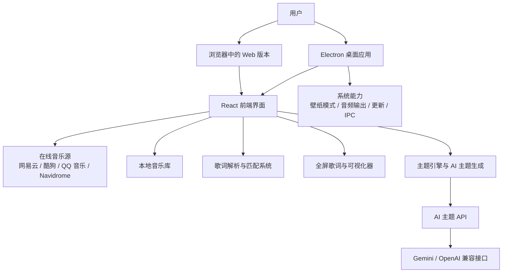
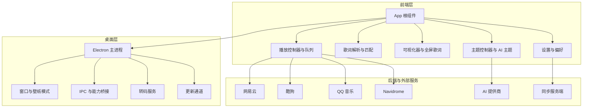
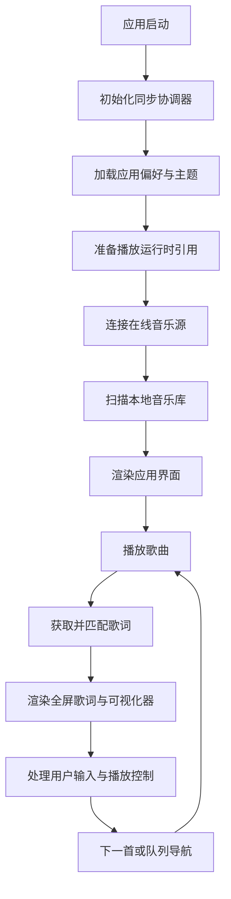
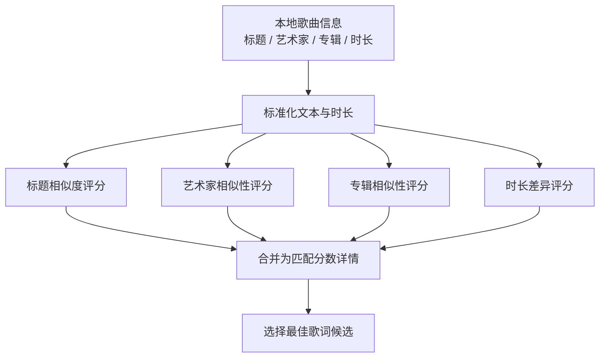
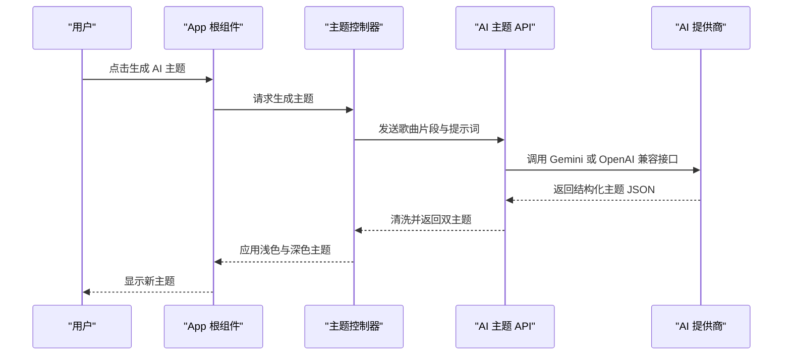
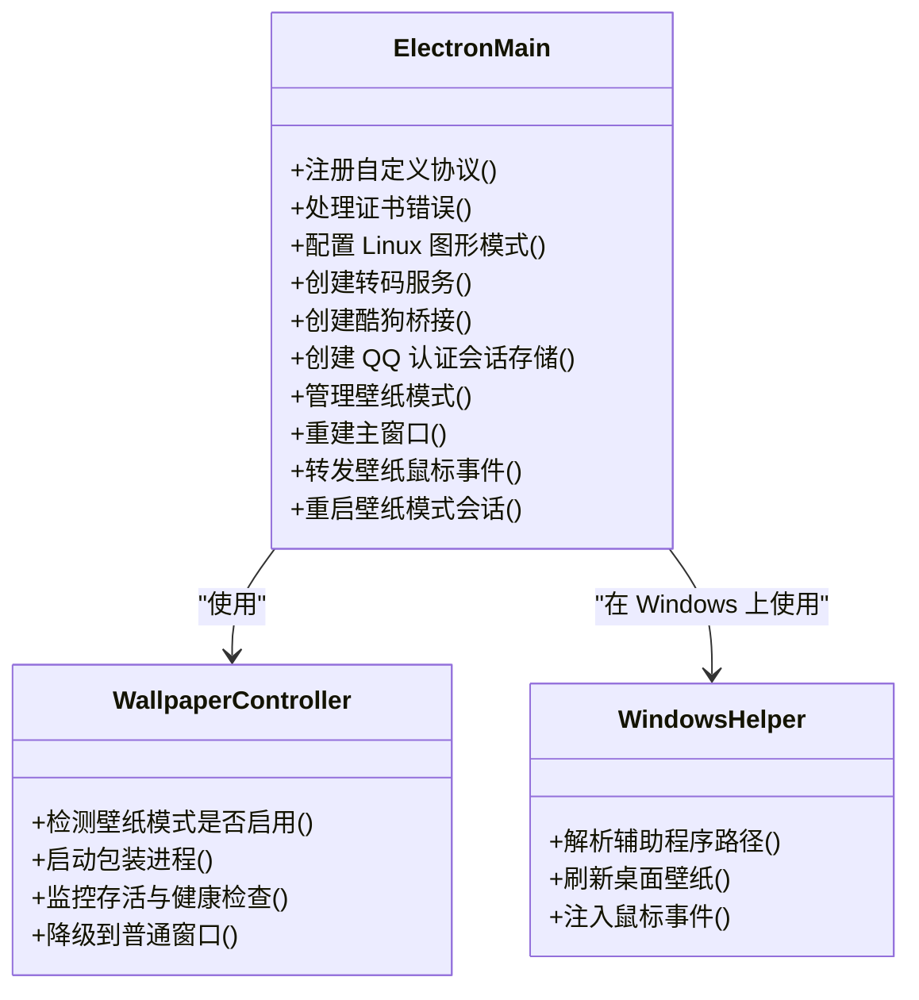
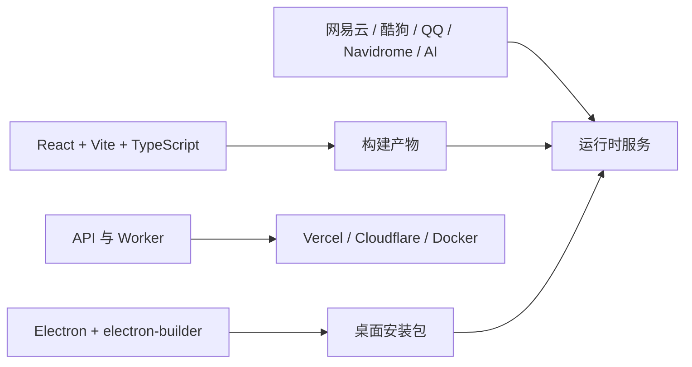

# 项目概述

<cite>
**本文引用的文件**   
- [README.md](file://README.md)
- [package.json](file://package.json)
- [docs/technical.md](file://docs/technical.md)
- [docs/local-library-management.md](file://docs/local-library-management.md)
- [src/App.tsx](file://src/App.tsx)
- [electron/main.cjs](file://electron/main.cjs)
- [api-ts/generate-theme.ts](file://api-ts/generate-theme.ts)
- [api/generate-theme_openai.js](file://api/generate-theme_openai.js)
- [src/utils/lyrics/matchScore.ts](file://src/utils/lyrics/matchScore.ts)
</cite>

## 目录
1. [简介](#简介)
2. [项目结构](#项目结构)
3. [核心能力与特性](#核心能力与特性)
4. [架构总览](#架构总览)
5. [关键组件分析](#关键组件分析)
6. [依赖关系分析](#依赖关系分析)
7. [性能与部署特性](#性能与部署特性)
8. [快速开始指南](#快速开始指南)
9. [常见问题与排错](#常见问题与排错)
10. [结论](#结论)

## 简介
Folia Major 是一个以全屏沉浸式歌词播放为核心的在线音乐播放器。它支持网易云、酷狗、QQ 音乐、Navidrome 和本地音乐库，通过智能歌词匹配、AI 生成配色主题以及多种全屏歌词动画，提供从桌面端到 Web 端的统一听歌体验。

项目同时提供：
- 基于 Electron 的 Windows、macOS、Linux 桌面应用；
- 基于 Node.js 和 React 的 Web 版本，可一键部署到 Vercel 或 Cloudflare；
- 可选的官方同步服务端 `sync-server`，用于跨设备同步外观设置与 AI 主题库。

对于初学者，可以把 Folia 理解为“一个能联网搜歌、也能管理本地音乐，并把歌词变成全屏视觉体验的音乐播放器”。对于开发者，它是一个包含前端 UI、Electron 主进程、多音源适配、歌词处理、AI 主题生成和部署脚本的完整工程。

**章节来源**
- [README.md:32-38](file://README.md#L32-L38)
- [README.md:107-118](file://README.md#L107-L118)
- [README.md:175-186](file://README.md#L175-L186)

## 项目结构
仓库采用“功能域 + 运行环境”混合组织方式：
- `src`：React 前端代码，包括应用壳、播放控制、歌词渲染、可视化器、设置面板、命令面板、模组系统等；
- `electron`：Electron 主进程逻辑，负责窗口、壁纸模式、系统能力、IPC、更新、转码、歌词接口等；
- `api` 与 `api-ts`：后端 API 实现，包括 AI 主题生成、歌词代理、分段歌词、QQ 音乐相关逻辑；
- `worker`：Web Worker 入口，封装部分后端能力；
- `deploy/docker`：Docker Compose 全栈部署配置；
- `sync-server`：可选的跨设备同步服务端；
- `mods` 与 `dist-mods`：Folium 模组示例与已分发模组；
- `test`：单元测试、UI 测试、组件测试与手动调试脚本；
- `docs`：技术说明、本地音乐库管理、模组文档等。

**图表来源**
- [src/App.tsx:160-1000](file://src/App.tsx#L160-L1000)
- [electron/main.cjs:1-100](file://electron/main.cjs#L1-L100)
- [api-ts/generate-theme.ts:87-111](file://api-ts/generate-theme.ts#L87-L111)
- [api/generate-theme_openai.js:303-338](file://api/generate-theme_openai.js#L303-L338)

**章节来源**
- [package.json:1-17](file://package.json#L1-L17)
- [package.json:18-60](file://package.json#L18-L60)
- [docs/technical.md:263-273](file://docs/technical.md#L263-L273)

## 核心能力与特性
### 多源音乐播放
- 在线搜索与播放：搜索歌曲、歌手或专辑后直接播放，并自动加载封面与歌词；
- 本地音乐支持：导入本地音频文件，建立本地曲库索引，不上传音频内容；
- 在线平台接入：网易云、酷狗、QQ 音乐、Navidrome；
- Now Playing 接入：可连接外部播放器，驱动 Folia 的舞台视图与全屏歌词。

### 智能歌词匹配
- 自动识别同目录同名 `.lrc`、`.vtt`、`.ttml`、`.qrc`、`.yrc`、`.krc` 歌词文件；
- 支持内嵌 LRC 歌词与增强型逐字歌词格式；
- 本地歌曲可自动匹配在线歌词与封面，也支持手动修正；
- 批量自动匹配优先网易云，回退到 QQ 音乐，再回退到酷狗音乐。

### AI 生成配色主题
- 根据歌曲情绪与歌词内容生成浅色与深色双主题；
- 支持 Google Gemini 与 OpenAI 兼容接口；
- 生成的主题经过安全清洗与结构化校验；
- 可在主题公园中编辑、保存、切换 AI 主题。

### 全屏歌词与可视化器
- 多种全屏歌词动画，具备不同排版氛围和可调参数；
- 响应式布局，自动适配不同窗口尺寸；
- 支持舞台视图、OBS 浏览器源、Stage API 等扩展场景；
- 支持随机切换可视化器模式、过渡动画与混音过渡。

**章节来源**
- [README.md:32-38](file://README.md#L32-L38)
- [README.md:107-118](file://README.md#L107-L118)
- [docs/local-library-management.md:1-19](file://docs/local-library-management.md#L1-L19)
- [docs/local-library-management.md:21-34](file://docs/local-library-management.md#L21-L34)
- [docs/local-library-management.md:127-153](file://docs/local-library-management.md#L127-L153)
- [docs/local-library-management.md:166-180](file://docs/local-library-management.md#L166-L180)

## 架构总览
Folia Major 的整体架构可以理解为三层：
1. 前端层：React + TypeScript + Tailwind CSS + Framer Motion，负责界面、播放状态、歌词渲染、可视化器、设置与命令面板；
2. 桌面层：Electron 主进程，负责窗口、系统能力、壁纸模式、转码、更新、歌词接口、模组系统与第三方服务桥接；
3. 后端与外部服务层：网易云、酷狗、QQ 音乐、Navidrome、AI 提供商、可选同步服务端。

**图表来源**
- [src/App.tsx:160-1000](file://src/App.tsx#L160-L1000)
- [electron/main.cjs:1-100](file://electron/main.cjs#L1-L100)
- [docs/technical.md:74-97](file://docs/technical.md#L74-L97)

**章节来源**
- [docs/technical.md:74-97](file://docs/technical.md#L74-L97)
- [docs/technical.md:263-273](file://docs/technical.md#L263-L273)

## 关键组件分析

### 应用根组件与播放中枢
`src/App.tsx` 是前端应用的根组件，承担以下职责：
- 初始化同步协调器、应用偏好、主题控制器；
- 管理当前歌曲、播放状态、歌词、封面、播放队列；
- 集成网易云、酷狗、QQ 音乐、Navidrome 等在线源；
- 管理本地音乐库扫描、自动重扫与权限恢复；
- 协调播放传输、交互、可视化器、OBS、Stage API、歌词 API；
- 处理在线音频源恢复、URL 刷新、音量平滑、输出设备切换；
- 暴露全屏歌词、舞台视图、命令面板、设置对话框等核心交互。

**图表来源**
- [src/App.tsx:160-200](file://src/App.tsx#L160-L200)
- [src/App.tsx:279-301](file://src/App.tsx#L279-L301)
- [src/App.tsx:480-502](file://src/App.tsx#L480-L502)
- [src/App.tsx:585-630](file://src/App.tsx#L585-L630)

**章节来源**
- [src/App.tsx:160-200](file://src/App.tsx#L160-L200)
- [src/App.tsx:279-301](file://src/App.tsx#L279-L301)
- [src/App.tsx:480-502](file://src/App.tsx#L480-L502)
- [src/App.tsx:585-630](file://src/App.tsx#L585-L630)

### 歌词匹配与评分
歌词匹配的核心逻辑包括：
- 标题相似度计算；
- 艺术家文本拆分与相似性评估；
- 专辑名称匹配；
- 时长差异评分；
- 综合评分与候选排序。

**图表来源**
- [src/utils/lyrics/matchScore.ts:61-81](file://src/utils/lyrics/matchScore.ts#L61-L81)
- [src/utils/lyrics/matchScore.ts:92-114](file://src/utils/lyrics/matchScore.ts#L92-L114)
- [src/utils/lyrics/matchScore.ts:155-180](file://src/utils/lyrics/matchScore.ts#L155-L180)

**章节来源**
- [src/utils/lyrics/matchScore.ts:61-81](file://src/utils/lyrics/matchScore.ts#L61-L81)
- [src/utils/lyrics/matchScore.ts:92-114](file://src/utils/lyrics/matchScore.ts#L92-L114)
- [src/utils/lyrics/matchScore.ts:155-180](file://src/utils/lyrics/matchScore.ts#L155-L180)

### AI 主题生成流程
AI 主题生成由前端触发，后端调用 AI 提供商返回结构化双主题 JSON，再由前端清洗、保存与应用。

**图表来源**
- [src/App.tsx:595-630](file://src/App.tsx#L595-L630)
- [api-ts/generate-theme.ts:87-111](file://api-ts/generate-theme.ts#L87-L111)
- [api/generate-theme_openai.js:303-338](file://api/generate-theme_openai.js#L303-L338)

**章节来源**
- [src/App.tsx:595-630](file://src/App.tsx#L595-L630)
- [api-ts/generate-theme.ts:87-111](file://api-ts/generate-theme.ts#L87-L111)
- [api/generate-theme_openai.js:303-338](file://api/generate-theme_openai.js#L303-L338)

### Electron 主进程与系统能力
`electron/main.cjs` 是 Electron 主进程的入口，负责：
- 注册自定义协议；
- 处理证书错误与 Linux 图形兼容性；
- 创建转码服务、酷狗桥接、QQ 认证会话存储；
- 管理壁纸模式（Windows、macOS、Linux）；
- 管理窗口重建、播放交接、鼠标注入、崩溃恢复；
- 集成模组系统、Stage API、歌词接口、更新通道。

**图表来源**
- [electron/main.cjs:1-100](file://electron/main.cjs#L1-L100)
- [electron/main.cjs:175-185](file://electron/main.cjs#L175-L185)
- [electron/main.cjs:230-273](file://electron/main.cjs#L230-L273)
- [electron/main.cjs:329-439](file://electron/main.cjs#L329-L439)

**章节来源**
- [electron/main.cjs:1-100](file://electron/main.cjs#L1-L100)
- [electron/main.cjs:175-185](file://electron/main.cjs#L175-L185)
- [electron/main.cjs:230-273](file://electron/main.cjs#L230-L273)
- [electron/main.cjs:329-439](file://electron/main.cjs#L329-L439)

## 依赖关系分析
### 运行时依赖
- Node.js 24 或更高版本；
- React 19、Vite 6、TypeScript、Tailwind CSS 4、Framer Motion；
- Electron 桌面端打包与更新；
- 网易云、酷狗、QQ 音乐相关 API 包；
- AI 提供商 SDK 或兼容接口；
- Dexie 本地数据库、music-metadata 元数据读取、onnxruntime-node 模型推理等。

### 构建与部署依赖
- Vite 构建 Web 版本；
- electron-builder 打包桌面端；
- Docker Compose 全栈部署；
- Vercel 与 Cloudflare 一键部署入口；
- sync-server 支持 Cloudflare Workers / D1、Docker、Node.js 自托管。

**图表来源**
- [package.json:15-17](file://package.json#L15-L17)
- [package.json:18-60](file://package.json#L18-L60)
- [package.json:201-216](file://package.json#L201-L216)
- [package.json:217-270](file://package.json#L217-L270)

**章节来源**
- [package.json:15-17](file://package.json#L15-L17)
- [package.json:18-60](file://package.json#L18-L60)
- [package.json:201-270](file://package.json#L201-L270)
- [docs/technical.md:109-121](file://docs/technical.md#L109-L121)

## 性能与部署特性
### 性能相关
- 歌词解析与匹配使用字符串相似度、时长评分与组合权重，避免过度复杂算法；
- 在线音频 URL 有 TTL 与刷新缓冲，减少频繁请求；
- 可视化器与全屏歌词渲染由 React 与 WebGL/Pixi/Three 生态支撑；
- Electron 主进程对 Linux Wayland/Vulkan、SwiftShader、软件渲染有明确降级策略；
- 壁纸模式在不同平台采用不同实现，避免不必要的窗口重建与资源泄漏。

### 部署相关
- Web 版本推荐使用 `vercel dev` 进行本地开发；
- 环境变量控制网易云、酷狗、QQ 音乐、AI 提供商；
- QQ 音乐支持常驻 Node 进程与 serverless 两种形态；
- Docker Compose 提供全栈部署方案；
- sync-server 推荐 Serverless 部署，也可 Docker 或 Node.js 自托管。

**章节来源**
- [docs/technical.md:74-97](file://docs/technical.md#L74-L97)
- [docs/technical.md:109-121](file://docs/technical.md#L109-L121)
- [docs/technical.md:117-223](file://docs/technical.md#L117-L223)
- [docs/technical.md:225-244](file://docs/technical.md#L225-L244)

## 快速开始指南

### 下载与安装
- 前往 Releases 页面下载 Windows、macOS、Linux 安装包；
- Arch Linux 可通过 AUR 安装 `folia-major-bin`；
- Flatpak 社区包可用；
- 国内网络较慢时可使用夸克网盘或百度网盘下载 Windows 与 Apple silicon 正式版安装包。

**章节来源**
- [README.md:144-153](file://README.md#L144-L153)

### 一键部署到 Vercel
- 使用 Vercel 一键部署按钮克隆仓库并创建项目；
- 部署完成后在 Vercel 项目设置中补齐环境变量；
- 推荐本地使用 `vercel dev` 验证线上行为。

**章节来源**
- [README.md:124-130](file://README.md#L124-L130)
- [docs/technical.md:109-121](file://docs/technical.md#L109-L121)

### 一键部署到 Cloudflare
- 使用 Cloudflare 一键部署按钮克隆仓库；
- QQ 音乐在 Cloudflare 上可绑定 Durable Object，增加扫码登录方式；
- 其他环境变量与 Vercel 类似。

**章节来源**
- [README.md:130-137](file://README.md#L130-L137)

### 基本功能演示
- 打开应用后进入首页，选择在线音乐源或本地音乐库；
- 搜索歌曲并播放，观察全屏歌词与可视化器；
- 尝试 AI 主题生成，查看浅色与深色双主题；
- 导入本地音乐文件夹，体验自动匹配与歌词识别；
- 如需移动端体验，可将 Web 版本添加为 PWA。

**章节来源**
- [README.md:32-38](file://README.md#L32-L38)
- [README.md:138-143](file://README.md#L138-L143)
- [docs/local-library-management.md:48-57](file://docs/local-library-management.md#L48-L57)

## 常见问题与排错

### 本地音乐无法导入
- 当前浏览器可能不支持 File System Access API；
- 改用支持目录选择的浏览器或使用桌面版。

**章节来源**
- [docs/local-library-management.md:251-256](file://docs/local-library-management.md#L251-L256)

### 重启后无法播放本地歌曲
- 先根据界面提示恢复目录访问权限；
- 如果目录已移动或改名，重新导入该目录。

**章节来源**
- [docs/local-library-management.md:257-260](file://docs/local-library-management.md#L257-L260)

### 自动匹配选错歌曲
- 进入对应文件夹的“整理歌曲信息”，修改检索文字并切换来源；
- 选择“使用本地信息”恢复导入快照并跳过后续自动匹配。

**章节来源**
- [docs/local-library-management.md:261-264](file://docs/local-library-management.md#L261-L264)

### 艺术家或专辑被错误合并
- 打开对应集合，进入实体信息面板；
- 选择错误成员并拆分到新实体或已有实体。

**章节来源**
- [docs/local-library-management.md:265-267](file://docs/local-library-management.md#L265-L267)

### 删除曲库会不会删除音乐文件
- 不会；删除操作只影响 Folia 的本地曲库记录，不会删除磁盘文件。

**章节来源**
- [docs/local-library-management.md:269-272](file://docs/local-library-management.md#L269-L272)

## 结论
Folia Major 是一个围绕全屏沉浸式歌词体验构建的现代音乐播放器。它在技术上融合了 React 前端、Electron 桌面能力、多音源适配、智能歌词匹配与 AI 主题生成；在体验上兼顾了在线音乐、本地音乐库与可视化艺术表达。对于新用户，它可以作为即装即用的桌面播放器或可部署的 Web 应用；对于开发者，它提供了清晰的模块边界、丰富的 hooks 与服务层、完整的测试与部署工具链，便于继续扩展歌词动画、主题系统、音源适配与跨平台能力。